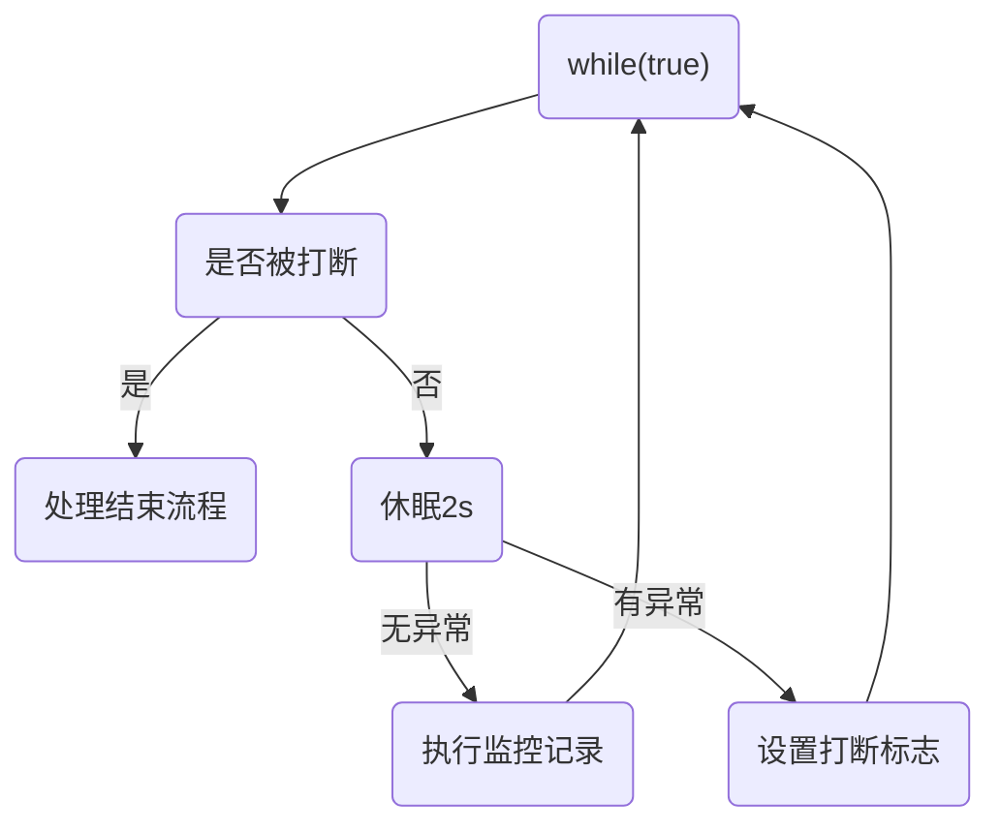

#  Java-并发编程


## 一、基础概念

- 进程、线程
- 并发、并行
- 同步、异步


**进程线程**

- **进程**：程序是静止的，**程序实体的运行过程就是进程**，是操作系统进行**资源分配**的基本单位

  

- **线程**：线程属于进程，是一个基本的 CPU 执行单元，线程是进程中的一个实体，是系统**独立调度**的基本单位
             线程本身只拥有少量在运行中必不可少的资源，与同属一个进程的其他线程**共享**进程所拥有的全部资源

- **关系**：一个进程可以包含多个线程

- **线程的作用**：使多道程序更好的并发执行，提高资源利用率和系统吞吐量，增强操作系统的并发性能


**并发并行**

- **并行**：在同一时刻，有多个指令在多个 CPU 上同时执行
- **并发**：在同一时刻，有多个指令在单个 CPU 上交替执行


**同步异步**

- **同步**：需要等待结果返回，才能继续运行就是同步
- **异步**：不需要等待结果返回，就能继续运行就是异步


## 二、线程-Thread


### 1. 简单使用

#### Thread

```Java
@Slf4j(topic = "c.Test1")
public class Test1 {
    // main 方法属于Java程序中的一个默认线程
    public static void main(String[] args) {

        // 创建线程
        Thread t = new Thread(() -> log.debug("t-running..."));

        // 设置线程名称
        t.setName("t1");
        // 启动线程 (将线程交给线程调度器)
        t.start();

        // 主线程的日志
        log.debug("m-running...");
    }
}
```


- `main` 方法启动后也是一个线程
- `t.start()` 启动线程，将线程交给CPU进行调度
  - 线程在启动后会执行其 `run()` 方法

- 如果是多核CPU则此时 main线程与t1线程并行执行


#### Runnable

```Java
@Slf4j(topic = "c.Test1")
public class Test1 {
    public static void t2(String[] args) {

        // 使用 runnable 编写需要执行的代码（任务）
        Runnable r = () -> log.debug("running...");

        // 创建线程 并将 runnable 作为参数传递
        Thread t = new Thread(r,"t2");

        t.start();
    }
}
```

- 使用Runnable编写需要执行的代码（任务），再将其作为参数创建线程


**Thread源码**

```java
public class Thread implements Runnable {
    private Runnable target;
    
    public void run() {
        if (target != null) {
            target.run();
        }
    }
}
```

- Thread底层也是实现了Runnable接口，并调用Runnable的 `run()`方法
  - 当Thread本身的 `run()`方法没有被重写时，先检查传入的Runnable对象，如不为空则调用该对象的 `run()`

**优点**

1. 同一个任务对象可以被包装成多个线程对象
2. 适合多个线程去共享同一个资源
3. 实现解耦操作，任务代码和线程独立


#### Callable

- `Callable` 属于只有一个方法属于函数式接口，其方法有返回值

```Java
@FunctionalInterface
public interface Callable<V> {
    V call() throws Exception;
}
```

- `public FutureTask(Callable<V> callable)`：在线程执行结束后可以获得执行结果

  

- `FutureTask` 实现了Runnable接口，属于Runnable对象

```Java
@Slf4j(topic = "c.Test2")
public class Test2 {
    public static void main(String[] args) throws Exception {

        // 能够有返回值
        FutureTask<Integer> task = new FutureTask<>(() -> {
            log.debug("running...");
            Thread.sleep(1000);
            return 100;
        });

        Thread t1 = new Thread(task, "t1");
        t1.start();

        // 主线程阻塞，等待t1线程执行完毕
        Integer i = task.get();
        log.debug("result:{}", i);
    }
}
```

- 将Callable包装成 `FutureTask` 对象，创建线程则可以取得线程任务的结果返回值
- `get()` 方法会阻塞当前线程，等待目标线程任务执行完成后取得返回值


### 2. 线程运行原理


#### 栈与栈帧

**Java Virtual Machine Stacks（Java 虚拟机栈）**：每个线程启动后，虚拟机就会为其分配一块栈内存

- 每个栈由多个栈帧（Frame）组成，对应着每次方法调用时所占用的内存
- 每个线程只能有一个活动栈帧，对应着当前正在执行的那个方法


#### 上下文切换

**线程上下文切换（Thread Context Switch）**：一些原因导致 CPU 不再执行当前线程，转而执行另一个线程

- 线程的 CPU 时间片用完
- 垃圾回收
- 有更高优先级的线程需要运行
- 线程自己调用了 sleep、yield、wait、join、park 等方法

当上下文切换发生时，需要由操作系统保存当前线程的状态（存入当前进程的PCB 中），并恢复另一个线程的状态


### 3. 线程方法-API

| 方法                                        | 说明                                                         |
| ------------------------------------------- | ------------------------------------------------------------ |
| public void start()                         | 启动一个新线程，Java虚拟机调用此线程的 run 方法              |
| public void run()                           | 线程启动后调用该方法                                         |
| public void setName(String name)            | 设置线程名称                                                 |
| public void getName()                       | 获取当前线程的名称 线程存在默认名称：子线程是 Thread-索引，主线程是 main |
| public static Thread currentThread()        | 获取当前线程对象                                             |
| public static void sleep(long time)         | 让当前线程阻塞规定时间再继续执行，time=0则让当前线程立刻被重新调度 |
| public static native void yield()           | 提示线程调度器让出当前线程对 CPU 的使用                      |
| public final int getPriority()              | 获取线程的优先级                                             |
| public final void setPriority(int priority) | 更改此线程的优先级                                           |
| public void interrupt()                     | 中断这个线程，异常处理机制                                   |
| public static boolean interrupted()         | 判断当前线程是否被打断，清除打断标记                         |
| public boolean isInterrupted()              | 判断当前线程是否被打断，不清除打断标记                       |
| public final void join()                    | 等待这个线程结束                                             |
| public final void join(long millis)         | 等待这个线程结束 millis 毫秒，0则永远等待                    |
| public final native boolean isAlive()       | 线程是否运行完毕）                                           |
| public final void setDaemon(boolean on)     | 将此线程标记为守护线程或用户线程                             |


#### start()

- 使用 `start()` 启动新的线程，使此线程处于就绪态，运行时执行 run 中的代码

- 被激活后的线程不能再次 `start()`


#### run()

- 线程体，包含了要执行的内容，
- 运行结束后此线程随即终止
- 如直接调用 `run()` 则是在主线程中执行 `run()`，没有启动新的线程

**注：**

​	因为 `Thread` 类的 `run()` 方法没有定义抛出任何受检查的异常。如果在 `run()` 方法中抛出受检查异常，则需要在方法内部进行处理，例如使用 `try-catch` 块捕获异常或使用 `throws` 关键字在方法内部声明抛出异常。


#### sleep()

- 调用 sleep() 会让当前线程从 `Running` 进入 `Timed Waiting` 状态（阻塞）

- sleep() 方法的过程中，**线程不会释放对象锁**

- 其它线程可以使用 `interrupt` 方法打断正在睡眠的线程，这时 sleep 方法会抛出 InterruptedException

- 睡眠结束后的线程未必会立刻得到执行，需要抢占 CPU

- 建议用 TimeUnit 的 sleep 代替 Thread 的 sleep 来获得更好的可读性

  ```java
  // 源码，其实是对Thread.sleep()进行包装
  public void sleep(long timeout) throws InterruptedException {
      if (timeout > 0) {
          long ms = toMillis(timeout);
          int ns = excessNanos(timeout, ms);
          Thread.sleep(ms, ns);
      }
  }
  ```


#### yield()

- 让出当前线程对 CPU 的使用，并立即进入线程调度
- 让出的时间片只会分配**给当前线程相同优先级**的线程
- 具体的实现依赖于操作系统的调度算法
- **会放弃 CPU 资源，锁资源不会释放**


#### join()

> 如果一个线程实例A执行了`threadB.join()`,其含义是：当前线程A会等待`threadB`线程终止后`threadA`才会继续执行

```Java
@Slf4j(topic = "c.Test4")
public class Test4 {

    public static void main(String[] args) throws InterruptedException {

        Thread t = new Thread(() ->{
           log.debug("Running...");
            try {
                Thread.sleep(1000);
            } catch (InterruptedException e) {
                e.printStackTrace();
            }
        });

        t.start();
        t.join();
        log.debug("End...");
    }
}
```

- join 方法是被 synchronized 修饰的，本质上是一个对象锁
- 当调用某个线程（t1）的 join 方法后，该线程（t1）抢占到 CPU 资源，就不再释放，直到线程执行完毕

```java
public final synchronized void join(long millis)
throws InterruptedException {
    if (millis == 0) {
        while (isAlive()) {
            wait(0);
        }
    }
}
```


#### interrupt()

> 中断可以理解为线程的一个标志位，它表示了一个运行中的线程是否被其他线程进行了中断操作。

- `public void interrupt()`：打断线程，异常处理机制

- `public static boolean interrupted()`：判断当前线程是否被打断，**清除打断标记**

- `public boolean isInterrupted()`：判断当前线程是否被打断，**不清除打断标记**

==**注意**==

- `sleep、wait、join` 方法都会让线程进入阻塞状态，此时打断线程**会清空打断状态**

- 当抛出`InterruptedException`时，会清除中断标志位

**打断sleep线程时报错**


```Java
@Slf4j(topic = "c.Test5")
public class Test5 {
    public static void main(String[] args) throws InterruptedException {

        Thread t1 = new Thread(()->{
           log.debug("T1开始sleep");
            try {
                Thread.sleep(2000);
            } catch (InterruptedException e) {
                e.printStackTrace();
            }
        });

        Thread t2 = new Thread(()->{
           log.debug("T2开始循环");
            Thread thread = Thread.currentThread();
            while (true) {
                boolean interrupted = thread.isInterrupted();
                if (interrupted){
                    log.debug("T2被中断了,状态{}",thread.getState());// RUNNABLE(就绪/运行)
                    break;
                }
            }
        });

        t1.start();
        // 将主线程先阻塞0.5s,让T1能先执行睡眠
        Thread.sleep(500);
        // 打断sleep线程
        t1.interrupt();
        Thread.sleep(50);
        log.debug("T1的标志位{}",t1.isInterrupted()); // false(被重置)
        log.debug("T1的状态{}",t1.getState());// TERMINATED(终止)

        t2.start();
        Thread.sleep(500);
        // 打断正常运行线程
        t2.interrupt();

    }
}
```


**打断park状态的线程**

> park 作用类似 sleep，打断 park 线程，不会清空打断状态

```java
@Slf4j(topic = "c.Test6")
public class Test6 {
    public static void main(String[] args) throws InterruptedException {
        Thread t1 = new Thread(() -> {
            log.debug("进入park...");
            LockSupport.park(); // TIME_WAITING
            log.debug("被唤醒...");
            log.debug("线程标志位{}", Thread.currentThread().isInterrupted()); // true
            // 当标志位为true时无法被park
            LockSupport.park();
            log.debug("跳过park");
        }, "t1");
        t1.start();
        Thread.sleep(500);
        // 打断线程
        t1.interrupt();
    }
}
```

- 如需多次park则可以使用`Interrupted()`在获取状态位后清除标记（false）


#### 终止线程


**不推荐使用**

- `stop()` ：会杀死线程，如果此时线程锁住了共享资源，则资源无法释放，使其他线程无法获取

- `System.exit(int)`：此方法会停止线程所在的整个进程
- `suspend()`：挂起（暂停）线程，如果此时线程锁住了共享资源，且没有进程调用`resume()`则资源无法释放
- `resume()`：恢复线程运行


**两阶段终止模式**




<center>流程图</center>

**代码实现**

```Java
@Slf4j(topic = "c.TwoPhaseTermination")
public class TwoPhaseTermination {
    // 监控进程
    private Thread monitor;
    public void start() {
        monitor = new Thread(() -> {
            while (true) {
                Thread current = Thread.currentThread();
                if (current.isInterrupted()) {
                    log.debug("处理后续事务");
                    break;
                }
                try {
                    Thread.sleep(1000);
                    log.debug("执行监控事务");
                } catch (InterruptedException e) {
                    e.printStackTrace();
                    // 有异常则说明在sleep时被打断，所以重置标志位
                    current.interrupt();
                }
            }
        });
        monitor.start();
    }
    public void stop() {
        // 打断监控线程
        monitor.interrupt();
    }
}
@Slf4j(topic = "c.Test")
class Test {
    public static void main(String[] args) throws InterruptedException {
        TwoPhaseTermination monitor = new TwoPhaseTermination();
        monitor.start();
        Thread.sleep(3500);
        monitor.stop();
    }
}
```


#### 守护线程

- **用户线程**：平常创建的普通线程

- **守护线程**：服务于用户线程，当其它非守护线程运行结束，守护线程会强制结束。

  > 守护进程是**脱离终端且在后台运行**，避免在执行的过程中的信息在终端上显示

使用 `setDaemon(true)`将普通线程设置为守护线程


**常见的守护线程**

- 垃圾回收器线程就是一种守护线程
- Tomcat 中的 Acceptor 和 Poller 线程都是守护线程，所以 Tomcat 接收到 shutdown 命令后，不会等待它们处理完当前请求


### 4. 线程状态

>  在Java中线程存在 6 种状态


- 注意：在`RUNNABLE`种还包含线程**由于IO操作被阻塞**的状态


**线程状态转换**


- `NEW` → `RUNNABLE`：当调用 `t.start()` 方法时，由 `NEW → RUNNABLE`

- `RUNNABLE <--> WAITING`：

  - 调用 `obj.wait()` 方法时

    调用 `obj.notify()、obj.notifyAll()、t.interrupt()`：

    - 竞争锁成功，线程从 `WAITING → RUNNABLE`
    - 竞争锁失败，线程从 `WAITING → BLOCKED`

  - 当前线程调用 `t.join()` 方法，注意是当前线程在 t 线程对象的监视器上等待

  - 当前线程调用 `LockSupport.park()` 方法

- `RUNNABLE <--> TIMED_WAITING`：

  - 调用 `obj.wait(long n)` 方法、当前线程调用 `t.join(long n)` 方法、当前线程调用 `Thread.sleep(long n)`

- `RUNNABLE <--> BLOCKED`：t 线程用 `synchronized(obj)` 获取了对象锁时竞争失败


## 三、同步与互斥


- **互斥**是保证临界区的竞态条件发生，同一时刻只能有一个线程执行临界区代码
- **同步**是由于线程执行的先后、顺序不同、需要一个线程等待其它线程运行到某个点


### 1. 临界区


- **临界资源**：一次只允许一个线程访问的资源
- **临界区**：一段代码快内，存在多个线程对临界资源的读写操作，则该代码快称之为临界区

- **竞态条件**：多个线程在临界区内执行，由于代码的执行序列不同而导致结果无法预测，称之为发生了竞态条件

```java
// 临界资源
static int count = 0;

static void incr()
// 临界区
{
    count++;
}

static void decr()
// 临界区
{
    count--;
}
```


- 注：当多个线程在临界区内对共享资源发生指令交错时，会出现线程安全问题

  `count++`编译为字节码命令为

  - `getstatic i`
  - `iconst_1`
  - `iadd`
  - `putstatic i`


<center>正常结果应该为 0</center> 

**解决线程安全问题（互斥）**

- 阻塞式的解决方案：synchronized，lock
- 非阻塞式的解决方案：原子变量


### 2. synchronized
> synchronized 对象锁

**保证了临界区内代码的原子性**，采用互斥的方式让同一时刻至多只有一个线程能持有对象锁，
其它线程获取这个对象锁时会阻塞，保证拥有锁的线程可以安全的执行临界区内的代码，不用担心线程上下文切换


#### 语法

**代码块**

```Java
// 锁对象为手动指定的对象
synchronized(锁对象){
	// 访问共享资源的核心代码
}
```


**实例方法**

```Java
class Room {
    private int counter = 0;
    public void increment() {
        synchronized (this) {
            counter++;
        }
    }
    // 等价于上面的写法
    // 锁对象this为当前对象
    public synchronized void decrement() {
            counter--;
    }

}
```


**静态方法**

```Java
class Room {
    private int counter = 0;
    public static void increment() {
        synchronized (Room.class) {
            counter++;
        }
    }
    // 等价于上面的写法
    // 锁对象为类对象
    public static synchronized void decrement() {
            counter--;
    }

}
```


**加锁以后则可以让线程互斥的访问临界资源**、


#### 线程安全分析

**成员变量和静态变量**

- 如果它们没有共享，则线程安全
- 如果它们被共享了，根据它们的状态是否能够改变，又分两种情况
  - 如果只有读操作，则线程安全
  - 如果有读写操作，则这段代码是临界区，需要考虑线程安全


**局部变量**

- 局部变量是线程安全的
  - 但局部变量引用的对象则夫必
- 如果该对象没有逃离方法，它是线程安全的
- 如果该对象逃离方法的作用范围（被return），需要考虑线程安全


**常见线程安全类**

- String

- Integer

- StringBuffer

- Random

- Vector

- Hashtable

- java.util.concurrent 包下的类（JUC）

它们的**每个方法是原子的**但注意它们多个方法的**组合不是原子**的

其中，String，Integer 为不可变类，指其内部状态不可改变


### 3. Monitor

> 监视器或管程


每个 Java 对象都可以关联一个 Monitor 对象，Monitor 也是 class，其**实例存储在堆中**，
使用 synchronized 给对象上锁之后，该对象头的 Mark Word 中就被设置指向 Monitor 对象的指针，这就是**重量级锁**

**monitor结构**


#### Java对象头

> 在同步的时候是获取对象的monitor,即获取到对象的锁。
> 对象的锁是类似对对象的一个标志，这个标志就是存放在Java对象的对象头


**存储结构**[^引用]

synchronized 用的锁是存在 Java 对象头里的。

- 如果对象是数组类型，则虚拟机用 3 个字宽（Word）存储对象头，
- 如果对象是非数组类型，则用 2 字宽存储对象头。

在 32 位虚拟机中，1 字宽等于 4 字节


​	Java 对象头里的 Mark Word 里默认存储对象的 HashCode、分代年龄和锁标记位。32 位 JVM 的 Mark Word 的默认存储结构如图


​	在运行期间，Mark Word 里存储的数据会随着锁标志位的变化而变化


​	在 64 位虚拟机下，Mark Word 是 64bit 大小


[^引用]: *方腾飞 《Java并发编程的艺术》*


#### 工作流程

- 开始时 Monitor 中 `Owner` 为 null
- 当 Thread-2 执行 synchronized(obj) 就会将 Monitor 的所有者 Owner 置为 Thread-2，Monitor 中只能有一个 Owner
  **obj 对象的 Mark Word 指向 Monitor**，把**对象原有的 Mark Word 存入线程栈中的锁记录**中（轻量级锁部分详解）


- 在 Thread-2 上锁的过程，Thread-3、Thread-4、Thread-5 也执行 synchronized(obj)，就会进入 `EntryList` BLOCKED 
- Thread-2 执行完同步代码块的内容，根据 obj 对象头中 Monitor 地址寻找，设置 `Owner` 为空，**恢复 MarkWord 原来的数据**
- 唤醒 EntryList 中等待的线程来竞争锁，竞争是**非公平的**，未得到锁的线程会继续阻塞
- `WaitSet` 中的 Thread-0，是以前获得过锁，但**条件不满足**进入 WAITING 状态的线程（wait-notify 机制）


**字节码角度分析**


- 示例代码

```Java
static final Object lock = new Object();
static int counter = 0;

public static void main(String[] args) {
    synchronized (lock) {
        counter++;
    }
}
```


- 对应字节码

```Java
public void main(java.lang.String[]);
	descriptor: ([Ljava/lang/String;)V
    flags: ACC_PUBLIC, ACC_STATIC
    Code:
      stack=2, locals=3, args_size=1
		 0: getstatic     #2		// <- lock引用 （synchronized开始）
		 3: dup
		 4: astore_1 	 			// lock引用 -> slot 1
		 5: monitorenter 			// 将 lock对象 MarkWord 置为 Monitor 指针
		 6: getstatic	  #3		// <- i
		 9: iconst_1				// 准备常数 1
		10: iadd 					// +1
		11: putstatic  	  #3		// -> i
		14: aload_1 				// <- lock引用
		15: monitorexit 			// 将 lock对象 MarkWord 重置, 唤醒 EntryList
		16: goto 		  24 		
		19: astore_2 				// e(异常) -> slot 2
		20: aload_1 				// <- lock引用
		21: monitorexit				// 将 lock对象 MarkWord 重置, 唤醒 EntryList
		22: aload_2 				// <- slot 2 (e) 
		23: athrow 					// throw e
		24: return 					
		Exception table:
		    from to target type
		       6  9 19 		any
		      19 22 19 		any
		LineNumberTable: ...
```

### 4. CAS

> Compare And Swap，是CPU并发原语


**原语**

- CAS 是一种系统原语，原语属于操作系统范畴，是由若干条指令组成 ，用于完成某个功能的一个过程，并且原语的执行必须是连续的，执行过程中不允许被中断，所以不会造成数据不一致的问题，是线程安全的
- CAS 并发原语体现在 Java 语言中就是 sun.misc.Unsafe 类的各个方法，调用 UnSafe 类中的 CAS 方法，JVM 会实现出 CAS 汇编指令，这是一种完全依赖于硬件的功能，实现了原子操作


**与锁对比**

- 使用锁时，线程获取锁是一种**悲观锁策略**，即假设每一次执行临界区代码都会产生冲突，
  所以当前线程获取到锁的时候同时也会阻塞其他线程获取该锁。

- 而CAS操作（又称为无锁操作）是一种**乐观锁策略**，它假设所有线程访问共享资源的时候不会出现冲突，
  既然不会出现冲突自然而然就不会阻塞其他线程的操作。线程就不会出现阻塞停顿的状态。

无锁操作是使用**CAS**又叫做比较交换来鉴别线程是否出现冲突，出现冲突就**重试当前操作**直到没有冲突为止


####  CAS操作流程

> Java代码实现见第四、五章

CAS的过程可以理解为比较交换**(V,O,N)**

- V 内存地址存放的**实际值**
- O 预期的值（**旧值**）
- N 更新的**新值**


- **V和O相同时**
  旧值和内存中实际的值相同，表明该值没有被其他线程更改过，即O就是目前来说最新的值了，可以将新值N赋值给V

- **V和O不同时**
  表明该值已经被其他线程改过了，则该旧值O不是最新版本的值了，所以不能将新值N赋给V，返回V即可

当多个线程使用CAS操作一个变量时，只有一个线程会成功，并成功更新，其余会失败
失败的线程会重新尝试，也可以选择挂起线程

当CAS操作失败后会进行一定的尝试，而非进行耗时的挂起唤醒的操作，因此也叫做**非阻塞同步**
不过，CAS的实现需要硬件指令集的支撑，在JDK1.5后虚拟机才可以使用处理器提供的**CMPXCHG**指令实现


结合CAS与volatile可以实现**无锁并发**，**适用于线程数少，多核CPU的情况下**

- 没有锁，线程不会阻塞，这是提高效率的原因之一
- 但如果线程太多，CPU核心少等导致竞争激烈，会平发生自旋，反而会影响效率
- CAS 必须借助 volatile 才能读取到共享变量的最新值来实现比较并交换的效果


#### CAS的问题

**ABA问题**

因为 CAS 需要在操作值的时候，检查值有没有发生变化，如果没有发生变化则更新，
但是如果一个值原来是 A，变成了 B，又变成了 A
那么使用 CAS 进行检查时会发现它的值没有发生变化，但是实际上却变化了。


- 解决方法

使用版本号。在变量前面追加上版本号
每次变量更新的时候把版本号加 1，那么 A→B→A 就会变成 1A→2B→3A

所以当前线程执行CAS操作时，会发现版本号与线程一开始获取的不一样，就会放弃此次更新


**循环时间长开销大**

自旋 CAS 如果长时间不成功，会给 CPU 带来非常大的执行开销


- 解决办法

使用 CAS 线程数不要超过 CPU 的核心数，如果 JVM 能支持处理器提供的 pause 指令，那么效率会有一定的提升。

pause 指令 有两个作用：

- 第一，它可以延迟流水线执行指令（de-pipeline），使 CPU 不会消耗过多的执行资源，延迟的时间取决于具体实现的版本，在一些处理器上延迟时间是零；
- 第二， 它可以避免在退出循环的时候因内存顺序冲突（Memory Order Violation）而引起 CPU 流水线被清空（CPU Pipeline Flush），从而提高 CPU 的执行效率。


**只能保证一个共享变量的原子操作**

当对一个共享变量执行操作时，我们可以使用 循环 CAS 的方式来保证原子操作，
但是对多个共享变量操作时，循环 CAS 就无法保证 操作的原子性


- 解决办法

使用锁，或将多个共享变量合并为一个共享变量来操作


**参考：《Java并发编程的艺术》方腾飞**


### 5. synchronized优化原理

> synchronized 锁是可重入，不公平的重量级锁

**优化的顺序**

**`无锁 -> 偏向锁 -> 轻量级锁 -> 重量级锁`**


**注意**：锁可以升级但**不能降级**，目的是为了提高获得锁和释放锁的效率


#### 偏向锁

> 当锁没有竞争时，每次重入都需要进行CAS操作，为了让线程获得锁的代价更低而引入了偏向锁

- 当一个线程访问同步块并获取锁时，会在对象头和栈帧中的锁记录里存储**锁偏向的线程 ID**
  以后该线程在进入和退出同步块时不需要进行 CAS 操作来加锁和解锁

- 当其他线程尝试竞争偏向锁时，持有偏向锁的线程才会释放锁


- 对象创建时**默认开启**了偏向锁，MarkWord最后 3 位为 101，其余都为 0，处于`Biased`状态

- 添加 VM 参数 `-XX:-UseBiasedLocking` 可以禁用偏向锁

​	**注：**偏向锁是默认是延迟的，不会在程序启动时立即生效，添加 VM 参数 `-XX:BiasedLockingStartupDelay=0` 来禁用延迟
​            JDK 8 延迟 4s 开启偏向锁原因：在刚开始执行代码时，会有许多线程来竞争锁，立即开偏向锁效率反而降低


**偏向锁的撤销**

- 当一个对象已经计算过 hashCode，会撤销偏向状态，且再也无法进入偏向状态
- 由上图可知，因为在`Biased`状态 MarkWord 无法存放 hashCode
  - 轻量级锁在锁记录中存放HashCode
  - 重量级锁在Monitor中存放HashCode

```Java
TimeUnit.SECONDS.sleep(4);
Object o = new Object();

synchronized (o){
    // 加锁后会在mark word 上记录ThreadID（由操作系统设置）
    log.debug(ClassLayout.parseInstance(o).toPrintable());
}
// 解锁后mark word 上ThreadID 不会消失（体现了偏向锁的特性），除非发生特定情况
log.debug(ClassLayout.parseInstance(o).toPrintable());

Object o1 = new Object();
// 如果计算对象的hashCode则会撤销对象的偏向状态
o1.hashCode();
// 因为在 Biased 状态下，Mark word 中没有存放HashCode的空间
// 而在 Normal 状态下 Mark Word 中存放了HashCode
log.debug(ClassLayout.parseInstance(o1).toPrintable());
```


- 当有其它线程使用偏向锁对象时，会将偏向锁升级为轻量级锁

- 调用 wait/notify，需要申请 Monitor，也会撤销偏向锁


**批量撤销**

> 如果对象被多个线程访问且没有竞争，这时偏向了线程 T1 的对象仍有机会重新偏向 T2，重偏向会重置对象的 Thread ID

- 当虚拟机撤销偏向锁数量超过 阈值20 （批量重偏向）

  - JVM 会给以后的对象加锁时**重新偏向**至加锁线程

    > - 先对30个对象用 T1线程 加锁
    > - 等 T1 线程运行完毕，T2线程再对这些对象获取锁
    > - 当T2 对象访问到第 20 个 (19 号) 时，JVM对剩余10个对象进行了重偏向

    

- 当虚拟机撤销偏向锁数量超过 阈值40  （批量撤销）
  
  - JVM 会对该类的所有对象都会变为不可偏向，新建的对象也是不可偏向


#### 轻量级锁

>  一个对象有多个线程要加锁，但加锁的时间是错开的（没有竞争）
> 可以使用轻量级锁来优化，轻量级锁对使用者是透明的

如果多个线程存在竞争，则轻量级锁会变成重量级锁


- **可重入锁**
  线程可以进入一个它已经拥有的锁的代码块，可重入锁最大的作用是**避免死锁**
  轻量级锁在锁重入时，每次重入仍然需要执行 CAS 操作，Java 6 才引入的偏向锁来优化

**锁重入示例**

```Java
static final Object obj = new Object();
public static void method1() {
    synchronized( obj ) {
        // 同步块 A
        method2();
    }
}
public static void method2() {
    synchronized( obj ) {
    	// 同步块 B
    }
}
```


- 创建锁记录（Lock Record）对象，每个线程的**栈帧**都会包含一个锁记录的结构，存储锁定对象的 Mark Word

- 让锁记录中 Object reference 指向锁住的对象，并尝试用 CAS 替换 Object 的 Mark Word，将 Mark Word 的值存入锁记录

- 如果 CAS 替换成功，对象头中存储了锁记录地址和状态 00（轻量级锁） ，表示由该线程给对象加锁


- 如果 CAS 失败，有两种情况：
  - 如果是其它线程已经持有了该 Object 的轻量级锁，这时表明有竞争，进入**锁膨胀**过程
  - 如果是线程自己执行了 synchronized 锁重入，就添加一条 Lock Record 作为**重入的计数**


- 当退出 synchronized 代码块（解锁时）
  - 如果有取值为 null 的锁记录，表示有重入，这时重置锁记录，表示重入计数减 1
  - 如果锁记录的值不为 null，这时使用 CAS 将 Mark Word 的值恢复给对象头
    - 成功，则解锁成功
    - 失败，说明轻量级锁进行了锁膨胀或已经升级为重量级锁，进入重量级锁解锁流程


#### 锁膨胀

> 当某线程尝试加轻量级锁的过程中，CAS 操作无法成功，可能是其它线程为此对象加上了轻量级锁（出现竞争），
> 这时需要进行锁膨胀，将轻量级锁变为**重量级锁**


- 当 T1 进行轻量级加锁时，发现 T0 已经对该对象加了轻量级锁，出现竞争，开始锁膨胀


- 锁膨胀流程：为 Object 对象申请 Monitor 锁，**通过 Object 对象头获取到持锁线程**，将 Monitor 的 Owner 置为 T0，
  将 Object 的对象头指向Monitor地址，然后自己进入 Monitor 的 EntryList BLOCKED


- 当 T0 退出同步块解锁时，使用 CAS 将 Mark Word 的值恢复给对象头失败，这时进入重量级解锁流程
  即按照 Monitor 地址找到 Monitor 对象，设置 Owner 为 null，唤醒 EntryList 中 BLOCKED 线程


#### 锁自旋

> 重量级锁竞争时，尝试获取锁的线程不会立即阻塞，可以使用**自旋**（默认 10 次）来进行优化
> 采用循环的方式去尝试获取锁

- 自旋占用 CPU 时间，同一时刻只能运行一个线程，只有多核 CPU 自旋才能发挥优势

- 自旋失败后会进入阻塞状态

  

<center>自旋成功</center>


<center>自旋失败</center>


- 在 Java 6 之后自旋锁是自适应的
  - 如果在同一个锁上，自旋等待刚刚成功获取过锁，并且持有锁的线程正在运行中，那么JVM会认为该锁自旋获取到锁的可能性很大，**会自动增加等待时间**这种机制可以使JVM对程序的锁的状态预测更加准确，从而提高并发性能
- Java 7 之后不能控制是否开启自旋功能，由 JVM 控制


#### 锁消除

> 若JVM检测到一个共享数据不会被多个线程访问时，会对锁进行消除，这是 JVM **即时编译器的优化**

锁消除主要是通过**逃逸分析**来支持，如果堆上的共享数据不可能逃逸出去被其它线程访问到，
那么就可以把它们当成私有数据对待，也就可以将它们的锁进行消除

- `-XX:-EliminateLocks`：通过设置此VM参数可以关闭JVM的锁消除


### 6. 多把锁

>  多把不相干的锁，细分管理资源

将锁的粒度细分：

- 好处，是可以增强并发度
- 坏处，如果一个线程需要同时获得多把锁，就容易发生死锁


```Java
public static void main(String[] args) {
    BigRoom bigRoom = new BigRoom();
    new Thread(() -> bigRoom.study()).start();
    new Thread(() -> bigRoom.sleep()).start();
}
class BigRoom {
    private final Object studyRoom = new Object();
    private final Object sleepRoom = new Object();

    public void sleep() throws InterruptedException {
        synchronized (sleepRoom) {
            System.out.println("sleeping");
            Thread.sleep(2000);
        }
    }

    public void study() throws InterruptedException {
        synchronized (studyRoom) {
            System.out.println("study");
            Thread.sleep(1000);
        }
    }
}
```


#### 死锁

> 多个线程同时被阻塞，其中每个线程都在等待其他线程占用的锁，导致程序无法正常运行

操作系统中，死锁产生的条件

- **互斥条件**，即当资源被一个线程使用（占有）时，别的线程不能使用

- **不可剥夺条件**，资源请求者不能强制从资源占有者手中夺取资源，资源只能由资源占有者主动释放

- **请求和保持条件**，即当资源请求者在请求其他的资源的同时保持对原有资源的占有

- **循环等待条件**，即存在一个等待循环队列：p1 要 p2 的资源，p2 要 p1 的资源，形成了一个等待环路

当四个条件都满足时，则会出现死锁情况，打破任一条件即可解除死锁


- 代码演示死锁情况

  ```Java
  public class Dead {
      public static void main(String[] args) {
          Object A = new Object();
          Object B = new Object();
  
          // 线程1
          new Thread(()->{
              synchronized (A){
  
                  log.debug("线程1获取到A锁");
                  try {
                      // 休眠1s使线程2先获取到B锁
                      TimeUnit.SECONDS.sleep(1);
                  } catch (InterruptedException e) {
                      e.printStackTrace();
                  }
                  synchronized (B){
                      log.debug("线程1获取到B锁");
                      log.debug("线程1开始执行任务");
                  }
              }
          },"T1").start();
  
          // 线程2
          new Thread(()->{
              synchronized (B){
                  log.debug("线程2获取到B锁");
                  try {
                      // 休眠1s使线程1先获取到A锁
                      TimeUnit.SECONDS.sleep(1);
                  } catch (InterruptedException e) {
                      e.printStackTrace();
                  }
                  synchronized (A){
                      log.debug("线程2获取到A锁");
                      log.debug("线程2开始执行任务");
                  }
              }
          },"T2").start();
      }
  }
  ```


**死锁的检测和定位**


- **使用JPS定位进程ID，再使用jstack id定位死锁**


```cmd
Found one Java-level deadlock:
=============================
"T2":
  waiting to lock monitor 0x000002829a1765a8 (object 0x00000000d9927c38, a java.lang.Object),
  which is held by "T1"
"T1":
  waiting to lock monitor 0x000002829a174298 (object 0x00000000d9927c48, a java.lang.Object),
  which is held by "T2"

```


- **使用Jconsole**


#### 活锁

> 指任务或者执行者没有被阻塞，由于某些条件没有满足，导致一直重复尝试—失败—尝试—失败的过程


- 两个线程相互改变对方的结束条件，导致都无法结束

```Java
class LiveLock {
    static volatile int count = 10;
    static final Object lock = new Object();
    public static void main(String[] args) {
        new Thread(() -> {
            // 期望减到 0 退出循环
            while (count > 0) {
                Thread.sleep(200);
                count--;
                log.debug("count:{}",count);
            }
        }, "T1").start();
        new Thread(() -> {
            // 期望超过 20 退出循环
            while (count < 20) {
                Thread.sleep(200);
                count++;
                log.debug("count:{}",count);
            }
        }, "T2").start();
    }
}
```


#### 饥饿

> 一个线程由于某些情况，始终得不到 CPU 调度执行，也不能够结束

例如：

- 资源竞争：多个线程同时竞争有限的资源。
- 锁的不公平性：某些线程优先获得锁资源，导致其他线程无法获得。
- 优先级反转：低优先级线程长时间占用资源，导致高优先级线程无法获取。
- 资源过度分配：某些线程得不到足够的资源。


### 7. wait-notify

**相关API**

- **`public final void notify()`** 
  - 唤醒正在等待对象Monitor中的一个线程
  - 唤醒是**随机的**，可能存在唤醒**非目标线程**的情况
- **`public final void notifyAll()`** 
  - 唤醒正在等待对象Monitor的所有线程
  - 推荐使用
- **`public final void wait()`**
  - 使当前线程等待并进入Monitor的WaitSet中,直到被另一个线程唤醒
- **`public final native void wait(long timeout)`** 
  - 有时限的等待, 到n毫秒后结束等待，或是被唤醒


**注意：**


- 当该线程获取锁对象，成为Owner时才能调用以上方法

- **wait 是挂起线程，需要唤醒的都是挂起操作**，阻塞线程可以竞争锁，挂起的线程需要唤醒后竞争锁


**执行流程**

- 当某对象的Owner线程发现因为某条件不足时，可以调用`wait`方法**进入该对象Monitor的WaitSet中**，并变为`WAITING`状态

- 此时该线程会释放锁资源，并等待被其他线程唤醒
- 此后获得锁对象的线程可以通过 `notify() 或 notifyAll()` 唤醒 WaitSet 中的线程，唤醒后进入EntryList 重新竞争锁


**wait 与 sleep 对比**

- **对象不同**
  - `sleep()` 方法是属于 Thread 类，是线程用来控制自身流程的，使此线程暂停执行一段时间而把CPU让给其他线程
  - `wait()` 方法属于 Object 类，用于线程间通信，也会让出CPU
- **处理机制不同**
  - 调用 `sleep()` 方法的过程中，线程**不会释放对象锁**
  - 当调用 `wait()` 方法的时候，线程会释放对象锁，且进入该对象Monitor的WaitSet中等待被唤醒
- **使用条件不同**
  - `wait()` 方法必须**先获取锁（在同步代码块中）**才能使用
  - `sleep()` 方法则可以放在任何地方使用


### 8. Park & Unpark

> LockSupport 是用来创建锁和其他同步类的**线程原语**


- `LockSupport.park()`：暂停当前线程，挂起原语

  - 源码

    ```Java
    public static void park(Object blocker) {
        Thread t = Thread.currentThread();
        setBlocker(t, blocker);
        UNSAFE.park(false, 0L);
        setBlocker(t, null);
    }
    ```

- `LockSupport.unpark(暂停的线程对象)`：恢复某个线程的运行

  - 源码

    ```Java
    public static void unpark(Thread thread) {
        if (thread != null)
            UNSAFE.unpark(thread);
    }
    ```


LockSupport 出现就是为了**增强** wait & notify 的功能：   

- wait，notify 和 notifyAll 必须配合 Object Monitor 一起使用，而 park、unpark 不需要
- park & unpark **以线程为单位**来阻塞和唤醒线程，而 notify 只能随机唤醒一个等待线程，notifyAll 是唤醒所有等待线程
- park & unpark 可以先 unpark，而 wait & notify 不能先 notify。
- wait 会释放锁资源进入等待队列，**park 不会释放锁资源**，只负责阻塞当前线程，会释放 CPU


**使用方法**

- 先 park

  

  1. 当前线程调用 Unsafe.park() 方法
  2. 检查 _counter ，此时情况为 0，则获得 _mutex 互斥锁
  3. 线程进入 _cond 条件变量挂起 
  4. 调用 Unsafe.unpark(Thread-0) ，设置 _counter 为 1
  5. 唤醒 _cond 条件变量中的 Thread_0，Thread-0 恢复运行，设置 _counter 为 0


- 先unpark

  
  1. 调用 Unsafe.unpark(Thread_0) 方法，设置 _counter 为 1

  2. 当前线程调用 Unsafe.park() 方法

  3. 检查 _counter ，本情况为 1，这时线程无需挂起，继续运行，且设置 _counter 为 0


### 9. 同步模式

#### 保护性暂停

> Guarded Suspension，用于一个线程等待另一个线程的执行结果

- 当一个线程的结果需要传递到另一个线程，可以它们关联同一个 `GuardedObject`
- 如果有结果不断从一个线程到另一个线程那么可以使用消息队列（见生产者/消费者）
- JDK 中，join 的实现、Future 的实现，采用的就是此模式


**一对一模式**


- 代码实现

```Java
public class GuardedObject {
    private final Integer id;
    private Object response;

    public GuardedObject(Integer id) {
        this.id = id;
    }

    public Integer getId() {
        return id;
    }
    // 获取结果
    public Object get(long timeout) {
        synchronized (this) {

            // 记录开始时间
            long begin = System.currentTimeMillis();
            // 经历的时间
            long passedTime = 0;

            // 判断是否由返回结果
            while (response == null) {
                // 计算还需等待的时间 （预防被其他线程虚假唤醒）
                long waitTime = timeout - passedTime;
                if (waitTime <= 0) {
                    break;
                }
                try {
                    // 不用timeout因为可能在超时之前被其他 非目标线程 唤醒，导致没有等待足够的时间
                    this.wait(waitTime); 
                } catch (InterruptedException e) {
                    e.printStackTrace();
                }
                // 计算循环等待的时间（因为存在被其他线程虚假唤醒的可能）
                passedTime = System.currentTimeMillis() - begin;
            }
        }
        return response;
    }

    // 产生结果并赋值
    public void complete(Object response) {
        synchronized (this) {
            this.response = response;
            // 唤醒等待的线程
            this.notifyAll();
        }
    }
}
```

- 模拟一个线程等待另一线程下载的结果

```Java
class Download {
    // 线程1 等待 线程2下载的结果
    public static void main(String[] args) {
        GuardedObject guardedObject = new GuardedObject(0);

        new Thread(() -> {
            log.debug("等待下载结果");
            Object response = guardedObject.get(3000);
            log.debug("下载结果:{}", response);
        }, "T1").start();

        new Thread(() -> {
            log.debug("开始下载任务");
            try {
                TimeUnit.SECONDS.sleep(4);
            } catch (InterruptedException e) {
                e.printStackTrace();
            }
            Object o = new Object();
            guardedObject.complete(o);
            log.debug("下载完成");

        }, "T2").start();

        new Thread(() -> {
            try {
                TimeUnit.SECONDS.sleep(1);
            } catch (InterruptedException e) {
                e.printStackTrace();
            }
            log.debug("虚假唤醒T1");
            guardedObject.complete(null);

        }, "T3").start();
    }
}
```

- 结果


**多对多模式**


- 创建一个`MutiGO`对象来管理多个`GuardedObject`

- 代码实现

```Java
public class MutiGO {
    // Hashtable 线程安全
    private static Map<Integer, GuardedObject> GOboxs = new Hashtable<>();
    private static int id = 0;

    public static synchronized Integer genId(){
       return ++id;
    }
    public static GuardedObject getGuardedObject(int id){
        // 设当前环境下，取出后删除
        return  GOboxs.remove(id);
    }
    public static GuardedObject genGuardedObject(){
        GuardedObject guardedObject = new GuardedObject(genId());
        GOboxs.put(id, guardedObject);
        return guardedObject;
    }
    public static Set<Integer> getIds(){
        return GOboxs.keySet();
    }

}
```

- 模拟邮递员送信

```Java
@Slf4j(topic = "c.People")
class People extends Thread{
    @Override
    public void run() {

        log.debug("开始收信");
        GuardedObject guardedObject = MutiGO.genGuardedObject();
        Integer id = guardedObject.getId();
        Object mail = guardedObject.get(5000);
        log.debug("收到信id:{},内容{}", id,mail);

    }
}
@Slf4j(topic = "c.Postman")
class Postman extends Thread{

    private int id;
    private String mail;

    public Postman(int id, String mail) {
        this.id = id;
        this.mail = mail;
    }
    @Override
    public void run() {
        GuardedObject guardedObject = MutiGO.getGuardedObject(id);
        log.debug("送信id:{},内容{}",id,mail);
        guardedObject.complete(mail);
    }

}
```

- 设三个邮箱

```Java
public static void main(String[] args) {
    for (int i = 0; i< 3; i++){
        TimeUnit.MILLISECONDS.sleep(10);
        new People().start();
    }
    Set<Integer> ids = MutiGO.getIds();
    ids.forEach(id ->new Postman(id,"你好"+id).start());
}
```


### 10. 异步模式

#### 生产者消费者模式


- 消息队列可以用来平衡生产和消费的线程资源，不需要产生结果和消费结果的线程一一对应
- 生产者仅负责产生结果数据，不关心数据该如何处理，而消费者专心处理结果数据
- 消息队列是有容量限制的，满时不会再加入数据，空时不会再消耗数据
- JDK 中各种阻塞队列，采用的就是这种模式


- 代码实现

  - 消息对象

    ```Java
    final class Message {
        private int id;
        private Object msg;
        public Message(int id, Object msg) {
            this.id = id;
            this.msg = msg;
        }
        public int getId() {
            return id;
        }
        public Object getMsg() {
            return msg;
        }
        @Override
        public String toString() {
            return "Message{" +
                    "id=" + id +
                    ", msg=" + msg +
                    '}';
        }
    }
    ```

  - 消息队列

    ```Java
    public class MessageQueue {
        private final int capacity;
        private final LinkedList<Message> queue = new LinkedList<>();
        public MessageQueue(int capacity) {
            this.capacity = capacity;
        }
        public void put(Message message) {
            synchronized (queue) {
                while (queue.size() == capacity) {
                    log.debug("队列已满,生产者等待");
                    try {
                        queue.wait();
                    } catch (InterruptedException e) {
                        e.printStackTrace();
                    }
                }
                queue.addLast(message);
                // 唤醒消费者
                queue.notifyAll();
            }
        }
        public Message get() {
            synchronized (queue) {
                while (queue.isEmpty()) {
                    log.debug("队列为空,消费者等待");
                    try {
                        queue.wait();
                    } catch (InterruptedException e) {
                        e.printStackTrace();
                    }
                }
                Message message = queue.removeFirst();
                // 唤醒生产者
                queue.notifyAll();
                return message;
            }
        }
    }
    ```

- 测试

  ```Java
  class TestMQ {
      public static void main(String[] args) {
          MessageQueue mq = new MessageQueue(2);
          for (int i = 0; i < 3; i++) {
              int id = i;
              TimeUnit.MILLISECONDS.sleep(100);
              new Thread(() -> {
                      mq.put(new Message(id, "消息" + id));
                      log.debug("生产者{} 生产消息{}", id,id);
              }, "生产者" + i).start();
          }
          TimeUnit.SECONDS.sleep(1);
          
          new  Thread(()->{
              while (true) {
                  TimeUnit.MILLISECONDS.sleep(100);
                  Message message = mq.get();
                  log.debug("消费者 消费消息{}", message.toString());
              }
          },"消费者").start();
      }
  }
  ```

- 结果


### 11. ReentrantLock

> ReentrantLock重入锁，是实现Lock接口的一个类，在实际编程中使用频率很高
> **基于AQS实现，原理见第八章**

- **可重入性**
  - 表示能够对共享资源能够重复加锁，即当前线程获取该锁再次获取不会被阻塞
  - Java关键字synchronized隐式支持重入性，synchronized通过获取自增，释放自减的方式实现重入。

- **公平与非公平锁**
  - ReentrantLock默认为非公平锁
  - 设置为公平锁后，满足阻塞队列先进先出（FIFO）原则调度线程
- **可打断性**
  - 在等待锁状态的线程能被 Interrupt() 打断
- **超时等待**
  - 使用 tryLock() 可以在获取锁失败后使线程不进入等待
  - 使用tryLock(long timeout , TimeUnit unit ) 可以设置超时等待时间 
- **条件变量（Condition）**
  - 跟据多个条件变量可以设置多个等待(waitSet)队列


**使用语法**

```Java
try{
    lock.lock();
}finally{
    lock.unlock();
}
```

lock() 与 unlock() 需成对出现


#### 可重入性

- 在线程获取锁的时如果当前线程已经获得该锁，则直接再次获取成功

- 锁会被获取n次，只有锁在被释放n次之后，该锁才算是完全释放成功


**代码示例**

```Java
public class ReentrantLock01 {
    private static final ReentrantLock lock = new ReentrantLock();
    public static void main(String[] args) {
        // 可重入性
	       m1();
    }

    private static void m1() {
        lock.lock();
        try {
            log.debug("进入 m1");
            m2();
        } finally {
            lock.unlock();
        }
    }
    private static void m2() {
        lock.lock();
        try {
            log.debug("进入 m2");
        } finally {
            lock.unlock();
        }
    }

}
```


#### 公平锁

ReentrantLock支持两种锁：**公平锁**和**非公平锁**。
**如果一个锁是公平的，那么锁的获取顺序就应该符合请求的绝对时间顺序，满足FIFO**


**源码**

```Java
// 默认空参构造器为非公平锁
public ReentrantLock() {
    sync = new NonfairSync();
}
// 当参数为 true 时创建公平锁
public ReentrantLock(boolean fair) {
    sync = fair ? new FairSync() : new NonfairSync();
}
```

**与非公平锁对比**

- 公平锁每次获取到锁为同步队列中的第一个节点，**保证请求资源时间上的绝对顺序**
- 非公平锁有可能刚释放锁的线程下次继续获取该锁，则有可能导致其他线程永远无法获取到锁，**造成“饥饿”现象**。

- 公平锁为了保证时间上的绝对顺序，需要频繁的上下文切换
- 而非公平锁会降低一定的上下文切换，降低性能开销。
  - 因此ReentrantLock默认选择的是非公平锁，则是为了减少一部分上下文切换，**保证了系统更大的吞吐量**。


#### 可打断

**代码示例**

```Java

    private static void interruptibility() {
        Thread t1 = new Thread(() -> {
            try {
                log.debug("尝试获取锁");
                // 如没有线程竞争锁，此方法就会获取到锁
                // 如果有其他线程竞争锁，就会进入阻塞队列。可被其他线程调用 interrupt 打断
                lock.lockInterruptibly();
                //lock.lock(); // 使用lock() 则无法被打断，会一直等待锁
            } catch (Exception e) {
                e.printStackTrace();
                log.debug("被打断，未获取到锁");
                return;
            }
            try {
                log.debug("获取到锁");
            } finally {
                lock.unlock();
            }
        });
        lock.lock();
        t1.start();

        sleep(1);
        log.debug("打断t1");
        t1.interrupt();

    }
```

- **运行结果**

  


#### 超时等待

**代码示例**

```java
    private static void timeoutLock() {
        Thread t1 = new Thread(() -> {
            log.debug("尝试获取锁");
            try {
                // tryLock() 也能被Interrupt打断
                if (!lock.tryLock(1, TimeUnit.SECONDS)) {
                    log.debug("获取锁失败");
                    return;
                }
            } catch (InterruptedException e) {
                e.printStackTrace();
                log.debug("获取锁失败");
                return;
            }
            try {
                log.debug("获取到锁");
            }finally {
                lock.unlock();
            }
        });
        // 设主线程先获取到锁
        lock.lock();
        log.debug("主线程获取到锁");
        t1.start();

    }
```

- **运行结果**

  等待 1s 后自动结束

  


#### 条件变量Condition

> 实现原理见第八章

在线程间实现通信时往往会应用到Object的几个方法，比如wait(),notify()等几个方法实现等待/通知机制。
而在java Lock体系下依然会有同样的方法实现等待/通知机制。

从整体上来看**Object的wait和notify是与对象监视器配合完成线程间的等待/通知机制，而Condition与是Lock配合完成等待通知机制，前者是java底层级别的，后者是语言级别的，具有更高的可控制性和扩展性**。

1. Condition能够支持不响应中断，而通过使用Object方式不支持；
2. Condition能够支持多个等待队列（new 多个Condition对象），而Object方式只能支持一个；
3. Condition能够支持超时时间的设置，而Object不支持

**Condition中等待与通知的方法**

**等待**

1. `void await() throws InterruptedException`：获取到锁后调用，使当前线程进入等待状态，此时被中断会抛出被中断异常
2. `long awaitNanos(long nanosTimeout)`：当前线程进入等待状态直到被通知，中断或者**超时**；
3. `boolean await(long time, TimeUnit unit)throws InterruptedException`：同第二种，支持自定义时间单位
4. `boolean awaitUntil(Date deadline) throws InterruptedException`：当前线程进入等待状态直到被通知，中断或者**到了设定时间**

**通知**

1. `void signal()`：唤醒一个等待在condition上的线程，将该线程从**等待队列**中转移到**同步（阻塞）队列**中，如果在同步队列中能够竞争到锁则可以从等待方法中返回
2. `void signalAll()`：唤醒所有等待在condition上的线程

**示例代码**

```Java
public class ConditionTest {
    static ReentrantLock ROOM = new ReentrantLock();
    static Condition waitASet = ROOM.newCondition();
    static Condition waitBSet = ROOM.newCondition();

    static Boolean hasA = false;
    static Boolean hasB = false;

    public static void main(String[] args) {
        // 需要A资源的线程
        new Thread(() -> {
            ROOM.lock();
            try {
                log.debug("线程A尝试获取资源A...{}", hasA);
                while (!hasA) {
                    log.debug("获取失败，进入A资源等待队列...");
                    try {
                        waitASet.await();
                    } catch (InterruptedException e) {
                        e.printStackTrace();
                    }
                }
                log.debug("线程A获取到资源A,开始执行任务...");
            } finally {
                ROOM.unlock();
            }
        }, "A").start();
        // 需要B资源的线程
        new Thread(() -> {
            ROOM.lock();
            try {
                log.debug("线程B尝试获取资源B...{}", hasB);
                while (!hasB) {
                    log.debug("获取失败，进入B资源等待队列...");
                    try {
                        waitBSet.await();
                    } catch (InterruptedException e) {
                        e.printStackTrace();
                    }
                }
                log.debug("线程B获取到资源B,开始执行任务...");
            } finally {
                ROOM.unlock();
            }
        }, "B").start();
        sleep(1);
        // 提供A资源线程
        new Thread(() -> {
            ROOM.lock();
            try {
                log.debug("释放A资源，唤醒A资源等待队列...");
                hasA = true;
                waitASet.signalAll();
            }finally {
                ROOM.unlock();
            }
        },"C").start();
        sleep(1);
        // 提供B资源线程
        new Thread(() -> {
            ROOM.lock();
            try {
                log.debug("释放B资源，唤醒B资源等待队列...");
                hasB = true;
                waitBSet.signalAll();
            }finally {
                ROOM.unlock();
            }
        },"D").start();
    }
}
```

**运行结果**


## 四、Java内存模型-JMM

> Java 内存模型是 Java Memory Model（JMM）


本身是一种**抽象的概念**，实际上并不存在，描述的是一组规则或规范
通过这组规范定义了程序中各个变量（包括实例字段，静态字段和构成数组对象的元素）的访问方式


Java **线程之间的通信**由 JMM控制，其决定一个线程对共享变量的写入**何时**对另一个线程可见。

JMM 定义了线程和主内存之间的抽象关系：

- 线程之间的共享变量存储在主内存（Main Memory）中，每个线 程都有一个私有的本地内存（Local Memory）
  本地内存中存储了该线程以读/写共享变 量的副本。
- 本地内存是 JMM 的一个抽象概念，并不真实存在。它涵盖了缓存、写缓冲 区、寄存器以及其他的硬件和编译器优化。


### 1. 三大特性

> 在线程安全问题中存在三条性质分别是，原子性，可见性，有序性


#### 原子性

> 原子性是指**一个操作是不可中断的，要么全部执行成功要么全部执行失败**。
> 在多个线程一起执行的时候，一个操作一旦开始，就不会被其他线程所干扰。

在JMM中定义了8种原子操作

1. `lock（锁定）`：作用于**主**内存中的变量，它把一个变量标识为一个线程独占的状态；
2. `unlock（解锁）`:作用于**主**内存中的变量，它把一个处于锁定状态的变量释放出来，释放后的变量才可以被其他线程锁定
3. `read（读取）`：作用于**主**内存的变量，它把一个变量的值从主内存传输到线程的工作内存中，以便后面的load动作使用；
4. `load（载入）`：作用于**工作**内存中的变量，它把read操作从主内存中得到的变量值放入工作内存中的变量副本
5. `use（使用）`：作用于**工作**内存中的变量，它把工作内存中一个变量的值传递给执行引擎，每当虚拟机遇到一个需要使用到变量的值的字节码指令时将会执行这个操作；
6. `assign（赋值）`：作用于**工作**内存中的变量，它把一个从执行引擎接收到的值赋给工作内存的变量，每当虚拟机遇到一个给变量赋值的字节码指令时执行这个操作；
7. `store（存储）`：作用于**工作**内存的变量，它把工作内存中一个变量的值传送给主内存中以便随后的write操作使用；
8. `write（写入）`：作用于**主**内存的变量，它把store操作从工作内存中得到的变量的值放入主内存的变量中。


注意：由原子性变量操作read,load,use,assign,store,write，可以**大致认为基本数据类型的访问读写具备原子性**
（例外就是没有加volatile的long和double的非原子性协定）


已6条可以满足基本数据类型的访问读写具备原子性
如果我们需要**更大范围的原子性操作**就可以使用lock和unlock原子操作。

**JVM种lock和unlock没有开放使用**，但更高层次的指令`monitorenter`和`monitorexit`指令开放使用

即java代码中的**synchronized满足原子性**


#### 可见性

> 可见性是指当一个线程修改了共享变量后，其他线程能够立即得知这个修改。


存在不可见问题的根本原因是由于缓存（工作内存）的存在

**代码示例**

```Java
public class Visuality {
    private static boolean run = true;
    public static void main(String[] args) {
        new Thread(()->{
            while(run){
                // ...
            }
        },"T1").start();

        log.debug("停止T1");
        run = false;
    }
```

- 此时主线程将 run 值修改并不会使线程 T1 停止 （此次修改在两个线程中出现不可见问题）


- 因为当 T1 线程频繁的访问共享变量 run 时，JIT（即时编译器）会将 run 的值缓存至该线程的工作内存中，以减少对主存的访问提高效率

**解决方法**

```Java
/**
 * 添加volatile关键字，使线程每一次都从主存中获取变量，此时变量在多个线程中可见
 * 不加volatile关键字，线程会从自己的工作内存中获取变量，导致线程不可见
 */
private volatile static boolean run = true;
```

- 在 run 上添加 volatile 关键字使线程每一次都从主存中获取该变量


#### 有序性

> 指令的有序性是指在多线程环境下，对共享变量进行操作或访问时的执行顺序问题。


Java使用了一些优化技术，例如指令重排序和缓存一致性来提高执行效率。
指令重排序是指在不改变程序结果的前提下，改变指令的执行顺序以提高性能。
但它们也引入了可见性和有序性问题。


CPU 的基本工作是执行存储的指令序列，执行的过程实际上是不断地取出指令、分析指令、执行指令的过程
为了提高性能，编译器和处理器会对指令重排，例如：

`源代码 -> 编译器优化的重排 -> 指令并行的重排 -> 内存系统的重排 -> 最终执行指令`


现代 CPU 支持多级指令流水线，其工作都可以分为 5 个阶段：

`取指令、指令译码、执行指令、访存取数、结果写回`

- instruction fetch (IF)
- instruction decode (ID)
- execute (EX)
- memory access(MEM)
- register write back (WB)


当CPU 可以在一个时钟周期内，同时运行五条指令的**不同阶段**称之为**五级指令流水线**，提高了CPU的吞吐率


多线程环境中线程交替执行，由于编译器优化重排，会获取其他线程处在不同阶段的指令同时执行

**代码示例**


- 上图代码中，正常情况下应只有两种结果 1 ，4 但因存在指令重排，在多线程下还会存在结果为 0 的情况


- 因为重排序，导致线程2中可能存在，先将 ready 赋值，再将 num 赋值
  而再多线程下，另一线程可能再num赋值之前，获取了ready的值，导致结果为 0 


### 2. volatile

> volatile是java虚拟机提供的最轻量级的同步机制

**特性**

- 保证可见性：被volatile修饰的变量能够保证每个线程能够获取该变量的最新值
- 保证有序性：设置屏障禁止指令重排
- 不保证原子性


与synchronized对比：synchronized **无法禁止指令重排和处理器优化**，但可以保证有序性可见性

- 加锁后，同一时间只有一个线程执行临界区代码，指令重排但结果不会改变
- 加锁前，线程会**清空工作内存**中共享变量的值，使用共享变量时需要从主内存中重新读取最新的值
  解锁前，会把共享变量的最新值**刷新到主内存**中


#### 实现原理

使用 volatile 修饰的共享变量，底层通过汇编 lock 前缀指令进行缓存锁定

- 将当前处理器缓存的数据写回系统内存
- 这个写回内存的操作会使得其他CPU里缓存了该内存地址的数据无效
- 当处理器发现本地缓存失效后，就会从主存中重读该共享变量数据，即可以获取当前最新值

lock 前缀指令就相当于**内存屏障**，Memory Barrier（Memory Fence）


- 在每个volatile写操作的**前面**插入一个StoreStore屏障；
- 在每个volatile写操作的**后面**插入一个StoreLoad屏障；
- 在每个volatile读操作的**后面**插入一个LoadLoad屏障；
- 在每个volatile读操作的**后面**插入一个LoadStore屏障。

**注意**：volatile写是在前面和后面**分别插入内存屏障**，而volatile读操作是在**后面插入两个内存屏障**

- 写屏障（Store Barrier）保证在该屏障之前的，对共享变量的改动，都同步到主存当中
  - **StoreStore屏障**：禁止上面的普通写和下面的volatile写重排序；
  - **StoreLoad屏障**：禁止上面的volatile写与下面可能有的volatile读/写重排序

  

- 读屏障（Load Barrier）保证在该屏障之后的，对共享变量的读取，都是主存中最新数据
  - **LoadLoad屏障**：禁止下面所有的普通读操作和上面的volatile读重排序
  - **LoadStore屏障**：禁止下面所有的普通写操作和上面的volatile读重排序

  

**保证可见性**

- 写屏障（Store Barrier）保证在该屏障之前的，对共享变量的改动，都同步到主存当中

- 读屏障（Load Barrier）保证在该屏障之后的，对共享变量的读取，都是主存中最新数据

**保证有序性**

- 写屏障会确保指令重排序时，不会将写屏障之前的代码排在写屏障之后
- 读屏障会确保指令重排序时，不会将读屏障之后的代码排在读屏障之前

```Java
volatile boolean ready = false;
public void actor1(I_Result r) {
    // 读屏障
    if(ready) {
    	r.r1 = num + num;
    } else {
    	r.r1 = 1;
    }
}
public void actor2(I_Result r) {
    num = 2;
    // 写屏障
    ready = true;    
}
```


**不能解决指令交错的问题（不保证原子性）**

**例如**

```Java
volatile i = 0;
new Thread(() -> {i++});
new Thread(() -> {i--});


// i++ 字节码指令
0: iconst_1			// 当int取值 -1~5 时，JVM采用iconst指令将常量压入栈中
1: istore_1			// 将操作数栈顶数据弹出，存入局部变量表的 slot 1
2: iinc		1, 1	
```


#### 双端检锁-DCL

> Double-Checked Locking：双端检锁机制

```java
public final class Singleton {
    private Singleton() { }
    private static Singleton INSTANCE = null;
    
    public static Singleton getInstance() {
        // 这里线程不安全，在临界区指令重排后，可能会先使INSTANCE != null,再构造对象赋值
        if(INSTANCE == null) {
            // 首次访问会同步，之后使用不会上锁
            synchronized(Singleton.class) {
                if (INSTANCE == null) { 
                    // 这里会产生指令重排
                    INSTANCE = new Singleton();
                }
            }
        }
        return INSTANCE;
    }
}
```

**特点**

- 懒惰初始化
- 首次使用 getInstance() 才使用 synchronized 加锁，后续使用时无需加锁
- 第一个 if 使用了 INSTANCE 变量，是在同步块之外，但在多线程环境下会产生问题


**DCL指令重排问题**

`getInstance()` 方法对应的字节码为

```java
0: 	getstatic 		#2 		// Field INSTANCE:Lcom/kongke/jmm/Singleton;
3: 	ifnonnull 		37
6: 	ldc 			#3 		// class com/kongke/jmm/Singleton
8: 	dup
9: 	astore_0
10: monitorenter
11: getstatic 		#2 		// Field INSTANCE:Lcom/kongke/jmm/Singleton;
14: ifnonnull 27
17: new 			#3 		// class com/kongke/jmm/Singleton 创建对象，将对象引用入栈
20: dup						// 复制一份对象引用，引用地址
21: invokespecial 	#4 		// Method "<init>":()V 利用一个对象引用，调用构造方法初始化对象
24: putstatic 		#2 		// Field INSTANCE:Lcom/kongke/jmm/Singleton; 利用一个对象引用，赋值给 static INSTANCE
27: aload_0
28: monitorexit
29: goto 37
32: astore_1
33: aload_0
34: monitorexit
35: aload_1
36: athrow
37: getstatic 		#2 		// Field INSTANCE:Lcom/kongke/jmm/Singleton;
40: areturn
```

**步骤 21 和 24 之间不存在数据依赖关系**，而且无论重排前后，程序的执行结果在单线程中并没有改变，**因此这种重排优化是允许的**

- 关键在于 0:getstatic 这行代码在 monitor 控制之外，可以越过 monitor 读取 INSTANCE 变量的值
- 当其他线程访问 INSTANCE 不为 null 时，由于 INSTANCE 实例未必已初始化
  那么其拿到的是将是一个未初始化完毕的单例返回，这就造成了线程安全的问题


**解决办法**

将共享变量加上 volatile 修饰，禁止读写操作时的指令重排

```Java
private static volatile Singleton INSTANCE = null;
```

此时，指令操作中，赋值操作就不会先于构造操作


#### happens-before

> **JMM可以通过happens-before(先行发生)关系向程序员提供跨线程的内存可见性保证**

JMM为程序员在上层提供了六条规则，这样我们就可以根据规则去推论跨线程的内存可见性问题，而不用再去理解底层重排序的规则。

**具体的定义为**

1. 如果一个操作happens-before另一个操作，那么第一个操作的执行结果将对第二个操作可见
   而且第一个操作的执行顺序排在第二个操作之前。

2. 两个操作之间存在happens-before关系，并不意味着Java平台的具体实现必须要按照happens-before关系指定的顺序来执行
   如果重排序之后的执行结果，与按happens-before关系来执行的结果一致，那么这种重排序并不非法
   (也就是说，JMM允许这种重排序)

**其中**

- **1是JMM对程序员的承诺**

- **2是JMM对编译器和处理器重排序的约束原则**。
  JMM遵循一个基本原则：只要不改变程序的执行结果编译器和处理器怎么优化都行。
  原因是：程序员对于这两个操作是否真的被重排序并不关心，程序员关心的是程序执行时的语义不能被改变
  (即执行结果不能被改变)

**具体的六项规则**

1. `程序顺序规则(Program Order Rule)`：一个线程中的每个操作，happens-before于该线程中的任意后续操作。
2. `监视器锁规则(Monitor Lock Rule)`：对一个锁的解锁，happens-before于随后对这个锁的加锁。
3. `volatile变量规则(Volatile Variable Rule)`：对一个volatile域的写，happens-before于任意后续对这个volatile域的读。
4. `传递规则(Transitivity)`：如果A happens-before B，且B happens-before C，那么A happens-before C。
5. `start()规则 (Thread Start Rule)`：如果线程A执行操作ThreadB.start()（启动线程B），那么A线程的ThreadB.start()操作happens-before于线程B中的任意操作。
6. `join()规则(Thread Termination Rule)`：如果线程A执行操作ThreadB.join()并成功返回，那么线程B中的任意操作happens-before于线程A从ThreadB.join()操作成功返回。
7. `程序中断规则(Thread Interruption Rule)`：对线程interrupted()方法的调用happens-before被中断线程的代码检测到中断时间的
8. `对象finalize规则(Finaizer Rule)`：一个对象的初始化完成（构造函数执行结束）happens-before它的finalize()方法的开始。


#### CAS与volatile

**无锁方式实现线程安全**

- 代码示例

```Java
public class AccountTest {
    public static void main(String[] args) {
        AccountLock accountLock = new AccountLock(10000);
        Account.demo(accountLock);

        AccountCas accountCas = new AccountCas(10000);
        Account.demo(accountCas);
    }
}
class AccountCas implements Account{
    private AtomicInteger balance;
    public AccountCas(Integer balance){
        this.balance = new AtomicInteger(balance);
    }
    @Override
    public Integer getBalance() {
        return balance.get();
    }
    @Override
    public void withDraw(Integer amount) {
        while (true){
            // 取当前值（该线程认为的预期值）
            int prev = balance.get();
            // 计算出新的值
            int next = prev - amount;
            /* cas操作
            * 1. 操作时会再在主存中取一次当前balance的值（当前实际值）
            * 2. 比较当前线程认为的预期值（prev）和当前实际值是否相等
            * 3. 相等说明此线程是最新来修改的线程，修改成功 返回true
            * 4. 不相等说明有其他线程已经修改了balance，当前线程认为的预期值已经失效，需要重新获取预期值，并再次进入循环
            */
            boolean res = balance.compareAndSet(prev, next);
            if (res){
                break;
            }
        }
    }
}
class AccountLock implements Account{
    private Integer balance;
    public AccountLock (Integer balance){
        this.balance = balance;
    }
    @Override
    public synchronized Integer getBalance() {
        return balance;
    }
    @Override
    public synchronized void withDraw(Integer amount) {
        balance -= amount;
    }
}
interface Account {
    Integer getBalance();
    void withDraw(Integer amount);
    static void demo(Account account){
        List<Thread> ts = new ArrayList<>();
        // 创建1000个线程
        for (int i = 0; i < 1000; i++) {
            ts.add(new Thread(()-> account.withDraw(10)));
        }
        long start = System.currentTimeMillis();
        // 全部启动
        ts.forEach(Thread::start);
        // 等待全部完成
        ts.forEach(t->{
            try {
                t.join();
            } catch (InterruptedException e) {
                e.printStackTrace();
            }
        });
        long end = System.currentTimeMillis();
        System.out.println("总耗时："+(end-start)+"ms , 剩余余额："+account.getBalance());
    }
}
```

- 运行结果，无锁方式效率优于加锁方式，当多次执行时，由于JVM的优化，出现的对比会更加明显

  

- 分析

```Java
public void withDraw(Integer amount) {
        while (true){
            // 取当前值（该线程认为的预期值）
            int prev = balance.get();
            // 计算出新的值
            int next = prev - amount;
            /* cas操作
            * 1. 操作时会再在主存中取一次当前balance的值（当前实际值）
            * 2. 比较当前线程认为的预期值（prev）和当前实际值是否相等
            * 3. 相等说明此线程是最新来修改的线程，修改成功 返回true
            * 4. 不相等说明有其他线程已经修改了balance，当前线程认为的预期值已经失效，需要重新获取预期值，并再次进入循环
            */
            boolean res = balance.compareAndSet(prev, next);
            if (res){
                break;
            }
        }
    }
```

CAS操作时序图为


- 使用CAS方式时，使用的AtomicInteger其中value是用volatile修饰的，来保证多线程间的可见性，使CAS操作能每次都获取到变量的最新值
- 且由于AtomicInteger中CAS的原子操作，保证了线程安全，不会出现数据脏读现象

```Java
// 部分源码
public class AtomicInteger extends Number implements java.io.Serializable {
    private volatile int value;
```


## 五、原子操作

> 原子操作（atomic  operation）意为“不可被中断的一个或一系列操作”

由于synchronized是采用的是悲观锁策略，并不是特别高效的一种解决方案

在JUC下的Atomic包提供了一系列的操作简单，性能高效，并能保证线程安全的类
去更新基本类型变量，数组元素，引用类型以及更新对象中的字段类型
Atomic 包里的类基本都是使用 **Unsafe 实现的包装类**

Atomic包下的这些类都是采用的是乐观锁策略去原子更新数据，在Java中则是使用CAS实现原子操作


**Atomic包提供的常见原子类**

1. AtomicBoolean：以原子更新的方式更新boolean；
2. AtomicInteger：以原子更新的方式更新Integer;
3. AtomicLong：以原子更新的方式更新Long；


**原子更新引用类型变量**，atomic也提供了相关的类：

1. AtomicReference：原子更新引用类型
2. AtomicStampedReference：原子更新带有版本号的引用类型
3. AtomicReferenceFieldUpdater：原子更新引用类型里的字段
4. AtomicMarkableReference：原子更新带有标记位的引用类型


atomic包下提供能**原子更新数组**中元素的类有：

1. AtomicIntegerArray：原子更新整型数组中的元素；
2. AtomicLongArray：原子更新长整型数组中的元素；
3. AtomicReferenceArray：原子更新引用类型数组中的元素


更新对象的**某个字段**，atomic提供了相应的原子操作类：

1. AtomicIntegeFieldUpdater：原子更新整型字段类；
2. AtomicLongFieldUpdater：原子更新长整型字段类；
3. AtomicReferenceFieldUpdater：原子更新引用类型里的字段


原子**累加器**类：

1. LongAdder：用于对long类型变量进行原子更新和累加操作。
2. DoubleAdder：用于对double类型变量进行原子更新和累加操作。
3. LongAccumulator：通用的线程安全的累加器，可对long类型变量进行原子更新和自定义累加操作。
4. DoubleAccumulator：通用的线程安全的累加器，可对double类型变量进行原子更新和自定义累加操作


### 1. AtomicInteger

> 原子型 Integer


- 构造方法

```java 
public AtomicInteger() // 初始化一个默认值为 0 的原子型 Integer
public AtomicInteger(int initialValue) // 初始化一个指定值的原子型 Integer
```


- 常用API

| 方法                                                | 作用                               |
| --------------------------------------------------- | ---------------------------------- |
| public final int get()                              | 获取整数的值                       |
| public final int getAndIncrement()                  | 以原子方式自增 1，类似 i++         |
| public final int incrementAndGet()                  | 以原子方式自增 1，类似 ++i         |
| public final int getAndSet(int value)               | 以原子方式设置为新值，返回旧值     |
| public final int addAndGet(int data)                | 以原子方式将原值加上data，返回新值 |
| public final int updateAndGet(IntUnaryOperator fun) | 以原子方式将值以fun的逻辑进行更新  |


**getAndIncrement()**


- 源码

  ```Java
  public final int getAndIncrement() {
      return unsafe.getAndAddInt(this, valueOffset, 1);
  }
  ```

  可以看出，该方法实际上是调用了**unsafe对象**的`getAndAddInt()`方法

- `getAndAddInt()`

  ```Java
      public final int getAndAddInt(Object o, long offset, int delta) {
          int v;
          do {
              v = getIntVolatile(o, offset);
          } while (!compareAndSwapInt(o, offset, v, v + delta));
          return v;
      }
  ```

  - `o`：该AtomicInteger对象本身
  - `offset`：对象内value的值的地址，相对于对象存储位置的偏移量，unsafe是根据内存偏移量获取到值
  - `delta`：修改参数
  - `v`：根据偏移量拿到的value值
  - 调用CAS方法自旋来完成操作


### 2. 原子引用

>  对 Object 进行原子操作，提供一种读和写都是原子性的对象引用变量

**常见类**

1. AtomicReference：原子更新引用类型
2. AtomicStampedReference：原子更新带有版本号的引用类型
3. AtomicReferenceFieldUpdater：原子更新引用类型里的字段
4. AtomicMarkableReference：原子更新带有标记位的引用类型


**AtomicReference**

- 构造方法：

```Java
  AtomicReference<T> atomicReference = new AtomicReference<T>()
```

 - 原子引用实现CAS操作

  ```Java
      public static void refTest() {
          BigDecimal bd = new BigDecimal("100");
          AtomicReference<BigDecimal> d = new AtomicReference<>(bd);
  
          while (true) {
              BigDecimal prev = d.get();
              BigDecimal next = prev.subtract(new BigDecimal("10"));
              if (d.compareAndSet(prev, next)) {
                  log.debug("d:{}", next);
                  break;
              }
          }
      }
  ```

  

### 3. 解决ABA问题

> ABA问题：当线程执行CAS操作 A -> C 时，实际值被其他线程提前 由A -> B B -> A，而当前线程无法察觉并依旧能完成修改

当前线程**仅能判断出共享变量的值与预期值 A 是否相同**，不能感知到这种从 A 改为 B 又 改回 A 的情况，
这时 CAS 虽然成功，但是过程存在问题

- 代码示例

```Java
public class ABA {
    static AtomicReference<String> ref = new AtomicReference<>("A");
    public static void main(String[] args) {
        log.debug("main start...");
        String prev = ref.get();
        otherThread();
        sleep(1);
        /* 此时，main线程并未察觉到变量已被其他线程修改 */
        log.debug("A -> C , {}",ref.compareAndSet(prev, "C"));
    }
    private static void otherThread() {
        new Thread(() ->{
            while (true){
                String prev = ref.get();
                if(ref.compareAndSet(prev, "B")){
                    log.debug("A -> B , {}",true);
                    break;
                }
            }
        },"T1").start();
		// 睡眠 100ms
        sleep(100L);
        new Thread(()->{
            while (true){
                String prev = ref.get();
                if(ref.compareAndSet(prev, "A")){
                    log.debug("B -> A , {}",true);
                    break;
                }
            }
        },"T2").start();
    }
}
```

- 运行结果


**解决办法**

- 使用原子引用 `AtomicStampedReference`类，添加版本号，并在每次修改时更新版本号
- 常用API
  - ` public boolean compareAndSet(V expectedReference, V newReference, int expectedStamp, int newStamp)`：**期望值和期望版本号都一致**才进行 CAS 操作
  - `public void set(V newReference, int newStamp)`：设置值和版本号
  - `public V getReference()`：返回引用的值
  - `public int getStamp()`：返回当前版本号

```Java
public class SolveABA {
    // 设置初始值与版本号
    static AtomicStampedReference<String> ref = new AtomicStampedReference<>("A", 0);
    public static void main(String[] args) {
        log.debug("main start...");
        String prev = ref.getReference();
        int stamp = ref.getStamp();
        log.debug("stamp:{}", stamp);
        otherThread();
        sleep(1);
        /* 此时，main线程根据版本号就能察觉到变量已被其他线程修改 */
        log.debug("A -> C , {}", ref.compareAndSet(prev, "C", stamp, stamp + 1));
    }
    private static void otherThread() {
        new Thread(() -> {
            while (true) {
                String prev = ref.getReference();
                int stamp = ref.getStamp();
                log.debug("stamp:{}", stamp);
                // 每次修改变量时，使版本号自增
                if (ref.compareAndSet(prev, "B", stamp, stamp + 1)) {
                    log.debug("A -> B , {}", true);
                    break;
                };
            }
        }, "T1").start();
        sleep(100L);
        new Thread(() -> {
            while (true) {
                String prev = ref.getReference();
                int stamp = ref.getStamp();
                log.debug("stamp:{}", stamp);
                if (ref.compareAndSet(prev, "A", stamp, stamp + 1)) {
                    log.debug("B -> A , {}", true);
                    break;
                }
            }
        }, "T2").start();
    }
}
```

- 运行结果


### 4. 原子数组

**常见类**

1. AtomicIntegerArray：原子更新整型数组中的元素；
2. AtomicLongArray：原子更新长整型数组中的元素；
3. AtomicReferenceArray：原子更新引用类型数组中的元素


**AtomicIntegerArray**

原子数组保证线程安全

- 代码示例

```Java
public static void main(String[] args) {
        // 普通数组，线程不安全
        arrayTest(
                ()->new int[10],
                (array)->array.length,
                (array,index)->array[index]++,
                (array)->log.debug("NormalArray:{}", Arrays.toString(array))
        );
        // 原子数组，线程安全
        arrayTest(
                ()->new AtomicIntegerArray(10),
                (array)->array.length(),
                (array,index) -> array.getAndIncrement(index),
                (array) -> log.debug("AtomicArray:{}", array)
        );
    }

private static <T> void arrayTest(
            Supplier<T> arraySupplier,
            Function<T, Integer> lengthFun,
            BiConsumer<T, Integer> putConsumer,
            Consumer<T> printConsumer
    ) {
        List<Thread> ts = new ArrayList<>();
        T array = arraySupplier.get();
        Integer length = lengthFun.apply(array);
    	// 创建10个线程，分别对数组每个位置做10000次自增
        for (int i = 0; i < length; i++) {
            ts.add(new Thread(() -> {
                for (int j = 0; j < 10000; j++) {
                    putConsumer.accept(array, j % length);
                }
            }));
        }
        ts.forEach(Thread::start);
        ts.forEach(t -> {
            try {
                t.join();
            } catch (InterruptedException e) {
                e.printStackTrace();
            }
        });
        printConsumer.accept(array);
    }
```

- 运行结果


### 5. 原子更新器

更新对象的某个字段，atomic提供了相应的原子操作类：

1. AtomicIntegeFieldUpdater：原子更新整型字段类；
2. AtomicLongFieldUpdater：原子更新长整型字段类；
3. AtomicReferenceFieldUpdater：原子更新引用类型里的字段

使用原子更新字段需要两步操作

1. 原子更新字段类都是**抽象类**，只能通过静态方法`newUpdater`来创建一个更新器，并且需要设置想要更新的类和属性；
2. 更新类的属性必须使用**`public volatile`**进行修饰，保证多线程时变量的可见性

利用字段更新器，可以针对对象的**某个域（Field）进行原子操作**，**只能配合 volatile 修饰的字段使用**，否则会出现异常 `IllegalArgumentException: Must be volatile type`


**AtomicReferenceFieldUpdater**

- 构造方法

```Java
AtomicReferenceFieldUpdater<Stu, String> updater =
                AtomicReferenceFieldUpdater.newUpdater(Stu.class, String.class, "name");
```

- 代码示例

```Java
    private void updaterTest() {
        Stu stu = new Stu();
        // 字段更新器
        AtomicReferenceFieldUpdater<Stu, String> updater =
                AtomicReferenceFieldUpdater.newUpdater(Stu.class, String.class, "name");
        boolean update = updater.compareAndSet(stu, null, "kongke");
        log.debug("update:{} , {}", update, stu);
    }
    class Stu {
        volatile String name;
        @Override
        public String toString() {
            return "Stu:" +
                    "name=" + name;
        }
    }
```


### 6. 原子累加器

**常见累加器**

1. LongAdder：用于对long类型变量进行原子更新和累加操作。
2. DoubleAdder：用于对double类型变量进行原子更新和累加操作。
3. LongAccumulator：通用的线程安全的累加器，可对long类型变量进行原子更新和自定义累加操作。
4. DoubleAccumulator：通用的线程安全的累加器，可对double类型变量进行原子更新和自定义累加操作

LongAddr 类是 LongAccumulator 类的一个特例，当accumulatorFunction 为 null 时就等价于 LongAddr

```Java
    public LongAccumulator(LongBinaryOperator accumulatorFunction,
                           long identity) {
        this.function = accumulatorFunction;
        base = this.identity = identity;
    }
```

- accumulatorFunction 是一个双目运算器接口，可以指定累加规则，比如累加或者相乘，其根据输入的两个参数返回一个计算值，LongAdder 内置累加规则
- identity 则是 LongAccumulator 累加器的初始值，LongAccumulator 可以为累加器提供非0的初始值，而 LongAdder 只能提供默认的 0


**LongAdder对比普通自增**

- 代码示例

```Java
private static void main(String[] args){
		// 普通累加	
    	for (int i = 0; i<5 ;i++) {
            accTest(
                    () -> new AtomicLong(0),
                    AtomicLong::getAndIncrement
            );
        }
    	// LongAdder累加器
        for (int i=0; i<5 ;i++){
            accTest(
                    LongAdder::new,
                    LongAdder::increment
            );
        }
    }
private static <T> void accTest(
            Supplier<T> accSupplier,
            Consumer<T> accConsumer
    ) {
        List<Thread> ts = new ArrayList<>();
        T acc = accSupplier.get();
    	// 4个线程，分别累加25000次
        for (int i = 0; i < 4; i++) {
            ts.add(new Thread(() -> {
                for (int j = 0; j < 25000; j++) {
                    accConsumer.accept(acc);
                }
            }));
        }
        long start = System.currentTimeMillis();
        ts.forEach(Thread::start);
        ts.forEach(t -> {
            try {
                t.join();
            } catch (InterruptedException e) {
                e.printStackTrace();
            }
        });
        log.debug("acc:{} , {}ms", acc, System.currentTimeMillis() - start);
    }
```

- 运行结果


后五次效率明显高于前五次，LongAdder优化明显


### 7. LongAdder优化机制

LongAdder 是 Java8 提供的类，跟 AtomicLong 有相同的效果
但对 CAS 机制进行了优化，尝试使用**分段 CAS 以及自动分段迁移**的方式来提升多线程高并发执行 CAS 操作的性能

CAS 是循环不断地尝试修改目标值，直到修改成功。
竞争激烈时失败率很高，失败后这些重复的原子性操作会耗费性能（**空循环，自旋转**）

**优化核心思想：数据分离**

- 将 AtomicLong 的**单点的更新压力分担到各个节点，空间换时间**
- 在低并发的时候直接更新，保障和 AtomicLong 的性能基本一致
- 在高并发的时候通过分散减少竞争，提高性能

**分段 CAS 机制**：

- 在发生竞争时，创建 Cell 数组用于将不同线程的操作分散（通过 hash 等算法映射）到不同的节点上
- 设置多个Cell累加单元（会根据需要扩容，最大为 CPU 核数）,使T0 累加 Cell[0]，T1 累加 Cell[1] 等，最后汇总
- 累加时操作的不同的 Cell 变量，减少了线程 CAS 竞争，提高性能

**自动分段迁移机制**：某个 Cell 的 value 执行 CAS 失败，就会自动寻找另一个分段内 Cell 的 value 值进行 CAS 操作

**LongAdder累加源码**

```Java
    public void add(long x) {
        Cell[] as; long b, v; int m; Cell a;
        if ((as = cells) != null || !casBase(b = base, b + x)) {
            boolean uncontended = true;
            if (as == null || (m = as.length - 1) < 0 ||
                (a = as[getProbe() & m]) == null ||
                !(uncontended = a.cas(v = a.value, v + x)))
                longAccumulate(x, null, uncontended);
        }
    }
```

**Cell源码**

```Java
    @sun.misc.Contended static final class Cell {
        volatile long value;
        Cell(long x) { value = x; }
        // CAS操作
        final boolean cas(long cmp, long val) {
            return UNSAFE.compareAndSwapLong(this, valueOffset, cmp, val);
        }
        / **省略** /
    }
```

**注意**：关键是其中**`@sun.misc.Contended`**实现了数据分离，将Cell累加单元能独立累加，多核CPU下互不影响

**解决了缓存行的伪共享**


### 8. 伪共享

内存行伪共享（false sharing）**指的是多个线程同时访问不同的变量，但这些变量被存储在同一个缓存行中**
当一个线程修改了所访问的变量时，由于缓存一致性协议的机制，**整个缓存行会被标记为失效**，
导致其他线程无法访问该变量，而需要进行额外的缓存同步操作。
这种情况下，多线程并发访问不同变量时，由于额外的缓存同步，性能会受到影响

内存行伪共享通常发生在，**多个变量被存储在连续的内存地址上，且变量之间的距离小于一个缓存行的大小**（通常是64字节）


**解决办法**

- 使用填充（padding）：在变量之间插入额外的填充变量，使每个变量占据独立的缓存行，避免多个变量存储在同一个缓存行中
- 使用`@Contended`注解：在编译时会自动生成填充来确保这些变量在不同缓存行上。


#### **CPU内存结构**


当处理器发出内存访问请求时，会先检查缓存中是否存在该数据，存在，则直接返回该数据；不存在（失效），则将内存中的相应数据同步到缓存，再将其返回处理器

#### **缓存行**

**缓存以缓存行 cache line 为单位**，每个缓存行对应着一块内存，一般是 64 byte（8 个 long），在 CPU 从主存获取数据时，以 cache line 为单位加载，于是**相邻的数据会一并加载到缓存中**

缓存会造成数据副本的产生，即同一份数据会缓存在不同核心的缓存行中，CPU 要保证**数据的一致性**，需要做到某个 CPU 核心更改了数据，其它 CPU 核心对应的**整个缓存行必须失效，需要重新从主存中载入**，这就是伪共享


#### **缓存一致性协议**

每个处理器都有自己的高速缓存，而又共享同一主内存
**当多个处理器都涉及同一块主存区域的更改时，将导致各自的的缓存数据不一致**

要使各个处理器访问缓存时都遵循一些协议，在读写时要根据协议来进行操作，来保证处理器间缓存的一致性
这类协议有MSI、MESI、MOSI等。


**MESI（Modified Exclusive Shared Or Invalid）**是一种**支持写回策略的缓存一致性协议**

CPU 中每个缓存行使用 4 种状态进行标记（使用额外的2bit表示)：

- Modified（修改）：该缓存行仅出现在此cpu缓存中，缓存已被修改，和内存中不一致，等待同步至内存。
- Exclusive（独占）：该缓存行仅出现在此cpu缓存中，缓存和内存中保持一致。
- Shared（共享）：该缓存行可能出现在多个cpu缓存中，且多个cpu缓存的缓存行和内存中的数据一致。
- Invalid（失效）：由于其他cpu修改了缓存行，导致本cpu中的缓存行失效。


#### **Cell的伪共享**

Cell 是数组形式**在内存中是连续存储的**，64 位系统中，一个 Cell 为 24 字节（16 字节的对象头和 8 字节的 value），每一个缓存行为 64 字节，因此缓存行可以存下 2 个的 Cell 对象，当 Core-0 要修改 Cell[0]、Core-1 要修改 Cell[1]时，无论谁修改成功都会导致当前缓存行失效，从而导致对方的数据失效，需要重新去主存获取，影响效率


Cell的解决办法

添加**`@sun.misc.Contended`**注解：防止缓存行伪共享，在使用此注解的对象或字段的前后各增加 128 字节大小的 padding，使用 2 倍于大多数硬件缓存行让 CPU 将对象预读至缓存时**占用不同的缓存行**


### 9. Unsafe

> Unsafe 是 CAS 的核心类，由于 Java 无法直接访问底层系统，需要通过本地（Native）方法来访问
>
> 命名Unsafe意为，涉及操作底层系统，不当操作会引起不安全情况发生


Unsafe 类存在 sun.misc 包，其中所有方法都是 native 修饰的，都是直接调用**操作系统底层资源**执行相应的任务，基于该类可以直接操作特定的内存数据


**使用Unsafe自定义实现原子整数**

```Java
class MyAtomicInteger {
    private static long valueOffset;
    private static Unsafe UNSAFE;

    static {
        try {
            // 使用反射获取Unsafe对象
            Field theUnsafe = Unsafe.class.getDeclaredField("theUnsafe");
            theUnsafe.setAccessible(true);
            UNSAFE = (Unsafe) theUnsafe.get(null);
            valueOffset = UNSAFE.objectFieldOffset(MyAtomicInteger.class.getDeclaredField("value"));
        } catch (NoSuchFieldException | IllegalAccessException e) {
            e.printStackTrace();
            throw new RuntimeException(e);
        }
    }

    private volatile int value;

    public MyAtomicInteger(int value){
        this.value = value;
    }
    
    public int getValue() {
        return value;
    }
    
    // CAS操作
    public void decrement(int amount) {
        while (true) {
            int prev = this.value;
            int next = prev - amount;
            if (UNSAFE.compareAndSwapInt(this, valueOffset, prev, next)) {
                break;
            }
        }
    }
}
```


## 六、不可变类

> 如果一个对象不能够修改其内部状态（属性），那么就是不可变对象
> 不可变对象线程安全的，不存在并发修改和可见性问题，是另一种避免竞争的方式


在Java中，不可变类是指类的实例在创建后不能被改变，所有的操作都会返回一个新的对象，而不是修改原始对象

**特点**

1. 状态不可改变：不可变类的属性在对象创建后不能被修改，对象的值是固定的，保持不变
2. **线程安全**：由于不可变类的状态不可更改，多个线程同时访问该对象不需要额外的同步措施
3. **可以被缓存和重用**：由于不可变类的值是确定的，可以安全地缓存对象，并在需要时重复使用。
4. 易于设计和维护：不可变类的设计相对简单，因为它们没有可变状态，不需要处理状态变化带来的问题。

常见的不可变类包括字符串（String）、包装类（如Integer、Double等）、枚举类、日期时间类等。这些类在创建后不能被修改，要改变其值只能通过创建新的对象来实现。


**例如String类的substring()方法**，虽然产生了新值，但没有改变原对象

- 源码

  ```Java
      public String substring(int beginIndex) {
          if (beginIndex < 0) {
              throw new StringIndexOutOfBoundsException(beginIndex);
          }
          int subLen = value.length - beginIndex;
          if (subLen < 0) {
              throw new StringIndexOutOfBoundsException(subLen);
          }
          // 具体操作，创建新的String对象
          return (beginIndex == 0) ? this : new String(value, beginIndex, subLen);
      }
  
      public String(char value[], int offset, int count) {
          if (offset < 0) {
              throw new StringIndexOutOfBoundsException(offset);
          }
          if (count <= 0) {
              if (count < 0) {
                  throw new StringIndexOutOfBoundsException(count);
              }
              if (offset <= value.length) {
                  this.value = "".value;
                  return;
              }
          }
          if (offset > value.length - count) {
              throw new StringIndexOutOfBoundsException(offset + count);
          }
          // 使用copyof方法创建新对象
          this.value = Arrays.copyOfRange(value, offset, offset+count);
      }
  ```

- 源码内部通过创建副本对象来避免共享的手段称之为 **保护性拷贝（defensive copy）**


### 1. 享元模式

> 享元模式（Flyweight pattern）：用于需要重用数量有限的同一类对象

享元模式是一种结构型设计模式，它的核心思想是共享对象以减少内存开销

在享元模式中

- 如果两个对象之间存在一些相同的属性，那么这些属性可以被提取出来作为一个共享的对象，并在需要时被多个对象共享使用

- 通常会将需要共享的对象封装在一个工厂类中，由工厂类负责创建和管理这些对象。这样就可以确保每个对象只有一份实例，并且可以在需要时复用这些对象，而不需要每次都创建新的对象

享元模式的优点

1. 减少内存开销：通过共享对象，可以减少内存中的对象数量，降低内存开销
2. 提高性能：由于可以重用对象，可以避免频繁地创建和销毁对象，提高系统性能
3. 简化代码逻辑：共享对象的创建和管理由工厂类处理，可以简化客户端代码的逻辑，使其更易于维护
4. 支持大规模数据处理：享元模式可以支持处理海量数据，它可以将大量相似的对象合并成一个共享对象

享元模式在实际应用中的场景包括：字符编码、线程池、数据库连接池等


#### 体现

**包装类**，在JDK中 Boolean，Byte，Short，Integer，Long，Character 等包装类提供了valueOf方法

例如Long的valueOf会缓存 `-128~127` 之间的对象，在这个范围之间会重用对象，大于这个范围，才会新建Long对象

- 源码

  ```Java
      public static Long valueOf(long l) {
          final int offset = 128;
          if (l >= -128 && l <= 127) { // 在范围之间不会创建对象
              return LongCache.cache[(int)l + offset];
          }
          return new Long(l);
      }
  ```


#### 自定义连接池

先预先创建好一批连接放入连接池，当请求到达后先从连接池获取连接，使用完毕后再放回连接池

```Java
public class Flyweight {
    public static void main(String[] args) {
        Pool pool = new Pool(2);
        for (int i = 0; i < 5; i++) {
            new Thread(()->{
                Connection conn = pool.borrow();
                sleep(new Random().nextInt(3));
                pool.free(conn);
            }).start();
        }
    }
}
@Slf4j(topic = "c.Pool")
class Pool {
    private final int poolSize;
    private final Connection[] connections;
    private final AtomicIntegerArray status;
    public Pool(int poolSize) {
        this.poolSize = poolSize;
        this.connections = new Connection[poolSize];
        this.status = new AtomicIntegerArray(new int[poolSize]);
        for (int i = 0; i < poolSize; i++) {
            connections[i] = new MockConnection("连接 "+i);
        }
    }
    public Connection borrow() {
        while (true) {
            for (int i = 0; i < poolSize; i++) {
                if (status.get(i) == 0) {
                    // CAS操作保证线程安全
                    if (status.compareAndSet(i, 0, 1)) {
                        log.debug("borrow {}",connections[i]);
                        return connections[i];
                    }
                }
            }
            // 循环一遍后未发现空闲则使当前线程等待
            synchronized (this) {
                try {
                    log.debug("wait...");
                    this.wait();
                } catch (InterruptedException e) {
                    e.printStackTrace();
                }
            }
        }
    }
    public void free(Connection conn) {
        for (int i = 0; i < poolSize; i++) {
            if (connections[i] == conn) {
                status.set(1, 0);
                // 唤醒等待的线程
                synchronized (this) {
                    log.debug("free: {}", conn);
                    this.notifyAll();
                }
                break;
            }
        }
    }
}
class MockConnection implements Connection {
    private String name;
    public MockConnection(String name) {
        this.name = name;
    }
    @Override
    public String toString() {
        return "MockConnection{" +
                "name='" + name + '\'' +
                '}';
    }
    /**省略实现方法**/
}
```

- 执行结果


### 2. Final

> final可以修饰**变量，方法和类**，用于表示所修饰的内容一旦赋值之后就不会再被改变


#### Final的使用场景

**修饰变量**

在java中变量，可以分为**成员变量**以及方法**局部变量**

final修饰成员变量，又分为

- 类变量
  - 必须在**静态初始化块**中指定初始值或者**声明该类变量时**指定初始值
- 实例变量
  - 必需在**非静态初始化块**，**声明该实例变量**或者在**构造器中**指定初始值

```Java
public class TestFinal {
    // 类变量
    private static final int a = 1 ;
    private static final int b ;
    static {
        b=2;
    }
    // 实例变量
    private final int c = 3;
    private final int d;
    private final int e;
    {
        d = 4;
    }
    public TestFinal(int e) {
        this.e = e;
    }
}
```


final修饰局部变量

```Java
// f 不能在方法内赋值，因为调用该方法时已经赋值    
public void test(final int f){
        // 两种赋值方式
        final int g = 5;
        final int h;
        h = 5;
    }
```


注意，如果final修饰的为**引用数据类型**，则其引用的对象的属性可以改变

```Java
public class FinalExample {
    private final static Person person = new Person(24, 170);
    public static void main(String[] args) {
        //对final引用数据类型person进行更改
        //此时修改可以生效
        person.age = 22;
    }
    static class Person {
        private int age;
        private int height;

        public Person(int age, int height) {
            this.age = age;
            this.height = height;
        }
    }
}
```

**因为引用对象保存的是一个地址引用，final只保证这个引用类型变量所引用的地址不会发生改变，即一直引用这个对象，但这个对象属性是可以改变的**


**宏变量**

当变量满足一下三个条件时，就会成为一个“宏变量”，即一个常量

1. 使用final修饰符修饰
2. 在定义该final变量时就指定了初始值
3. 该初始值在编译时就能够唯一指定

注意：当程序中使用该宏变量的地方，编译器会直接替换成该变量的值

---

**修饰方法**

- 父类的final方法是不能够被子类重写的
- final方法是可以被重载的

```Java
public class FinalTest {
    public final void test() {
    }

    public final void test(String str) {
    }
}
```


---

**修饰类**

- 被final修饰的类不能被子类继承

子类继承往往可以重写父类的方法和改变父类属性，当一个类不希望被继承时就可以使用final修饰


#### Final的应用

> final利用不可变性，通常来实现不可变类


**String类**

- 部分源码

```Java
// 被final修饰
public final class String
    implements java.io.Serializable, Comparable<String>, CharSequence {
    // 属性也被final修饰
    private final char value[];
```


#### Final的实现原理


**设置final变量的原理**

- 代码示例

  ```java
  public void TestFinal{
      final int a = 20;
  }
  ```

- 字节码为

  ```java
  0: aload_0
  1: invokespecial #1
  4: aload_0
  5: bipush		 20
  7: putfield		 #2
     <-- 写屏障 (storestore屏障)
  10: return
  ```

1. JMM禁止编译器把final域的写重排序到屏障以外
2. 并且将屏障以内的写操作同步到内存中，使其他线程可见，且只能有唯一值


**获取final对象的原理**

**在一个线程中，初次读对象引用和初次读该对象包含的final域，JMM会禁止这两个操作的重排序**处理器会在读final域操作的前面插入一个LoadLoad屏障。


## 七、线程池

> 一个容纳多个线程的容器，容器中的线程可以重复使用，省去了频繁创建和销毁线程对象的操作

**线程池的作用**

- 降低资源消耗：减少了创建和销毁线程的次数，每个工作线程都可以被重复利用，可执行多个任务

- 提高响应速度：当任务到达时，如果有线程可以直接用，不会出现系统僵死

- 提高管理性：线程池可以对线程进行统一的分配，调优和监控

核心思想：**线程复用**，同一个线程可以被重复使用，来处理多个任务

池化技术 (Pool) ：核心思想是资源复用，在请求量大时能优化应用性能，降低系统频繁建连的资源开销


**线程池基本处理流程**


### 1. 自定义线程池

#### 阻塞队列

有界队列和无界队列：

- 有界队列：有固定大小的队列，比如设定了固定大小的 LinkedBlockingQueue，又或者大小为 0
- 无界队列：没有设置固定大小的队列，任务可以直接入队，直到溢出（超过 Integer.MAX_VALUE）


`java.util.concurrent.BlockingQueue` 接口下阻塞队列的实现：先进先出队列（FIFO）

- ArrayBlockQueue：由数组结构组成的有界阻塞队列
- LinkedBlockingQueue：由链表结构组成的无界（默认大小 Integer.MAX_VALUE）的阻塞队列
- PriorityBlockQueue：支持优先级排序的无界阻塞队列
- DelayedWorkQueue：使用优先级队列实现的延迟无界阻塞队列
- SynchronousQueue：不存储元素的阻塞队列，每一个生产线程会阻塞到有一个 put 的线程放入元素为止
- LinkedTransferQueue：由链表结构组成的无界阻塞队列
- LinkedBlockingDeque：由链表结构组成的**双向**阻塞队列

与普通队列（LinkedList、ArrayList等）的不同点在于阻塞队列中**阻塞添加和阻塞删除方法，以及线程安全**：

- 阻塞添加 put()：当阻塞队列元素已满时，添加队列元素的线程会被阻塞，直到队列不满时被唤醒
- 阻塞删除 take()：在队列元素为空时，删除队列元素的线程将被阻塞，直到队列不空时被唤醒


**示例代码**

- 自定义任务阻塞队列

```Java
@Slf4j(topic = "c.BlockingQueue")
class BlockingQueue<T> {
    // 任务队列
    private final Deque<T> queue = new ArrayDeque<>();
    // 锁
    private final ReentrantLock lock = new ReentrantLock();
    // 生产者变量
    private final Condition fullWaitSet = lock.newCondition();
    // 消费者变量
    private final Condition emptyWaitSet = lock.newCondition();
    // 容量
    private final int capacity;
    public BlockingQueue(int capacity) {
        this.capacity = capacity;
    }
    // 超时获取
    public T poll(long timeout, TimeUnit unit) {
        lock.lock();
        long nanos = unit.toNanos(timeout);
        try {
            while (queue.isEmpty()) {
                try {
                    // 防止虚假唤醒
                    if (nanos <= 0) {
                        return null;
                    }
                    // 返回剩余等待时间
                    nanos = emptyWaitSet.awaitNanos(nanos);
                } catch (InterruptedException e) {
                    e.printStackTrace();
                }
            }
            T t = queue.removeFirst();
            fullWaitSet.signal();
            return t;
        } finally {
            lock.unlock();
        }
    }
    // 阻塞获取
    public T take() {
        lock.lock();
        try {
            while (queue.isEmpty()) {
                try {
                    emptyWaitSet.await();
                } catch (InterruptedException e) {
                    e.printStackTrace();
                }
            }
            T t = queue.removeFirst();
            fullWaitSet.signal();
            return t;
        } finally {
            lock.unlock();
        }
    }
    // 阻塞添加
    public void put(T element) {
        lock.lock();
        try {
            while (queue.size() == capacity) {
                try {
                    log.debug("等待加入任务队列{}", element);
                    fullWaitSet.await();
                } catch (InterruptedException e) {
                    e.printStackTrace();
                }
            }
            queue.addLast(element);
            log.debug("加入任务队列{}", element);
            emptyWaitSet.signal();
        } finally {
            lock.unlock();
        }
    }
    // 超时阻塞添加
    public boolean offer(T element, long timeout, TimeUnit unit) {
        lock.lock();
        long nanos = unit.toNanos(timeout);
        try {
            while (queue.size() == capacity) {
                try {
                    if (nanos <= 0) {
                        return false;
                    }
                    log.debug("等待加入任务队列{}", element);
                    nanos = fullWaitSet.awaitNanos(nanos);
                } catch (InterruptedException e) {
                    e.printStackTrace();
                }
            }
            queue.addLast(element);
            log.debug("加入任务队列{}", element);
            emptyWaitSet.signal();
            return true;
        } finally {
            lock.unlock();
        }
    }
    public int size() {
        lock.lock();
        try {
            return queue.size();
        } finally {
            lock.unlock();
        }
    }
    // 拒绝策略
    public void tryPut(RejectPolicy<T> rejectPolicy, T task) {
        lock.lock();
        try {
            if (this.size() == capacity) {
                rejectPolicy.reject(this, task);
            } else {
                queue.addLast(task);
                log.debug("加入任务队列{}", task);
                emptyWaitSet.signal();
            }
        } finally {
            lock.unlock();
        }
    }
}
```


####  池对象

线程池一般需要包含以下属性：

- 核心线程数（corePoolSize）：线程池中保留的核心线程数量。核心线程会一直存活，即使没有任务需要执行。

- 最大线程数（maximumPoolSize）：线程池中允许的最大线程数量。当有新任务提交时，如果核心线程都在执行任务，且任务队列已满，则线程池会创建新的线程，直到达到最大线程数。

- 任务队列（workQueue）：用于存储待执行的任务的队列。当任务提交时，如果核心线程都在执行任务，任务会被放入任务队列中等待执行。

- 线程存活时间（keepAliveTime）：当线程池中的线程数量超过核心线程数时，空闲线程的存活时间。超过这个时间，空闲线程会被销毁，直到保持线程池中的线程数量不超过核心线程数

- 拒绝策略（rejectedExecutionHandler）：当线程池无法接受新的任务时，如何处理这些被拒绝的任务

- 线程工厂（threadFactory）：用于创建新线程的工厂


- 代码示例

  ```Java
  @Slf4j(topic = "c.ThreadPool")
  class ThreadPool {
  
      // 任务队列
      private BlockingQueue<Runnable> taskQueue;
      // 线程集合
      private HashSet<Worker> workers = new HashSet<>();
      // 核心线程数
      private int coreSize;
      // 超时时间
      private long timeout;
      // 超时单位
      private TimeUnit unit;
      // 拒绝策略
      private RejectPolicy<Runnable> rejectPolicy;
      public ThreadPool(int coreSize, long timeout, TimeUnit unit,
                        int capacity, RejectPolicy<Runnable> rejectPolicy) {
          this.coreSize = coreSize;
          this.timeout = timeout;
          this.unit = unit;
          this.taskQueue = new BlockingQueue<>(capacity);
          this.rejectPolicy = rejectPolicy;
      }
      public void execute(Runnable task) {
          synchronized (workers) {
              if (workers.size() < coreSize) {
                  // 工作线程数量小于核心数则创建新的工作线程，并直接赋予任务
                  Worker worker = new Worker(task);
                  workers.add(worker);
                  log.debug("新增 worker{},当前任务{}", worker, task);
                  worker.start();
              } else {
                  // 工作线程数量大于核心数则将任务放入任务队列
  //                taskQueue.put(task);
                  // 使用策略模式，拒绝策略
                  taskQueue.tryPut(rejectPolicy, task);
              }
          }
      }
      private class Worker extends Thread {
          private Runnable task;
          public Worker(Runnable task) {
              this.task = task;
          }
          @Override
          public void run() {
              // 只要任务不空就一直工作
  //            while (task != null || (task = taskQueue.take()) != null){
              while (task != null || (task = taskQueue.poll(timeout, unit)) != null) {
                  try {
                      log.debug("正在执行任务....{}", task);
                      task.run();
                  } catch (Exception e) {
                      e.printStackTrace();
                  } finally {
                      task = null;
                  }
              }
              // 任务结束，将自己从线程集合中移除
              synchronized (workers) {
                  workers.remove(this);
                  log.debug("移除worker...{}", this);
              }
          }
      }
  }
  ```

  

#### 拒绝策略

> 指当线程池无法接受新的任务时，如何处理这些被拒绝的任务


**常见拒绝策略**

- AbortPolicy：直接抛出`RejectedExecutionException`异常，拒绝执行新的任务。

- CallerRunsPolicy：将任务返回给提交任务的线程进行执行。

- DiscardPolicy：直接丢弃被拒绝的任务，不做任何处理。

- DiscardOldestPolicy：丢弃线程池中最早被放入任务队列的任务，然后尝试将被拒绝的任务重新放入任务队列。


**自定义策略**

- 创建函数式接口

  ```Java
  @FunctionalInterface
  interface RejectPolicy<T> {
      void reject(BlockingQueue<T> queue, T task);
  }
  ```

- 在构造线程池对象时，自定义实现


#### 主函数测试

```Java
@Slf4j(topic = "c.Test")
public class MyPool {
    public static void main(String[] args) {
        ThreadPool threadPool =
                new ThreadPool(2, 100, TimeUnit.MILLISECONDS, 2,
                        (queue, task) -> {
                            // 死等
//                            queue.put(task);
                            // 超时等待
//                            queue.offer(task,1500,TimeUnit.MILLISECONDS);
                            // 抛出异常
//                            throw new RuntimeException("任务执行失败"+task);
                            // 主线程自己执行
                            task.run();
                        });
        for (int i = 0; i < 5; i++) {
            int j = i;
            threadPool.execute(() -> {
                sleep(1);
                log.debug("task..{}", j);
            });
        }
    }
}  
```

- 运行结果


### 2.  ThreadPoolExecutor

> Executor 框架最核心的类是 ThreadPoolExecutor，它是线程池的实现类


#### 线程池状态

ThreadPoolExecutor 使用 int 的**高 3 位来表示线程池状态，低 29 位表示线程数量**。

- 状态信息

| 状态       | 高3位 | 接收新任务 | 处理阻塞任务队列 | 说明                                      |
| ---------- | ----- | ---------- | ---------------- | ----------------------------------------- |
| RUNNING    | 111   | Y          | Y                |                                           |
| SHUTDOWN   | 000   | N          | Y                | 不接收新任务，但处理阻塞队列剩余任务      |
| STOP       | 001   | N          | N                | 中断正在执行的任务，并抛弃阻塞队列任务    |
| TIDYING    | 010   | -          | -                | 任务全执行完毕，活动线程为 0 即将进入终结 |
| TERMINATED | 011   | -          | -                | 终止状态                                  |

注意：int 的二进制表示时，第 1 位为符号位 ，1表示负数，0表示正数

所以五种状态的数字大小：TERMINATED > TIDYING > STOP > SHUTDOWN > RUNNING

这些信息存储在一个原子变量 ctl 中，目的是将线程池状态与线程个数合二为一，这样就可以**用一次 CAS 原子操作进行赋值**

- 源码

  ```Java
  private final AtomicInteger ctl = new AtomicInteger(ctlOf(RUNNING, 0));
  // 使用或运算合并
  private static int ctlOf(int rs, int wc) { return rs | wc; }
  // cas操作
  ctl.compareAndSet(expect, expect + 1);
  ```

- 状态转换


#### 构造方法

- 源码

  ```Java
      public ThreadPoolExecutor(int corePoolSize,
                                int maximumPoolSize,
                                long keepAliveTime,
                                TimeUnit unit,
                                BlockingQueue<Runnable> workQueue,
                                ThreadFactory threadFactory,
                                RejectedExecutionHandler handler)
  ```

  

- `corePoolSize`：核心线程池的大小。当调用`execute()`提交任务时，当前核心线程池的线程个数没有达到corePoolSize，则会创建新的线程来执行所提交的任务，**即使当前核心线程池有空闲的线程**。
  
- 如果调用了`prestartCoreThread()`或 `prestartAllCoreThreads()`，线程池创建的时会创建并启动所有的核心线程
  
- `maximumPoolSize`：线程池能创建线程的最大个数。**一般线程池中会存在核心线程和救急线程**

- `keepAliveTime`：空闲线程存活时间。当线程个数超过corePoolSize，且线程空闲时间超过了keepAliveTime会将这些空闲线程销毁，直到保持线程池中的线程数量不超过核心线程数

- `unit`：keepAliveTime的时间单位

- `workQueue`：阻塞队列。用于保存任务的阻塞队列

- `threadFactory`：创建线程的工程类。可以通过指定线程工厂为每个线程设置标志性的名称，方便查找和定位

- `handler`：饱和策略。当线程池的阻塞队列已满和指定的线程都已经开启，就需要采用一种策略来处理后续的任务


通过 Executor 框架的工具类 Executors，可以创建 3 种类型的 ThreadPoolExecutor

-  FixedThreadPool
-  SingleThreadExecutor
-  CachedThreadPool


**FixedThreadPool**

> 被称为可重用固定线程数的线程池

```java
    public static ExecutorService newFixedThreadPool(int nThreads) {
        return new ThreadPoolExecutor(nThreads, nThreads,
                                      0L, TimeUnit.MILLISECONDS,
                                      new LinkedBlockingQueue<Runnable>());
    }
```

- corePoolSize 和 maximumPoolSize  相等，说明池中没有救急线程

- 使用无界队列 LinkedBlockingQueue 作为工作队列（容量为 Integer.MAX_VALUE），所以此线程池不会拒绝任务

**适用于任务量已知，相对耗时的任务的场景**

`execute()`工作示意图


1. 如果当前运行的线程数少于 corePoolSize，则创建新线程来执行任务
2. 在线程池完成预热之后（运行的线程数等于 corePoolSize），将任务加入 LinkedBlockingQueue
3. 线程执行完 1 中的任务后，会在循环中反复从 LinkedBlockingQueue 获取任务来执行

---


**SingleThreadExecutor**

> SingleThreadExecutor 是使用单个 worker 线程的 Executor    

```java
    public static ExecutorService newSingleThreadExecutor() {
        return new FinalizableDelegatedExecutorService
            (new ThreadPoolExecutor(1, 1,
                                    0L, TimeUnit.MILLISECONDS,
                                    new LinkedBlockingQueue<Runnable>()));
    }
```

- corePoolSize 和 maximumPoolSize 为 1。
- 使用无界队列 LinkedBlockingQueue 作为线程池的工作队列

**适用于多个任务排队执行的场景**

`execute()`运行示意图


1. 如果当前线程池中无运行的线程，则创建一个新线程来执行任务
2. 当线程池中有一个运行的线程后，将任务加入 LinkedBlockingQueue
3. 线程执行完任务后，会在一个无限循环中反复从 LinkedBlockingQueue 获取任务来执行


---


**CachedThreadPool**

> CachedThreadPool 是一个会根据需要创建新线程的线程池

```Java
public static ExecutorService newCachedThreadPool() {
    return new ThreadPoolExecutor(0, Integer.MAX_VALUE,
                                  60L, TimeUnit.SECONDS,
                                  new SynchronousQueue<Runnable>());
}
```

- corePoolSize 为 0，即 corePool 为空，即创建出来的线程全部为救急线程
- maximumPoolSize 为 Integer.MAX_VALUE，即 maximumPool 是无界的
  - 如果任务提交速度高于线程处理任务的速度，CachedThreadPool 会不断创建新线程
- keepAliveTime 为 60L，则空闲线程等待新任务的最长时间为 60 秒，超过 60 秒后将会被终止

- 使用没有容量的 SynchronousQueue 作为线程池的工作队列
  - 由于没有容量，所以只有线程等待任务时，才会将任务交给线程执行，否则会创建新的线程

**适合任务密集，且任务执行时间较短的环境**

**SynchronousQueue**


`execute()`运行示意图


1. 首先执行 offer 如果当前线程池中有**空闲线程正在执行** poll ，那么主线程执行 offer 操作与空闲线程执行的 poll 操作配对成功，主线程把任务交给空闲线程执行。否则创建新的线程
2. 当初始线程池为空或没有空闲线程时，线程池会创建一个新线程执行任务
3. 线程任务执行完成后，执行 poll 操作，且会让空闲线程最多等待 60 秒钟，超时没有新任务这个空闲线程将终止


#### 提交任务

> ExecutorService 类中提交任务的API

```java
// 执行任务（Executor 类的API）
void execute(Runnable command)
// 提交任务 task()
Future<?> submit(Runnable task)
// 提交任务 task，用返回值 Future 获得任务执行结果
Future submit(Callable task)
// 提交 tasks 中所有任务
<T> List<Future> invokeAll(Collection<? extends Callable<T>> tasks)
//提交 tasks 中所有任务，超时时间针对所有task，超时会取消没有执行完的任务，并抛出超时异常
<T> List<Future> invokeAll(Collection<? extends Callable<T>> tasks, long timeout, TimeUnit unit)
//提交 tasks 中所有任务，哪个任务先成功执行完毕，返回此任务执行结果，其它任务取消
<T> T invokeAny(Collection<? extends Callable<T>> tasks)
// 可以设置超时等待时间
<T> List<Future<T>> invokeAll(Collection<? extends Callable<T>> tasks,long timeout, TimeUnit unit)
```

**注意**

- `execute()`方法用于提交不需要返回值的任务（Runnable），所以无法判断任务是否被线程池执行成功
- `execute()` 会直接抛出任务执行时的异常

- `submit()`方法用于提交需要返回值的任务（Callable）也能提交Runnable
  - 线程池会返回一个 future 类型的对象，通过future可以判断任务是否执行成功
  - 并且可以通过 future 的 get() 方法来获取返回值，get()方法会**阻塞当前线程**直到任务完成

- `submit()` 会吞掉异常，可通过 Future 的 get() 方法将任务执行时的异常重新抛出


#### 关闭线程池

> ExecutorService 类中关闭线程池的 API

- `shutdownNow`首先将线程池的状态设置为**STOP**,然后尝试**停止所有的正在执行和未执行任务**的线程，并返回等待执行任务的列表

  ```Java
      public List<Runnable> shutdownNow() {
          List<Runnable> tasks;
          final ReentrantLock mainLock = this.mainLock;
          mainLock.lock();
          try {
              checkShutdownAccess();
              // 修改线程状态
              advanceRunState(STOP);
              // 打断所有线程
              interruptWorkers();
              // 收集未执行任务
              tasks = drainQueue();
          } finally {
              mainLock.unlock();
          }
          // 尝试终结 （此时所有线程都被打断，会直接终止线程池）
          tryTerminate();
          return tasks;
      }
  ```

  

- `shutdown`只是将线程池的状态设置为**SHUTDOWN**状态，然后中断所有空闲线程

  ```Java
      public void shutdown() {
          final ReentrantLock mainLock = this.mainLock;
          mainLock.lock();
          try {
              checkShutdownAccess();
              // 设置线程池状态
              advanceRunState(SHUTDOWN);
              // 打断空闲线程
              interruptIdleWorkers();
              onShutdown(); // hook for ScheduledThreadPoolExecutor
          } finally {
              mainLock.unlock();
          }
          // 尝试终止线程池，如果还有线程未结束也不会阻塞
          tryTerminate();
      }
  ```

  

调用了这两个方法的任意一个，`isShutdown`方法都会返回 true，当所有的线程都关闭成功，才表示线程池成功关闭，这时调用`isTerminated`方法才会返回 true


### 3. 任务调度

#### **Timer**

Timer操作简单，但所有任务都是由同一个线程来调度，所有任务都是串行执行，且前一个任务的延迟或异常都将会影响到之后的任务

```Java
    private static void testTimer() {
        Timer timer = new Timer();
        TimerTask task1 = new TimerTask() {
            @Override
            public void run() {
                log.debug("task1");
                int i = 1 / 0; // 前一个任务出错会影响到下一个任务
                sleep(2);
            }
        };
        // 任务串行执行
        TimerTask task2 = new TimerTask() {
            @Override
            public void run() {
                log.debug("task2");
            }
        };
        
        timer.schedule(task1, 1000);
        timer.schedule(task2, 1000);
    }
```

- 运行结果


---

####  ScheduledThreadPoolExecutor 

> 可以用来在给定延时后执行异步任务或者周期性执行任务，相对于任务调度的Timer来说，其功能更加强大

属于任务调度线程池继承 ThreadPoolExecutor

- 使用内部类 ScheduledFutureTask 封装任务
- 使用内部类 DelayedWorkQueue 作为线程池队列
- 重写 onShutdown 方法去处理 shutdown 后的任务
- 提供 DecorateTask 方法包装 ScheduledFutureTask

```Java
Executors.newScheduledThreadPool(int corePoolSize)
```

```Java
public ScheduledThreadPoolExecutor(int corePoolSize) {
    // 最大线程数固定为 Integer.MAX_VALUE，空闲存活时间 keepAliveTime 固定为 0
    super(corePoolSize, Integer.MAX_VALUE, 0, NANOSECONDS,
          // 阻塞队列是 DelayedWorkQueue
          new DelayedWorkQueue());
}
```

- 常用 API：

 ```java
// 延迟执行任务
ScheduledFuture<?> schedule(Runnable/Callable<V>, long delay, TimeUnit u)
// 定时执行周期任务，不考虑执行的耗时，参数为初始延迟时间、间隔时间、单位
ScheduledFuture<?> scheduleAtFixedRate(Runnable/Callable<V>, long initialDelay, long period, TimeUnit unit)
// 定时执行周期任务，考虑执行的耗时，参数为初始延迟时间、间隔时间、单位
ScheduledFuture<?> scheduleWithFixedDelay(Runnable/Callable<V>, long initialDelay, 
                                          long delay, TimeUnit unit)
 ```

- 当调用这些API时，实际上是将提交的任务转换成的`ScheduledFutureTask`类（可周期性执行的任务）
  - 例如`schedule`方法

```Java
public ScheduledFuture<?> schedule(Runnable command,
                                   long delay,
                                   TimeUnit unit) {
    if (command == null || unit == null)
        throw new NullPointerException();
    RunnableScheduledFuture<?> t = decorateTask(command,
        new ScheduledFutureTask<Void>(command, null,
                                      triggerTime(delay, unit)));
    delayedExecute(t);
    return t;
}
```

- 为了实现延时执行异步任务以及能够周期执行任务，其中含有一个延时队列`DelayedWorkQueue`

  - 定时任务执行时需要取出最近要执行的任务，所以任务在队列中一定是按照时间先后排序

  - DelayedWorkQueue是一个优先级队列，是基于堆结构的队列，在执行插入和删除操作时的最坏时间复杂度是 `O(logN)`

  - 部分数据结构

    ```Java
    //初始大小
    private static final int INITIAL_CAPACITY = 16;
    //DelayedWorkQueue是由一个大小为16的数组组成，数组元素为实现RunnableScheduleFuture接口的类
    //实际上为ScheduledFutureTask
    private RunnableScheduledFuture<?>[] queue =
        new RunnableScheduledFuture<?>[INITIAL_CAPACITY];
    private final ReentrantLock lock = new ReentrantLock();
    private int size = 0;
    ```

- 简单使用

```Java
private static void testSchedulePool() {
        // 任务调度线程池
        ScheduledExecutorService pool = Executors.newScheduledThreadPool(2);

        pool.schedule(() -> {
            log.debug("task1");
//            sleep(1);
            int i = 1 / 0 ;
        }, 1, TimeUnit.SECONDS);
        pool.schedule(() -> {
            log.debug("task2");
        }, 1, TimeUnit.SECONDS);

    -------------------------------------------

        log.debug("start...");

        // 严格设置任务间隔时间
        pool.scheduleWithFixedDelay(() -> {
            log.debug("Running...");
            sleep(2);
        }, 1, 1, TimeUnit.SECONDS);

        pool.scheduleAtFixedRate(()->{
            log.debug("Running...");
            sleep(2); // 任务时间超过规定间隔时间，则以任务时间为间隔
        },1,1,TimeUnit.SECONDS);
    }
```

- 设置每周四18时的定时任务

```Java
private static void testSchedule() {
        // 设置一个每周四18时执行的定时任务
        ScheduledExecutorService pool = Executors.newScheduledThreadPool(2);
        // 计算当前距离周四的时间差

        LocalDateTime now = LocalDateTime.now();
        // 本周四的时间
        LocalDateTime thu = now.withHour(18).withMinute(0).withSecond(0)
            .withNano(0).with(DayOfWeek.THURSDAY);
        if (now.compareTo(thu) > 0) {
            // 如果当前时间在本周四之后，则选择下周四
            thu = thu.plusWeeks(1);
        }
        // 计算时间差
        long initialDelay = Duration.between(now, thu).toMillis();
        long period = 1000 * 60 * 60 * 24 * 7;

        pool.scheduleAtFixedRate(() -> {
            log.debug("running...");
        }, initialDelay, period, TimeUnit.MILLISECONDS);

    }
```


### 4. Fork / Join

> Fork/Join 框架是 Java 7 提供的一个用于并行执行任务的框架，将大任务分割成若干个小任务，最终汇总每个小任务结果后得到大任务结果


Fork 就是把一个大任务切分为若干子任务并行的执行，Join 就是合并这些子任务的执行结果，最后得到这个大任务的结果

**运行流程图**


#### **工作窃取算法**

> 工作窃取（work-stealing）算法是指某个线程从其他队列里窃取任务来执行

将较大的任务分割为若干互不依赖的子任务时，为了减少线程间的竞争，把这些子任务分别放到**不同的队列**里，并为每个队列**创建一个单独的线程**来执行队列里的任务，**线程和队列一一对应**

但是，当有的线程已经把自己队列里的任务完成，而其他线程对应的队列里还有任务等待处理，它就去其他线程的队列里窃取一个任务来执行，而在这时**它们会访问同一个队列**

为了减少窃取任务线程和被窃取任务线程之间的竞争，通常会使用**双端队列**，被窃取任务线程永远从**双端队列的头部**拿任务执行，而窃取任务的线程永远从**双端队列的尾部**拿任务执行

- **优点**：充分利用线程进行并行计算，减少了线程间的竞争

- **缺点**：某些情况下还是有竞争，如双端队列里只有一个任务时，且该算法消耗了更多的系统资源，如创建多个线程和多个双端队列

---

Fork/Join 使用两个类来完成任务切割与合并结果

- ForkJoinTask：我们要使用 ForkJoin 框架，必须首先创建一个 ForkJoin 任务。它 提供在任务 中执行 fork()和 join()操作的机制。通常情况下，我们不需要直接继承 ForkJoinTask 类，只需要继承它的子类Fork/Join 框架提供了以下两个子类。 
  - RecursiveAction：用于没有返回结果的任务
  - RecursiveTask：用于有返回结果的任务
- ForkJoinPool：是一个特殊的线程池，**默认会创建与 CPU 核心数相同的线程**，ForkJoinTask 需要通过 ForkJoinPool 来执行

任务分割出的子任务会添加到当前工作线程所维护的双端队列中，进入队列的头部。当一个工作线程的队列里暂时没有任务时，它会**随机**从其他工作线程的队列的尾部获取一个任务


#### 简单使用

**使用Fork / Join框架计算 n 的累加**

```Java
public class TestForkJoin {
    public static void main(String[] args) {
        ForkJoinPool pool = new ForkJoinPool();
        pool.invoke(new MyTask(5));
    }
}
@Slf4j(topic = "c.MyTask")
class MyTask extends RecursiveTask<Integer>{
    int n;
    public MyTask(int n) {
        this.n = n;
    }
    @Override
    public String toString() {
        return "{ "+n+" }";
    }
    @Override
    protected Integer compute() {
        if (n == 1){
            log.debug("join() {}",n);
            return n;
        }
        // 递归任务拆分
        MyTask myTask = new MyTask(n - 1);
        myTask.fork();
        log.debug("fork : {} + {}",n,myTask);
        // 获取任务结果
        int res = myTask.join() + n;
        log.debug("join {} + {} = {}",n,myTask,res);
        return res;
    }
}
```

- 运行结果


ForkJoinTask 与一般任务的主要区别在于它需要实现 compute 方法
首先需要判断任务是否足够小，足够小就直接执行任务，不够小就必须分割成两个子任务
每个子任务在调用 fork 时，又会进入 compute ，判断是否需要继续分割，使用 join 方法会等待子任务执行完并得到其结果

---

#### **异常处理**

ForkJoinTask 在执行的时候可能会抛出异常，但是无法在主线程里直接捕获异常

所以 ForkJoinTask 提供了 `isCompletedAbnormally()`方法来检查任务是否已经抛出异常或已经被取消了，通过 ForkJoinTask 的 `getException` 方法获取异常。

```Java
 if (task.isCompletedAbnormally()) {
     System.out.println(task.getException()); 
 } 
```

`getException` 方法返回 `Throwable` 对象，如果任务被取消了则返 `CancellationException`

---


#### **实现原理**


ForkJoinPool 由 ForkJoinTask 数组和 ForkJoinWorkerThread 数组组成

- ForkJoinTask 数组负责将存放的程序提交给 ForkJoinPool 的任务
- ForkJoinWorkerThread 数组负责执行这些任务


**fork方法实现原理**

- 调用fork 方法时，程序会调用 ForkJoinWorkerThread 的 **push** 方法异步地执行这个任务，然后立即返回结果

```Java
    public final ForkJoinTask<V> fork() {
        Thread t;
        // 判断是否是此类对象
        if ((t = Thread.currentThread()) instanceof ForkJoinWorkerThread)
            ((ForkJoinWorkerThread)t).workQueue.push(this);
        else
            ForkJoinPool.common.externalPush(this);
        return this;
    }
```

- push 方法把当前任务存放在 ForkJoinTask 数组队列里。然后再调用 ForkJoinPool 的 **signalWork()**方法唤醒或创建一个工作线程来执行任务

```Java
        final void push(ForkJoinTask<?> task) {
            ForkJoinTask<?>[] a; ForkJoinPool p;
            int b = base, s = top, n;
            if ((a = array) != null) {    // ignore if queue removed
                int m = a.length - 1;     // fenced write for task visibility
                U.putOrderedObject(a, ((m & s) << ASHIFT) + ABASE, task);
                U.putOrderedInt(this, QTOP, s + 1);
                if ((n = s - b) <= 1) {
                    if ((p = pool) != null)
                        p.signalWork(p.workQueues, this);
                }
                else if (n >= m)
                    growArray();
            }
        }
```


**join 方法实现原理**

- Join 方法的主要作用是阻塞当前线程并等待获取结果

```Java
    public final V join() {
        int s;
        if ((s = doJoin() & DONE_MASK) != NORMAL)
            reportException(s);
        return getRawResult();
    }

    private void reportException(int s) {
        if (s == CANCELLED)
            throw new CancellationException();
        if (s == EXCEPTIONAL)
            rethrow(getThrowableException());
    }
```

- 首先它调用了 **doJoin()**方法，通过 doJoin()方法得到当前任务的状态来判断返回结果，
  - 状态有 4 种：**已完成（NORMAL）**、**被取消（CANCELLED）**、**信号 （SIGNAL）**和**出现异常（EXCEPTIONAL）**
    - 如果任务状态是已完成，则直接返回任务结果
    - 如果任务状态是被取消，则直接抛出 CancellationException
    - 如果任务状态是抛出异常，则直接抛出对应的异常

```Java
    private int doJoin() {
        int s; Thread t; ForkJoinWorkerThread wt; ForkJoinPool.WorkQueue w;
        return (s = status) < 0 ? s :
            ((t = Thread.currentThread()) instanceof ForkJoinWorkerThread) ?
            (w = (wt = (ForkJoinWorkerThread)t).workQueue).
            tryUnpush(this) && (s = doExec()) < 0 ? s :
            wt.pool.awaitJoin(w, this, 0L) :
            externalAwaitDone();
    }
```

其中首先通过查看任务的状态，检查任务是否已经执行完成

- 执行完成，则直接返回任务状态，没有执行完，则从任务数组里取出任务并执行
- 任务顺利执行完成，则设置任务状态为 NORMAL，出现异常则记录异常并将任务状态设置为 EXCEPTIONAL


## 八、队列同步器-AQS

> 队列同步器 AbstractQueuedSynchronizer（AQS），是用来构建锁或者其他同步组件的基础框架

同步器的主要使用方式是**继承**，子类通过继承同步器并实现它的抽象方法来管理同步状态
其自身没有实现任何同步接口，它仅定义了若干同步状态获取和释放的方法来供自定义同步组件使用

同步器支持**独占式和共享式**地获取同步状态以实现不同类型的同步组件
(ReentrantLock、ReentrantReadWriteLock 和 CountDownLatch等)

同步器是实现锁（或任意同步组件）的关键，在锁的实现中聚合同步器，利用同步器实现锁的语义

- **锁（Lock）**：
  锁是用来控制多个线程访问共享资源的方式，在Lock接口出现之前，java程序主要是靠synchronized关键字实现锁功能的，而lock接口提供了与synchronized一样的锁功能**它没有synchronize关键字隐式加锁解锁的便捷性，但是拥有锁获取和释放的可操作性，可中断的获取锁以及超时获取锁等多种synchronized关键字所不具备的同步特性**

  - 拥有synchronized关键字所不具备的同步特性	

    

  - Lock 是一个接口，定义了锁获取和释放的基本操作

    

  - 基本使用

    ```Java
    Lock lock = new ReentrantLock();
    lock.lock();
    try{
    	.......
    }finally{
    	lock.unlock();
    }
    ```

    注意：lock 与 unlock需成对出现

  - 当查看ReentrantLock（实现了Lock接口）源码时，会发现**基本上所有的方法的实现实际上都是调用了其静态内存类`Sync`中的方法，而`Sync`类继承了`AbstractQueuedSynchronizer`**

锁与同步器之间的关系

- **锁面向使用者**，它定义了使用者与锁交互的接口，隐藏了实现细节
- **同步器面向锁的实现者**，它简化了锁的实现方式，屏蔽了状态管理、等待与唤醒等底层操作


### 1. AQS的设计模式

> 同步器AQS的设计是基于模板方法模式

使用者需要继承同步器并重写指定的方法，随后将同步器组合在自定义同步组件的实现中

重写同步器指定的方法时，需要使用同步器提供的如下 3 个方法来访问或修改同步状态

- `getState()`：获取当前同步状态
- `setState(int newState)`：设置当前同步状态
- `compareAndSetState(int expect,int update)`：使用 CAS 设置当前状态，保证状态设置的原子性

AQS可重写方法


实现同步组件时AQS提供的模板方法


模板方法分为3类

1. 独占式获取与释放同步状态
2. 共享式获取与释放同步状态
3. 查询同步队列中等待线程情况

#### 自定义不可重入锁

- 完整代码

```Java
class MyLock implements Lock {
    /**
     * 自定义同步器
     */
    static class MySync extends AbstractQueuedSynchronizer{
        @Override
        protected boolean tryAcquire(int arg) {
            if (compareAndSetState(0,1)){
                // 操作成功则设置 owner
                setExclusiveOwnerThread(Thread.currentThread());
                return true;
            }
            return false;
        }
        @Override
        protected boolean tryRelease(int arg) {
            setExclusiveOwnerThread(null);
            setState(0); // 注意此处state是volatile变量，所以将此操作放在后面执行加上写屏障
            return true;
        }
        @Override
        protected boolean isHeldExclusively() {
            return getState() == 1;
        }
        public Condition newCondition(){
            return new ConditionObject();
        }
    }
    private MySync mySync = new MySync();
    /**
     * 加锁
     */
    @Override
    public void lock() {
        mySync.acquire(1);
    }
    /**
     * 可打断加锁
     */
    @Override
    public void lockInterruptibly() throws InterruptedException {
        mySync.acquireInterruptibly(1);
    }
    /**
     * 尝试加锁
     */
    @Override
    public boolean tryLock() {
        return mySync.tryAcquire(1);
    }
    @Override
    public boolean tryLock(long time, TimeUnit unit) throws InterruptedException {
        return mySync.tryAcquireNanos(1,unit.toNanos(time));
    }
    /**
     * 解锁
     */
    @Override
    public void unlock() {
        mySync.release(1);
    }
    /**
     * 创建条件变量
     */
    @Override
    public Condition newCondition() {
        return mySync.newCondition();
    }
}
```


### 2. 同步队列

> 当共享资源被某个线程占有，其他请求该资源的线程将会阻塞，从而进入同步队列

同步器依赖内部的同步队列（一个 FIFO 双向链式队列）来完成同步状态的管理

当线程获取同步状态（锁）失败时，同步器会将当前线程以及等待状态等信息构造成为一个**节点 （Node）**并将其加入同步队列，同时阻塞当前线程，当同步状态（锁）释放时，会把首节点中的线程唤醒，使其再次尝试获取同步状态 

同步队列中的节点用来保存获取**同步状态失败的线程引用、等待状态以及前驱和后继节点**

**节点属性**


节点是构成同步队列的基础，同步器拥首节点（head）和尾节点（tail）没有获取到同步状态的线程会成为节点加入该队列的尾部

**同步队列的基本结构**


当一个线程成功地获取了同步状态，其他线程被构造成节点并加入到同步队列中时，这个**加入队列的过程必须要保证线程安全**
因此同步器提供了一个基于 CAS 的设置尾节点的方法： `compareAndSetTail(Node expect,Node update)`

**同步队列遵循 FIFO**

**首节点是获取同步状态成功的节点**，首节点的线程在释放同步状态时，将会唤醒后继节点，而后继节点将会在获取同步状态成功时将自己设置为首节点，设置首节点是获取同步状态成功的线程来完成的，它只需要将首节点设置成为原首节点的后继节点并断开原首节点的 next 引用即可


### 3. 独占锁

> 同一时刻只有一个线程能获得锁，具体的 Java 实现有 ReentrantLock

#### 获取锁

通过调用同步器的 `acquire(int arg)`方法获取同步状态，且方法对中断不敏感，也就是当线程未获取到同步状态后进入同步队列中，后续对线程进行中断操作时，线程不会从同步队列中移出

- `acquire(int arg)`

  ```Java
      public final void acquire(int arg) {
          // 检查同步状态是否获取成功，成功则退出方法
          if (!tryAcquire(arg) &&
              // 失败则先调用addWaiter()方法再调用acquireQueued()方法
              acquireQueued(addWaiter(Node.EXCLUSIVE), arg))
              selfInterrupt();
      }
  ```

首先调用 `tryAcquire(int arg)`，保证线程安全的获取同步状态，如果获取失败，则构造同步节点 （独占式 `Node.EXCLUSIVE`）并通过 `addWaiter(Node node)` 方法将该节点加入到同步队列的尾部，最后调用 `acquireQueued(Node node,int arg)`方法，使得该节点以“死循环”的方式获取同步状态

- `addWaiter(Node node)`

  ```Java
  // 返回当前线程的 node 节点
  private Node addWaiter(Node mode) {
      // 将当前线程关联到一个 Node 对象上, 模式为独占模式   
      Node node = new Node(Thread.currentThread(), mode);
      Node pred = tail;
      // 快速入队，如果 tail 不为 null，说明存在队列
      if (pred != null) {
          // 将当前节点的前驱节点指向 尾节点
          node.prev = pred;
          // 通过 cas 将 node 对象加入 AQS 队列尾部
          if (compareAndSetTail(pred, node)) {
              pred.next = node;// 双向链表
              return node;
          }
      }
      // 初始时队列为空，或者 CAS 失败进入这里
      enq(node);
      return node;
  }
  ```

- `enq(final Node node)`

  ```Java
  private Node enq(final Node node) {
          for (;;) {
              Node t = tail;
  			if (t == null) {
  				//1.初始队列为空，构造头结点
                  if (compareAndSetHead(new Node()))
                      tail = head;
              } else {
  				// 2. 尾插入，CAS操作失败自旋尝试
                  node.prev = t;
                  if (compareAndSetTail(t, node)) {
                      t.next = node;
                      return t;
                  }
              }
          }
  }
  ```

节点进入同步队列之后，就进入了一个自旋的过程，每个节点都在自旋地观察，当条件满足获取到了同步状态就退出，否则会留在这个自旋过程中（并会阻塞节点的线程）

- `acquireQueued(Node node,int arg)`

  ```Java
  final boolean acquireQueued(final Node node, int arg) {
      // true 表示当前线程抢占锁失败
      boolean failed = true;
      try {
          // 表示当前线程是否被中断
          boolean interrupted = false;
          for (;;) {
              // 获得当前线程节点的前驱节点
              final Node p = node.predecessor();
              // 前驱节点是 head, FIFO 队列的特性表示轮到当前线程可以去获取锁
              if (p == head && tryAcquire(arg)) {
                  // 获取成功, 设置当前线程自己的 node 为 head
                  setHead(node);
                  p.next = null; // help GC
                  failed = false;
                  // 返回当前线程是否被中断
                  return interrupted;
              }
              // 判断是否应当 park，返回 false 后需要新一轮的循环，返回 true 进入条件二阻塞线程
              if (shouldParkAfterFailedAcquire(p, node) && parkAndCheckInterrupt())
                  // 条件二返回结果是当前线程是否被打断，没有被打断返回 false 不进入这里
                  // 就算被打断了，也会继续循环
                  interrupted = true;
          }
      } finally {
          // 可打断模式下才会进入该逻辑
          if (failed)cancelAcquire(node);
      }
  }
  ```

- 获取锁失败的话`shouldParkAfterFailedAcquire(p, node)`，**将前驱节点的 waitStatus 改为 -1（由INITIAL改为SIGNAL）**

  ```Java
  private static boolean shouldParkAfterFailedAcquire(Node pred, Node node) {
      int ws = pred.waitStatus;
      // 表示前置节点是个可以唤醒当前节点的节点，返回 true
      if (ws == Node.SIGNAL)
          return true;
      // 前置节点的状态处于取消状态，需要删除前面所有取消的节点, 返回到外层循环重试
      if (ws > 0) {
          do {
              node.prev = pred = pred.prev;
          } while (pred.waitStatus > 0);
          // 获取到非取消的节点，连接上当前节点
          pred.next = node;
      // 默认情况下 node 的 waitStatus 是 0，进入这里的逻辑
      } else {
          // 设置上一个节点状态为 Node.SIGNAL，返回外层循环重试
          compareAndSetWaitStatus(pred, ws, Node.SIGNAL);
      }
      // 返回不应该 park，再次尝试一次
      return false;
  }
  ```

- 当`compareAndSetWaitStatus`设置失败则说明`shouldParkAfterFailedAcquire`方法返回false，然后会在`acquireQueued()`方法中`for (;;)`死循环中会继续重试，直至`compareAndSetWaitStatus`设置节点状态位为SIGNAL时`shouldParkAfterFailedAcquire`返回true时才会执行方法`parkAndCheckInterrupt()`方法

  ```Java
  private final boolean parkAndCheckInterrupt() {
      // 阻塞当前线程，如果打断标记已经是 true, 则 park 会失效
      LockSupport.park(this);
      // 判断当前线程是否被打断，并清除打断标记
      return Thread.interrupted();
  }
  ```

  

- 示意图

  

  - 由于头节点是成功获取同步状态的节点，而头节点的线程释放了同步状态之后，将会唤醒其后继节点，后继节点的线程被唤醒后**需要检查自己的前驱节点是否是头节点**，如果是则尝试获取同步状态。节点和节点之 间在循环检查的过程中基本不相互通信，而是简单地判断自己的前驱是否为头节点，这样就使得节点的释放规则符合 FIFO，并且也便于对过早通知的处理（**过早通知是指前驱节点不是头节点的线程由于中断而被唤醒**）

- 流程图

  


#### 超时获取锁

调用同步器的 `doAcquireNanos(int arg,long nanosTimeout)`方法可以**在指定的时间段内获取同步状态**，获取成功返回 true，否则false，该方法提供了 synchronized 所不具备的特性

在该方法前，先介绍一下响应中断的同步状态获取过程

- 当一个线程获取不到锁而被阻塞在 synchronized 之外时，对该线程进行中断操作， 此时该线程的中断标志位会被修改，**但线程依旧会阻塞**在 synchronized 上，等待着获取锁
- 在同步器中提供了 `acquireInterruptibly(int arg)`方法，这个方法在等待获取同步状态时，如果当前**线程被中断，会立刻返回**，并抛出 `InterruptedException`

而超时获取同步状态过程可以被视作响应中断获取同步状态过程的“增强版”

- `tryAcquireNanos`

  ```Java
      public final boolean tryAcquireNanos(int arg, long nanosTimeout)
              throws InterruptedException {
          if (Thread.interrupted())
              throw new InterruptedException();
          return tryAcquire(arg) ||
              doAcquireNanos(arg, nanosTimeout);
      }
  ```

- `doAcquireNanos`

  ```Java
  private boolean doAcquireNanos(int arg, long nanosTimeout)
          throws InterruptedException {
      if (nanosTimeout <= 0L)
          return false;
  	//1. 根据超时时间和当前时间计算出截止时间
      final long deadline = System.nanoTime() + nanosTimeout;
      final Node node = addWaiter(Node.EXCLUSIVE);
      boolean failed = true;
      try {
          for (;;) {
              final Node p = node.predecessor();
  			//2. 当前线程获得锁出队列
              if (p == head && tryAcquire(arg)) {
                  setHead(node);
                  p.next = null; // help GC
                  failed = false;
                  return true;
              }
  			// 3.1 重新计算超时时间
              nanosTimeout = deadline - System.nanoTime();
              // 3.2 已经超时返回false
  			if (nanosTimeout <= 0L)
                  return false;
  			// 3.3 线程阻塞等待 
              if (shouldParkAfterFailedAcquire(p, node) &&
                  nanosTimeout > spinForTimeoutThreshold)
                  LockSupport.parkNanos(this, nanosTimeout);
              // 3.4 线程被中断抛出被中断异常
  			if (Thread.interrupted())
                  throw new InterruptedException();
          }
      } finally {
          if (failed)
              cancelAcquire(node);
      }
  }
  ```

  在自旋过程中，当节点的前驱节点为头节点时尝试获取同步状态，获取成功则从该方法返回

  如果线程获失败，则判断是否超时 ，如果没有超时，重新计算超时间隔 `nanosTimeout`，然后使当前线程等待，当已到设置的超时时间，该线 程会从 `LockSupport.parkNanos(Object blocker,long nanos)`方法返回，如果 `nanosTimeout` 小于等于 `spinForTimeoutThreshold`（1000 纳秒）时，**将不会使该线程进行超时等待，而是进入快速的自旋过程**，非常短的超时等待无法做到十分精确，如果这时再进行超时等待，相反会让 `nanosTimeout` 的超时从整体上表现得不精确

  
  
- 超时获取流程图
  


---

#### 释放锁

调用同步器的 `release(int arg)`方法可以释放同步状态，该方法在释放了同步状态之后，会唤醒其后继节点

-  `release(int arg)`

  ```Java
  public final boolean release(int arg) {
      // 尝试释放锁，tryRelease 返回 true 表示当前线程已经完全释放锁（包括所有重入）
      if (tryRelease(arg)) {
          // 队列头节点
          Node h = head;
          // 当头结点不为null，并且该节点的状态值不为0的话才会执行unparkSuccessor()
          if (h != null && h.waitStatus != 0)
              unparkSuccessor(h);
          return true;
      }    
      return false;
  }
  ```

- `unparkSuccessor()`

  ```Java
  private void unparkSuccessor(Node node) {
      // 当前节点的状态
      int ws = node.waitStatus;    
      if (ws < 0)
          // 尝试重置状态为 0，因为当前节点要完成对后续节点的唤醒任务了，不需要 -1 了
          compareAndSetWaitStatus(node, ws, 0);    
      // 找到需要 unpark 的节点，当前节点的下一个    
      Node s = node.next;    
      // 已取消的节点不能唤醒，需要找到距离头节点最近的非取消的节点
      if (s == null || s.waitStatus > 0) {
          s = null;
          // AQS 队列 从后至前 找需要 unpark 的节点，直到 t == 当前的 node 为止，找不到就不唤醒了
          for (Node t = tail; t != null && t != node; t = t.prev)
              // 说明当前线程状态需要被唤醒
              if (t.waitStatus <= 0)
                  // 置换引用
                  s = t;
      }
      // 找到合适的可以被唤醒的 node，则唤醒线程
      if (s != null)
          LockSupport.unpark(s.thread);
  }
  ```


### 4. 共享锁

> 共享式获取与独占式获取最主要的区别在于，同一时刻能否有多个线程同时获取到同步状态

#### 获取锁

- 调用同步器的 `acquireShared(int arg)`

  ```Java
      public final void acquireShared(int arg) {
          if (tryAcquireShared(arg) < 0)
              doAcquireShared(arg);
      }
  ```

- `tryAcquireShared`返回一个int值，当值大于等于0时成功获取锁，否则失败，执行`doAcquireShared`

  ```Java
      private void doAcquireShared(int arg) {
          final Node node = addWaiter(Node.SHARED);
          boolean failed = true;
          try {
              boolean interrupted = false;
              for (;;) {
                  final Node p = node.predecessor();
                  if (p == head) {
                      int r = tryAcquireShared(arg);
                      if (r >= 0) {
                          // 当该节点的前驱节点是头结点且成功获取同步状态则退出自旋
                          setHeadAndPropagate(node, r);
                          p.next = null; // help GC
                          if (interrupted)
                              selfInterrupt();
                          failed = false;
                          return;
                      }
                  }
                  if (shouldParkAfterFailedAcquire(p, node) &&
                      parkAndCheckInterrupt())
                      interrupted = true;
              }
          } finally {
              if (failed)
                  cancelAcquire(node);
          }
      }
  ```

  


#### 释放锁

- 调用 `releaseShared(int arg)` 方法可以释放同步状态

  ```Java
  public final boolean releaseShared(int arg) {
      if (tryReleaseShared(arg)) {
          doReleaseShared();
          return true;
      }
      return false;
  }
  ```

- 成功释放同步状态之后会继续执行`doReleaseShared`

  ```Java
  private void doReleaseShared() {
      for (;;) {
          Node h = head;
          if (h != null && h != tail) {
              int ws = h.waitStatus;
              if (ws == Node.SIGNAL) {
                  if (!compareAndSetWaitStatus(h, Node.SIGNAL, 0))
                      continue;            // loop to recheck cases
                  unparkSuccessor(h);
              }
              else if (ws == 0 &&
                       !compareAndSetWaitStatus(h, 0, Node.PROPAGATE))
                  continue;                // loop on failed CAS
          }
          if (h == head)                   // loop if head changed
              break;
      }
  }
  ```

  在共享式锁的释放过程中，对于能够支持多个线程同时访问的并发组件，**必须保证多个线程能够安全的释放同步状态**，这里采用的CAS保证，当CAS操作失败continue，在下一次循环中进行重试

---


### 5. ReentrantLock实现原理

> ReentrantLock重入锁，是实现Lock接口的一个类

**特性**

- 支持重入性
- 支持公平锁和非公平锁


#### 重入性的实现原理

要想支持重入性，就要解决两个问题

1. 在线程获取锁的时候，如果当前线程已经获得锁的话，则可以再次成功获取，不会被锁所阻塞
2. 由于锁会被获取n次，只有锁在被释放n次之后，锁才算是成功释放


- 以非公平锁，判断当前线程能否获得锁为例，核心方法`nonfairTryAcquire`

  ```Java
  final boolean nonfairTryAcquire(int acquires) {
      final Thread current = Thread.currentThread();
      int c = getState();
      //1. 如果该锁未被任何线程占有，该锁能被当前线程获取
  	if (c == 0) {
          if (compareAndSetState(0, acquires)) {
              setExclusiveOwnerThread(current);
              return true;
          }
      }
  	//2.若被占有，检查占有线程是否是当前线程
      else if (current == getExclusiveOwnerThread()) {
  		// 3. 再次获取，计数加一
          int nextc = c + acquires;
          if (nextc < 0) // overflow
              throw new Error("Maximum lock count exceeded");
          setState(nextc);
          return true;
      }
      return false;
  }
  ```

- 释放锁`tryRelease(int releases)`

  ```Java
  protected final boolean tryRelease(int releases) {
  	//1. 同步状态减1
      int c = getState() - releases;
      if (Thread.currentThread() != getExclusiveOwnerThread())
          throw new IllegalMonitorStateException();
      boolean free = false;
      if (c == 0) {
  		//2. 只有当同步状态为0时，锁成功被释放，返回true
          free = true;
          setExclusiveOwnerThread(null);
      }
  	// 3. 锁未被完全释放，返回false
      setState(c);
      return free;
  }
  ```

  

#### 公平锁和非公平锁原理

公平性与否是针对获取锁而言的，如果一个锁是公平的，**那么锁的获取顺序，就应该符合请求的绝对时间顺序**，也就是 FIFO

ReentrantLock默认构造非公平锁

对于非公平锁，只要 CAS 设置同步状态成功，则表示当前线程获取了锁，而公平锁则不同

- 公平获取锁`tryAcquire(int acquires)`

  ```Java
  protected final boolean tryAcquire(int acquires) {
              final Thread current = Thread.currentThread();
              int c = getState();
              if (c == 0) {
                  if (!hasQueuedPredecessors() &&
                      compareAndSetState(0, acquires)) {
                      setExclusiveOwnerThread(current);
                      return true;
                  }
              }
              else if (current == getExclusiveOwnerThread()) {
                  int nextc = c + acquires;
                  if (nextc < 0)
                      throw new Error("Maximum lock count exceeded");
                  setState(nextc);
                  return true;
              }
              return false;
          }
  ```

  与 `nonfairTryAcquire(int acquires)`比较，唯一不同的位置为判断条件多了 `hasQueuedPredecessors()`方法，即当前节点是否有前驱节点的判断，如果该方法返回 true 则表示该节点之前有比他更早入队的节点，因此需要等待前驱线程获取并释放锁完成

**总结**

1. **公平锁每次都是从同步队列中的第一个节点获取到锁，而非公平性锁则不一定，有可能刚释放锁的线程能再次获取到锁**
2. 公平锁**保证请求资源时间上的绝对顺序**，而非公平锁则有可能导致其他线程永远无法获取到锁，**造成“饥饿”现象**
3. 公平锁为了保证时间上的绝对顺序，**需要频繁的上下文切换，而非公平锁会降低一定的上下文切换，降低性能开销**因此，ReentrantLock默认选择的是非公平锁，则是为了减少一部分上下文切换，**保证了系统更大的吞吐量**

---

### 6. 读写锁

之前提到锁（如synchronized，ReentrantLock）基本都是排他锁，这些锁在**同一时刻只允许一个线程进行访问**，而在一些业务场景中，大部分只是读数据，写数据很少，在这种业务场景下，独占锁会出现性能瓶颈
针对这种读多写少的情况，Java还提供了另外一个实现Lock接口的**ReentrantReadWriteLock(读写锁)**

而读写锁在**同一时刻可以允许多个读线程访问**，但是在写线程访问时，所有的读线程和其他写线程均被阻塞
读写锁维护了一对锁，**一个读锁和一个写锁**，通过分离读锁和写锁，使得并发性相比一般的排他锁有了很大提升

 **读锁是共享锁，写锁是独占锁**

**特性**

1. **公平性选择**：支持非公平性（默认）和公平的锁获取方式，吞吐量还是非公平优于公平
2. **重入性**：读锁获取后能再次获取，写锁获取之后能够再次获取写锁，同时也能够获取读锁
3. **锁降级**：遵循获取写锁，获取读锁再释放写锁的次序，写锁能够降级成为读锁

**简单使用**

```Java
public class TestRWLock {
    public static void main(String[] args) {
        DataContainer dataContainer = new DataContainer();
        new Thread(dataContainer::read,"T1").start();
        new Thread(dataContainer::write,"T2").start();
    }
}
@Slf4j(topic = "c.DataContainer")
class DataContainer{
    private Object data;
    private ReentrantReadWriteLock rw = new ReentrantReadWriteLock();
    private ReentrantReadWriteLock.ReadLock r = rw.readLock();
    private ReentrantReadWriteLock.WriteLock w = rw.writeLock();
    public Object read(){
        log.debug("尝试获取读锁");
        r.lock();
        try{
            log.debug("读取。。。");
            sleep(1);
            return data;
        }finally {
            log.debug("释放读锁");
            r.unlock();
        }
    }
    public void write(){
        log.debug("尝试获取写锁");
        w.lock();
        try{
            log.debug("写入。。。");
            sleep(1);
        }finally {
            log.debug("释放写锁");
            w.unlock();
        }

    }
}
```


#### 读写状态设计

在 ReentrantLock 中同步状态表示锁被一个线程重复获取的次数，而读写锁需要在同步状态（state）上**维护多个读线程和一个写线程的状态**

在一个整型变量上维护多种状态，就一定需要“**按位切割使用”**这个变量，读写锁将变量切分成了两个部分
高 16 位表示读，低 16 位表示写


读写锁**通过位运算**迅速确定读和写各自的状态

假设当前同步状态值为 S，写状态等于 `S&0x0000FFFF`（将高 16 位全部抹去），读状态等于 `S>>>16`（无符号补 0 右移 16 位）
当写状态增加 1 时，等 于 S+1，当读状态增加 1 时，等于 S+(1<<16)，也就是 `S+0x00010000` 


#### 写锁

> 写锁是一个支持重进入的排它锁

**写锁的获取，ReentrantReadWriteLock 的 `tryAcquire`**

```java
protected final boolean tryAcquire(int acquires) {
    Thread current = Thread.currentThread();
	// 1. 获取写锁当前的同步状态
    int c = getState();
	// 2. 获取写锁获取的次数
    int w = exclusiveCount(c);
    if (c != 0) {
        // (Note: if c != 0 and w == 0 then shared count != 0)
		// 3.1 当读锁已被读线程获取或者当前线程不是已经获取写锁的线程的话
		// 当前线程获取写锁失败
        if (w == 0 || current != getExclusiveOwnerThread())
            return false;
        if (w + exclusiveCount(acquires) > MAX_COUNT)
            throw new Error("Maximum lock count exceeded");
        // Reentrant acquire
		// 3.2 当前线程获取写锁，支持可重复加锁
        setState(c + acquires);
        return true;
    }
	// 3.3 写锁未被任何线程获取，当前线程可获取写锁
    if (writerShouldBlock() ||
        !compareAndSetState(c, c + acquires))
        return false;
    setExclusiveOwnerThread(current);
    return true;
}
```

该方法除了重入条件之外，增加了一个读锁是否存在的判断

- 如果存在读锁，则写锁不能被获取，因为**要确保写锁的操作对读锁可见**，如果允许读锁在已被获取的情况下对写锁的获取，那么正在运行的其他读线程就无法感知到当前写线程的操作

**写锁的释放 `tryRelease`**

```Java
protected final boolean tryRelease(int releases) {
    if (!isHeldExclusively())
        throw new IllegalMonitorStateException();
	//1. 同步状态减去写状态
    int nextc = getState() - releases;
	//2. 当前写状态是否为0，为0则释放写锁
    boolean free = exclusiveCount(nextc) == 0;
    if (free)
        setExclusiveOwnerThread(null);
	//3. 不为0则更新同步状态
    setState(nextc);
    return free;
}
```

与ReentrantLock基本一致，需要注意的是，减少写状态` int nextc = getState() - releases;`
只需要用**当前同步状态直接减去写状态的原因正是我们刚才所说的写状态是由同步状态的低16位表示的**


#### 读锁

> 读锁是一个支持重进入的共享锁，它能够被多个线程同时获取

如果当前线程已经获取了读锁，则增加读状态。如果当前线程在获取读锁 时，写锁已被其他线程获取，则进入等待状态。

其中 `getReadHoldCount()`方法，作用是返回当前线程获取读锁的次数。**读状态是所有线程获取读锁次数的总和**，**而每个线程各自获取 读锁的次数只能选择保存在 ThreadLocal 中**，由线程自身维护

**读锁的获取`tryAcquireShared`**

```Java
protected final int tryAcquireShared(int unused) {
    Thread current = Thread.currentThread();
    int c = getState();
	//1. 如果写锁已经被获取并且获取写锁的线程不是当前线程的话，当前
	// 线程获取读锁失败返回-1
    if (exclusiveCount(c) != 0 &&
        getExclusiveOwnerThread() != current)
        return -1;
    int r = sharedCount(c);
    if (!readerShouldBlock() &&
        r < MAX_COUNT &&
		//2. 当前线程获取读锁
        compareAndSetState(c, c + SHARED_UNIT)) {
		//3. 下面的代码主要是新增的一些功能，比如getReadHoldCount()方法
		//返回当前获取读锁的次数
        if (r == 0) {
            firstReader = current;
            firstReaderHoldCount = 1;
        } else if (firstReader == current) {
            firstReaderHoldCount++;
        } else {
            HoldCounter rh = cachedHoldCounter;
            if (rh == null || rh.tid != getThreadId(current))
                cachedHoldCounter = rh = readHolds.get();
            else if (rh.count == 0)
                readHolds.set(rh);
            rh.count++;
        }
        return 1;
    }
	//4. 处理在第二步中CAS操作失败的自旋已经实现重入性
    return fullTryAcquireShared(current);
}
```

需要注意的是 **当写锁被其他线程获取后，读锁获取失败**，否则获取成功利用CAS更新同步状态
当前同步状态需要加上`SHARED_UNIT（(1 << SHARED_SHIFT)即0x00010000）`因为同步状态的高16位用来表示读锁被获取的次数
如果CAS失败或者已经获取读锁的线程再次获取读锁时，是靠`fullTryAcquireShared`方法实现的


**读锁的释放 `tryReleaseShared`**

```Java
protected final boolean tryReleaseShared(int unused) {
    Thread current = Thread.currentThread();
	// 前面还是为了实现getReadHoldCount等新功能
    if (firstReader == current) {
        // assert firstReaderHoldCount > 0;
        if (firstReaderHoldCount == 1)
            firstReader = null;
        else
            firstReaderHoldCount--;
    } else {
        HoldCounter rh = cachedHoldCounter;
        if (rh == null || rh.tid != getThreadId(current))
            rh = readHolds.get();
        int count = rh.count;
        if (count <= 1) {
            readHolds.remove();
            if (count <= 0)
                throw unmatchedUnlockException();
        }
        --rh.count;
    }
    for (;;) {
        int c = getState();
		// 读锁释放 将同步状态减去读状态即可
        int nextc = c - SHARED_UNIT;
        if (compareAndSetState(c, nextc))
            // Releasing the read lock has no effect on readers,
            // but it may allow waiting writers to proceed if
            // both read and write locks are now free.
            return nextc == 0;
    }
}
```


#### 锁降级

>  锁降级指的是写锁降级成为读锁

锁降级是指把持住写锁，再获取到读锁，随后释放写锁的过程

**源码中的示例**

```Java
void processCachedData() {
        rwl.readLock().lock();
        if (!cacheValid) {
            // 在获得写锁之前必须释放读锁
            rwl.readLock().unlock();
            rwl.writeLock().lock();
            try {
                // 重新检查状态，因为另一个线程可能获取
                // 获得写锁并在操作之前更改状态
                if (!cacheValid) {
                    data = ...
            cacheValid = true;
          }
          // 通过在释放写锁之前获取读锁来降级
          rwl.readLock().lock();
        } finally {
          rwl.writeLock().unlock(); // 释放写锁，继续保留读锁
        }
      }
 
      try {
        use(data);
      } finally {
        rwl.readLock().unlock();
      }
    }
}
```


### 7. Condition原理

**Object的wait和notify/notifyAll是与对象监视器配合完成线程间的等待/通知机制，而Condition与Lock配合完成等待通知机制，前者是Java底层级别的，后者是语言级别的，具有更高的可控制性和扩展性**

**功能特性**

1. Condition能够支持不响应中断，而通过使用Object方式不支持
2. Condition能够支持多个等待队列（new 多个Condition对象），而Object方式只能支持一个
3. Condition能够支持超时时间的设置，而Object不支持

ConditionObject **是同步器AQS的内部类**，因为 Condition 的操作需要获取相关联的锁，所以作为同步器的内部类也较为合理，每个 Condition 对象都包含着一个队列（等待队列），**该队列是 Condition 对象实现等待/通知功能的关键**

Condition 的实现，主要包括：等待队列、等待和通知

#### 等待队列

> 等待队列是一个 FIFO 的队列

队列中的每个节点都包含了一个线程引用，就是在 Condition 对象上等待的线程

如果一个线程调用了 `Condition.await()`方法，该线程将会释放锁、构造成节点加入等待队列并进入等待状态
**节点的定义复用了同步器中节点的定义**，也就是说，同步队列和等待队列中节点类型都是同步器的静态内部类 `AbstractQueuedSynchronizer.Node`

一个 Condition 包含一个等待队列，Condition 拥有首节点（firstWaiter）和尾节点 （lastWaiter）
当前线程调用 `Condition.await()`方法，将会以当前线程构造节点，**并将节点从尾部加入等待队列**

**基本结构**


Condition 拥有首尾节点的引用，而新增节点只需要将原有的尾节点 nextWaiter 指向它，并且更新尾节点即可
**节点引用更新的过程并没有使用 CAS 保证**，因为调用 await()方法的线程**必定是获取了锁的线程**

在 Object 的Monitor模型上，一个对象拥有一个同步队列和等待队列，而并发包中的同步器拥有一个同步队列和多个等待队列


**Condition 的实现是同步器的内部类**，每个 Condition 都能够访问同步器提供的方法，每个 Condition 都拥有所属同步器的引用


#### 等待（await）

> Condition 的 await()方法（或者 await 开头的方法）会使当前线程进入等待队列并释放锁，同时线程状态变为等待状态

从队列（同步队列和等待队列）的角度看 await()方法， 当调用 await()方法时，**相当于同步队列的首节点（获取了锁的节点）移动到 Condition 的等待队列中**

**Condition 的 await()方法**

```Java
public final void await() throws InterruptedException {
    if (Thread.interrupted())
        throw new InterruptedException();
	// 1. 将当前线程包装成Node，尾插入到等待队列中
    Node node = addConditionWaiter();
	// 2. 释放当前线程所占用的lock，在释放的过程中会唤醒同步队列中的下一个节点
    int savedState = fullyRelease(node);
    int interruptMode = 0;
    while (!isOnSyncQueue(node)) {
		// 3. 当前线程进入到等待状态
        LockSupport.park(this);
        if ((interruptMode = checkInterruptWhileWaiting(node)) != 0)
            break;
    }
	// 4. 自旋等待获取到同步状态（即获取到lock）
    if (acquireQueued(node, savedState) && interruptMode != THROW_IE)
        interruptMode = REINTERRUPT;
    if (node.nextWaiter != null) // 如果被取消则清理
        unlinkCancelledWaiters();
	// 5. 处理被中断的情况
    if (interruptMode != 0)
        reportInterruptAfterWait(interruptMode);
}
```

从队列的角度去看，当前线程加入 Condition 的等待队列，同步队列的首节点**并不会直接加入**等待队列，而是通过 `addConditionWaiter()`方法**把当前线程构造成一个新的节点并将其加入等待队列中**


#### 通知（signal）

调用该方法的前置条件是当前线程必须获取了锁，可以看到 signal()方法进行了 `isHeldExclusively()`检查，接着获取等待队列的首节点，将其移动到同步队列并使用 LockSupport 唤醒节点中的线程

**signal源码**

```Java
public final void signal() {
    //1. 先检测当前线程是否已经获取lock
    if (!isHeldExclusively())
        throw new IllegalMonitorStateException();
    //2. 获取等待队列中第一个节点，之后的操作都是针对这个节点
	Node first = firstWaiter;
    if (first != null)
        doSignal(first);
}
private void doSignal(Node first) {
    do {
        if ( (firstWaiter = first.nextWaiter) == null)
            lastWaiter = null;
		//1. 将头结点从等待队列中移除
        first.nextWaiter = null;
		//2. while中transferForSignal方法对头结点做真正的处理
    } while (!transferForSignal(first) &&
             (first = firstWaiter) != null);
}
final boolean transferForSignal(Node node) {
	//1. 更新状态为0
    if (!compareAndSetWaitStatus(node, Node.CONDITION, 0))
        return false;
	//2.将该节点移入到同步队列中去
    Node p = enq(node);
    int ws = p.waitStatus;
    if (ws > 0 || !compareAndSetWaitStatus(p, ws, Node.SIGNAL))
        LockSupport.unpark(node.thread);
    return true;
}
```

通过AQS的 `enq(Node node)`方法，等待队列中的头节点线程安全地移动到同步队列，**当节点移动到同步队列后，当前线程再使用 LockSupport 唤醒该节点的线程**

被唤醒后的线程，将从 `await()`方法中的 `while` 循环中退出`isOnSyncQueue(Node  node)`方法返回 true，节点已经在同步队列中，进而调用AQS的 `acquireQueued()`方法加入到获取同步状态的竞争中

成功获取同步状态之后，被唤醒的线程将从先前调用的 await()方法返回，此时该线程已经成功地获取了锁。 `signalAll()`方法相当于对等待队列中的每个节点均执行一次`signal()`方 法，效果就是将等待队列中所有节点全部移动到同步队列中，并唤醒每个节点的线程。

**过程图**


## 九、并发工具类

在 JDK 的并发包里提供了几个非常有用的并发工具类

CountDownLatch、 CyclicBarrier 和 Semaphore 工具类提供了一种并发流程控制的手段，Exchanger 工具类则提供了在线程间交换数据的一种手段

### 1.  Semaphore

>  Semaphore（信号量）是用来控制并发线程数量

Semaphore就相当于一个许可证，线程需要先通过`acquire()`方法获取该许可证，该线程才能继续往下执行，否则只能在该方法出阻塞等待。当执行完业务功能后，需要通过`release()`方法将许可证归还，以便其他线程能够获得许可证继续执行。

Semaphore可以用于做流量控制，特别是公共资源有限的应用场景，比如数据库连接。假如有多个线程读取数据后，需要将数据保存在数据库中，而可用的最大数据库连接只有10个，这时候就需要使用Semaphore来控制能够并发访问到数据库连接资源的线程个数最多只有10个。在限制资源使用的应用场景下，Semaphore是特别合适的。

**主要API**

```Java
//获取许可，如果无法获取到，则阻塞等待直至能够获取为止
void acquire() throws InterruptedException 

//同acquire方法功能基本一样，只不过该方法可以一次获取多个许可
void acquire(int permits) throws InterruptedException

//释放许可
void release()

//释放指定个数的许可
void release(int permits)

//尝试获取许可，如果能够获取成功则立即返回true，否则，则返回false
boolean tryAcquire()

//与tryAcquire方法一致，只不过这里可以指定获取多个许可
boolean tryAcquire(int permits)

//尝试获取许可，如果能够立即获取到或者在指定时间内能够获取到，则返回true，否则返回false
boolean tryAcquire(long timeout, TimeUnit unit) throws InterruptedException

//与上一个方法一致，只不过这里能够获取多个许可
boolean tryAcquire(int permits, long timeout, TimeUnit unit)

//返回当前可用的许可证个数
int availablePermits()

//返回正在等待获取许可证的线程数
int getQueueLength()

//是否有线程正在等待获取许可证
boolean hasQueuedThreads()

//获取所有正在等待许可的线程集合
Collection<Thread> getQueuedThreads()
```

**简单运用**

```Java
public class TestSemaphore {
    public static void main(String[] args) {
        Semaphore semaphore = new Semaphore(3);
        for (int i = 0; i < 10; i++) {
            new Thread(() -> {
                try {
                    semaphore.acquire();
                } catch (InterruptedException e) {
                    e.printStackTrace();
                }
                try {
                    log.debug("running");
                    sleep(500L);
                    log.debug("end");
                } finally {
                    semaphore.release();
                }
            }).start();
        }
    }
}
```


- 可以发现同一时刻控制为三个线程并行


### 2. Exchanger

> 进行线程间的数据交换

它提供一个同步点，在这个同步点，两个线程可以交换彼此的数据

这两个线程通过 `exchange()` 方法交换数据，如果第一个线程先执行 `exchange()`方法，它会一直等待第二个线程也执行 `exchange()` 方法，当两个线程都到达同步点时，这两个线程就可以交换数据

**主要API**

```Java
//当一个线程执行该方法的时候，会等待另一个线程也执行该方法，因此两个线程就都达到了同步点
//将数据交换给另一个线程，同时返回获取的数据
V exchange(V x) throws InterruptedException

//同上一个方法功能基本一样，只不过这个方法同步等待的时候，增加了超时时间
V exchange(V x, long timeout, TimeUnit unit)
    throws InterruptedException, TimeoutException 
```

**举例**[^引用]

Exchanger 也可以用于校对工作， 比如我们需要将纸制银行流水通过人工的方式录入成电子银行流水，为了避免错误，采 用 AB 岗两人进行录入，录入到 Excel 之后，系统需要加载这两个 Excel，并对两个 Excel 数据进行校对

```Java
public class ExchangerTest {
    private static final Exchanger<String> exgr = new Exchanger<>();
    private static ExecutorService threadPool = Executors.newFixedThreadPool(2);
    public static void main(String[] args) {
        threadPool.execute(() -> {
            try {
                String A = "银行流水 A"; // A 录入银行流水数据
                exgr.exchange(A);
            } catch (InterruptedException e) {
            }
        });
        threadPool.execute(() -> {
            try {
                String B = "银行流水 B"; // B 录入银行流水数据
                String A = exgr.exchange("B");
                System.out.println("A 和 B 数据是否一致：" + A.equals(B) + "，A 录入的是："
                        + A + "，B 录入是：" + B);
            } catch (InterruptedException e) {
            }
        });
        threadPool.shutdown();
    }
}
```


### 3. CountDownLatch

> CountDownLatch （倒计时锁）用来进行线程同步协作，允许一个或多个线程等待其他线程完成操作

在多线程协作完成业务功能时，有时候主线程需要等待其他多个线程完成任务之后，在这种的业务场景下，通常可以使用Thread类的join方法，让主线程等待被join的线程执行完，使用线程间消息通信机制也可以完成。但CountDownLatch，可以十分方便的完成所说的这种业务场景

构造器：

- `public CountDownLatch(int count)`：初始化唤醒需要 down 的次数

常用API：

- `public void await() `：让当前线程等待，必须 down 完初始化的数字才可以被唤醒，否则进入无限等待
- `public void countDown()`：计数器进行减 1（down 1）

**简单运用**

```Java
public class CountDownTest {
    // 模拟10人进入游戏倒计时
    public static void main(String[] args) throws InterruptedException {
        CountDownLatch latch = new CountDownLatch(10);
        ExecutorService service = Executors.newFixedThreadPool(10);
        String[] all = new String[10];
        Random random = new Random();

        for (int j = 0; j < 10; j++) {
            // 线程中需要引用值不变的常量
            int index = j;
            service.submit(() -> {
                for (int i = 0; i <= 100; i++) {
                    sleep(random.nextInt(2));
                    all[index] = i + "%";
                    // \r代表覆盖之前的打印
                    System.out.print("\r" + Arrays.toString(all));
                }
                // 当前线程运行结束就将计数器减一
                latch.countDown();
            });
        }
        latch.await();
        // 只有当所有的线程到达 100% 后才会打印游戏开始
        System.out.println("\n游戏开始");
        service.shutdown();
    }
}
```


### 4. CyclicBarrier

> CyclicBarrier（循环屏障）用来进行线程协作，等待线程满足某个计数，才能触发自己执行

它要做的事情是让一组线程到达一个屏障（也可以叫同步点）时被阻塞，直到最后一个线程到达屏障时，屏障才会开门，所有被屏障拦截的线程才会继续运行

如跑步比赛，只有当所有的运动员（线程）到达跑道（屏障）才开始比赛，且当这一组比赛结束，下一组还能重复利用（循环）这个跑道

**构造方法**

- ```java
  // 参数表示屏障拦截的线程数量，每个线程调用 await 方法告诉 CyclicBarrier 已经到达了屏障，然后当前线程被阻塞
  public CyclicBarrier(int parties)
  ```
```
  
- ```Java
  // 于在线程到达屏障时，优先执行 barrierAction，方便处理更复杂的业务场景
  public CyclicBarrier(int parties, Runnable barrierAction)
```


**常用API**

```Java
//等到所有的线程都到达指定的临界点
await() throws InterruptedException, BrokenBarrierException 

//与上面的await方法功能基本一致，只不过这里有超时限制，阻塞等待直至到达超时时间为止
await(long timeout, TimeUnit unit) throws InterruptedException, 
BrokenBarrierException, TimeoutException 

//获取当前有多少个线程阻塞等待在临界点上
int getNumberWaiting()

//用于查询阻塞等待的线程是否被中断
boolean isBroken()
	
//将屏障重置为初始状态。如果当前有线程正在临界点等待的话，将抛出BrokenBarrierException。
void reset()
```


**简单运用**

```Java
public static void main(String[] args) {
    ExecutorService service = Executors.newFixedThreadPool(2);
    CyclicBarrier barrier = new CyclicBarrier(2, () -> {
        System.out.println("task1 task2 finish...");
    });
     // 循环重用
    for (int i = 0; i < 3; i++) {
        service.submit(() -> {
            System.out.println("task1 begin...");
            try {
                Thread.sleep(1000);
                barrier.await(); 
            } catch (InterruptedException | BrokenBarrierException e) {
                e.printStackTrace();
            }
        });
        service.submit(() -> {
            System.out.println("task2 begin...");
            try {
                Thread.sleep(2000);
                barrier.await(); 
            } catch (InterruptedException | BrokenBarrierException e) {
                e.printStackTrace();
            }
        });
    }
    service.shutdown();
}
```

### 5. CDL与CB的区别

CountDownLatch与CyclicBarrier都可以理解成维护的就是一个计数器，但侧重点不同：

1. CountDownLatch一般用于某个线程A等待若干个其他线程执行完任务之后，它才执行
   CyclicBarrier一般用于一组线程互相等待至某个状态，然后这一组线程再同时执行
   CountDownLatch强调一个线程等多个线程完成某件事情
   CyclicBarrier是多个线程互等，等大家都完成，再携手共进
2. 调用CountDownLatch的`countDown()`方法后，当前线程并不会阻塞，会继续往下执行
   CyclicBarrier的`await()`方法，会阻塞当前线程，直到指定的线程全部都到达了指定点，才能继续往下执行
3. CountDownLatch方法比较少，操作比较简单
   CyclicBarrier提供的方法更多，**并且CyclicBarrier的构造方法可以传入`barrierAction`**，指定业务功能
4. CountDownLatch是不能复用的，而CyclicBarrier是可以通过`reset()`复用的


## 十、并发容器

### 1. ConcurrentHashMap

> ConcurrentHashMap 是线程安全且高效的 HashMap

三种集合容器对比：

- HashMap 是线程不安全的，性能好
- Hashtable 线程安全基于 synchronized，综合性能差，已经被淘汰
- ConcurrentHashMap 保证了线程安全，而且效率高，性能好


**JDK 1.6版本中**

ConcurrentHashMap、**利用了锁分段的思想提高了并发度**
HashTable 容器在竞争激烈的并发环境下表现出效率低下的原因是，**所有访问 HashTable 的线程都必须竞争同一把锁，假如容器里有多把锁，每一把锁用于锁容器其中 一部分数据，那么当多线程访问容器里不同数据段的数据时，线程间就不会存在锁竞争**，从而提高并发访问效率，**这就是 ConcurrentHashMap 所使用的锁分段技术**：首先将数据分成一段一段地存储，然后给每一段数据配一把锁，当一个线程占用锁访问其中一个段数据的时候，其他段的数据也能被其他线程访问

- segment继承了ReentrantLock充当锁的角色，为每一个segment提供了线程安全的保障

- segment维护了哈希散列表的若干个桶，每个桶由HashEntry构成的链表

**JDK 1.8版本中**

ConcurrentHashMap就有了很大的变化，**1.8版本舍弃了segment**，并且大量使用了synchronized，以及CAS无锁操作以保证ConcurrentHashMap操作的线程安全性。

实际上，synchronized做了很多的优化，包括偏向锁，轻量级锁，重量级锁，可以依次向上升级锁状态，因此，使用synchronized相较于ReentrantLock的性能会持平甚至在某些情况更优另外，底层数据结构改变为**采用数组+链表+红黑树的数据形式**


#### 关键属性及类

**关键属性**

- `volatile Node<K,V>[] table`：装载Node的数组，作为ConcurrentHashMap的数据容器，采用懒加载的方式，直到第一次插入数据的时候才会进行初始化操作，**数组的大小总是为2的幂次方**
- `volatile Node<K,V>[] nextTable`：扩容时使用，平时为null，只有在扩容的时候才为非null
- `volatile int sizeCtl`：**用来控制table数组的大小**，根据是否初始化和是否正在扩容有几种情况： 
  - **当值为负数时：**为-1表示正在初始化，为-N则表示当前正有N-1个线程进行扩容操作
  - **当值为正数时：**
    - 当前数组为null的话表示table在初始化过程中，sizeCtl表示为需要新建数组的长度
    - 若已经初始化了，表示下次扩容时的触发条件（阈值，元素个数，不是数组的长度）
  - **当值为0时**：即数组长度为默认初始值
- `sun.misc.Unsafe U`在ConcurrentHashMap的实现中可以看到大量的`U.compareAndSwapXXXX`的方法去修改ConcurrentHashMap的一些属性，
  - 这些方法实际上是利用了CAS保证了线程安全性，大量的同步组件和并发容器的实现中使用CAS是通过`sun.misc.Unsafe`类实现的，该类提供了一些可以直接操控内存和线程的底层操作，该成员变量的获取是在静态代码块中

```Java
 static {
     try {
         U = sun.misc.Unsafe.getUnsafe();
 		.......
     } catch (Exception e) {
         throw new Error(e);
     }
 }
```

---

**关键内部类**

- `Node` 类实现了`Map.Entry`接口，主要存放键值对，并且具有next域

```Java
 static class Node<K,V> implements Map.Entry<K,V> {
         final int hash;
         final K key;
         volatile V val;
         volatile Node<K,V> next;
 		......
 }
```

另外可以看出很多属性都是用volatile进行修饰的，也就是为了保证多线程的可见性

- `TreeNode` 树节点，继承于承载数据的Node类，而红黑树的操作是针对`TreeBin`类的，从该类的注释也可以看出，**也就是TreeBin会将TreeNode进行再一次封装**

```Java
 **
  * Nodes for use in TreeBins
  */
 static final class TreeNode<K,V> extends Node<K,V> {
         TreeNode<K,V> parent;  // red-black tree links
         TreeNode<K,V> left;
         TreeNode<K,V> right;
         TreeNode<K,V> prev;    // needed to unlink next upon deletion
         boolean red;
 		......
 }
```

- `TreeBin` 这个类并不负责包装用户的键值信息，而是包装的很多TreeNode节点。实际的ConcurrentHashMap**数组中，存放的是TreeBin对象，而不是TreeNode对象**

```Java
 static final class TreeBin<K,V> extends Node<K,V> {
         TreeNode<K,V> root;
         volatile TreeNode<K,V> first;
         volatile Thread waiter;
         volatile int lockState;
         // values for lockState
         static final int WRITER = 1; // set while holding write lock
         static final int WAITER = 2; // set when waiting for write lock
         static final int READER = 4; // increment value for setting read lock
 		......
 }
```


3. `ForwardingNode` 在扩容时才会出现的特殊节点，其key,value,hash全部为null。并拥有nextTable指针引用新的table数组

   ```java
    static final class ForwardingNode<K,V> extends Node<K,V> {
        final Node<K,V>[] nextTable;
        ForwardingNode(Node<K,V>[] tab) {
            super(MOVED, null, null, null);
            this.nextTable = tab;
        }
       .....
    }
   ```


---

**CAS关键操作**

>  几个常用的利用CAS算法来保障线程安全的操作

- `tabAt()`：用来获取table数组中索引为 i 的Node元素

```java
 static final <K,V> Node<K,V> tabAt(Node<K,V>[] tab, int i) {
     return (Node<K,V>)U.getObjectVolatile(tab, ((long)i << ASHIFT) + ABASE);
 }
```

- `casTabAt()`：利用CAS操作设置table数组中索引为 i 的元素

```java
 static final <K,V> boolean casTabAt(Node<K,V>[] tab, int i,
                                     Node<K,V> c, Node<K,V> v) {
     return U.compareAndSwapObject(tab, ((long)i << ASHIFT) + ABASE, c, v);
 }
```

- `setTabAt()`：用来设置table数组中索引为 i 的元素

```java
 static final <K,V> void setTabAt(Node<K,V>[] tab, int i, Node<K,V> v) {
     U.putObjectVolatile(tab, ((long)i << ASHIFT) + ABASE, v);
 }
```

---

*以下代码分析 参考文章*

* [JavaNote/Seazean](https://github.com/Seazean/JavaNote/blob/main/Prog.md)
* [Java-concurrency](https://github.com/CL0610/Java-concurrency/blob/master)

---

#### **构造器方法**

一共提供了如下几个构造器方法：

```Java
// 1. 构造一个空的map，即table数组还未初始化，初始化放在第一次插入数据时，默认大小为16
ConcurrentHashMap()
// 2. 给定map的大小
ConcurrentHashMap(int initialCapacity) 
// 3. 给定一个map
ConcurrentHashMap(Map<? extends K, ? extends V> m)
// 4. 给定map的大小以及加载因子
ConcurrentHashMap(int initialCapacity, float loadFactor)
// 5. 给定map大小，加载因子以及并发度（预计同时操作数据的线程）
ConcurrentHashMap(int initialCapacity,float loadFactor, int concurrencyLevel)
```

- `ConcurrentHashMap(int initialCapacity)` 源码为：

```Java
public ConcurrentHashMap(int initialCapacity) {
	//1. 小于0直接抛异常
    if (initialCapacity < 0)
        throw new IllegalArgumentException();
	//2. 判断是否超过了允许的最大值，超过了话则取最大值，否则再对该值进一步处理
    int cap = ((initialCapacity >= (MAXIMUM_CAPACITY >>> 1)) ?
               MAXIMUM_CAPACITY :
               tableSizeFor(initialCapacity + (initialCapacity >>> 1) + 1));
	//3. 赋值给sizeCtl
    this.sizeCtl = cap;
}
```

**当调用构造器方法之后，sizeCtl的大小应该就代表了ConcurrentHashMap的大小，即table数组长度**

- `tableSizeFor(int c)`源码为：

```Java
private static final int tableSizeFor(int c) {
    int n = c - 1;
    n |= n >>> 1;
    n |= n >>> 2;
    n |= n >>> 4;
    n |= n >>> 8;
    n |= n >>> 16;
    return (n < 0) ? 1 : (n >= MAXIMUM_CAPACITY) ? MAXIMUM_CAPACITY : n + 1;
}
```

该方法会将调用构造器方法时指定的大小转换成一个2的幂次方数，**ConcurrentHashMap的大小一定是2的幂次方**

当指定大小为18时，为了满足2的幂次方特性，实际上的大小为2的5次方（32）另外，**调用构造器方法的时候并未构造出table数组**（可以理解为ConcurrentHashMap的数据容器），只是算出table数组的长度，**当第一次向ConcurrentHashMap插入数据的时候才真正的完成初始化创建table数组**

---

#### **initTable()初始化方法**

```java
private final Node<K,V>[] initTable() {
    Node<K,V>[] tab; int sc;
    while ((tab = table) == null || tab.length == 0) {
        if ((sc = sizeCtl) < 0)
			// 1. 保证只有一个线程正在进行初始化操作
            Thread.yield(); // lost initialization race; just spin
        else if (U.compareAndSwapInt(this, SIZECTL, sc, -1)) {
            try {
                if ((tab = table) == null || tab.length == 0) {
					// 2. 得出数组的大小
                    int n = (sc > 0) ? sc : DEFAULT_CAPACITY;
                    @SuppressWarnings("unchecked")
					// 3. 这里才真正的初始化数组
                    Node<K,V>[] nt = (Node<K,V>[])new Node<?,?>[n];
                    table = tab = nt;
					// 4. 计算数组中可用的大小：n*0.75（加载因子）
                    sc = n - (n >>> 2);
                }
            } finally {
                sizeCtl = sc;
            }
            break;
        }
    }
    return tab;
}
```

若当前已经有一个线程正在初始化即sizeCtl值变为-1，**这个时候其他线程在 If判断为true 从而调用`Thread.yield()`让出CPU时间片**正在进行初始化的线程会调用`U.compareAndSwapInt`将sizeCtl改为-1即正在初始化的状态

如果选择是无参的构造器的话，会使用默认大小为`DEFAULT_CAPACITY`（16），然后乘以加载因子0.75为12，可用大小为12

---

#### **put()存入方法**

```java
public V put(K key, V value) {
    // 第三个参数 onlyIfAbsent 为 false 表示哈希表中存在相同的 key 时【用当前数据覆盖旧数据】
    return putVal(key, value, false);
}
final V putVal(K key, V value, boolean onlyIfAbsent) {
    // 【ConcurrentHashMap 不能存放 null 值】
    if (key == null || value == null) throw new NullPointerException();
    // 重哈希，以减小Hash冲突
    int hash = spread(key.hashCode());
    // 表示当前 键值对 封装成 node 后插入到指定桶位后，在桶位中的所属链表的下标位置
    int binCount = 0;
    // tab 引用当前 map 的数组 table，开始自旋
    for (Node<K,V>[] tab = table;;) {
        // f 表示桶位的头节点，n 表示哈希表数组的长度
        // i 表示 key 通过寻址计算后得到的桶位下标，fh 表示桶位头结点的 hash 值
        Node<K,V> f; int n, i, fh;
        // 【CASE1】：表示当前 map 中的 table 尚未初始化
        if (tab == null || (n = tab.length) == 0)
            // 懒惰初始化
            tab = initTable();
        // 【CASE2】：i 表示 key 使用【寻址算法】得到 key 对应数组的下标位置，tabAt 获取指定桶位的头结点f
        else if ((f = tabAt(tab, i = (n - 1) & hash)) == null) {
            // 对应的数组为 null 说明没有哈希冲突，直接新建节点添加到表中
            if (casTabAt(tab, i, null, new Node<K,V>(hash, key, value, null)))
                break;
        }
        // 【CASE3】：逻辑说明数组已经被初始化，并且当前 key 对应的位置不为 null
        // 条件成立表示当前桶位的头结点为 FWD 结点，表示目前 map 正处于扩容过程中
        else if ((fh = f.hash) == MOVED)
            // 当前线程【需要去帮助哈希表完成扩容】
            tab = helpTransfer(tab, f);
        // 【CASE4】：哈希表没有在扩容，当前桶位可能是链表也可能是红黑树
        else {
            // 当插入 key 存在时，会将旧值赋值给 oldVal 返回
            V oldVal = null;
            // 【锁住当前 key 寻址的桶位的头节点】
            synchronized (f) {
                // 这里重新获取一下桶的头节点有没有被修改，因为可能被其他线程修改过，这里是线程安全的获取
                if (tabAt(tab, i) == f) {
                    // 【头节点的哈希值大于 0 说明当前桶位是普通的链表节点】
                    if (fh >= 0) {
                        // 当前的插入操作没出现重复的 key，追加到链表的末尾，binCount表示链表长度 -1
                        // 插入的key与链表中的某个元素的 key 一致，变成替换操作，binCount 表示第几个节点冲突
                        binCount = 1;
                        // 迭代循环当前桶位的链表，e 是每次循环处理节点，e 初始是头节点
                        for (Node<K,V> e = f;; ++binCount) {
                            // 当前循环节点 key
                            K ek;
                            // key 的哈希值与当前节点的哈希一致，并且 key 的值也相同
                            if (e.hash == hash &&
                                ((ek = e.key) == key ||
                                 (ek != null && key.equals(ek)))) {
                                // 把当前节点的 value 赋值给 oldVal
                                oldVal = e.val;
                                // 允许覆盖
                                if (!onlyIfAbsent)
                                    // 新数据覆盖旧数据
                                    e.val = value;
                                // 跳出循环
                                break;
                            }
                            Node<K,V> pred = e;
                            // 如果下一个节点为空，把数据封装成节点插入链表尾部，【binCount 代表长度 - 1】
                            if ((e = e.next) == null) {
                                pred.next = new Node<K,V>(hash, key,
                                                          value, null);
                                break;
                            }
                        }
                    }
                    // 当前桶位头节点是红黑树
                    else if (f instanceof TreeBin) {
                        Node<K,V> p;
                        binCount = 2;
                        if ((p = ((TreeBin<K,V>)f).putTreeVal(hash, key,
                                                              value)) != null) {
                            oldVal = p.val;
                            if (!onlyIfAbsent)
                                p.val = value;
                        }
                    }
                }
            }
            // 条件成立说明当前是链表或者红黑树
            if (binCount != 0) {
                // 如果 binCount >= 8 表示处理的桶位一定是链表，说明长度是 9
                if (binCount >= TREEIFY_THRESHOLD)
                    // 树化
                    treeifyBin(tab, i);
                if (oldVal != null)
                    return oldVal;
                break;
            }
        }
    }
    // 统计当前 table 一共有多少数据，判断是否达到扩容阈值标准，触发扩容
    // binCount = 0 表示当前桶位为 null，node 可以直接放入，2 表示当前桶位已经是红黑树
    addCount(1L, binCount);
    return null;
}
```

- `spread()`：重哈希，以减小Hash冲突

```java
static final int spread(int h) {
    return (h ^ (h >>> 16)) & HASH_BITS; // 0111 1111 1111 1111 1111 1111 1111 1111
}
```

**从整体而言，为了解决线程安全的问题，ConcurrentHashMap使用了synchronized和CAS的方式**

ConcurrentHashMap结构图


ConcurrentHashMap是一个哈希桶数组，如果不出现哈希冲突的时候，每个元素均匀的分布在哈希桶数组中。当出现哈希冲突的时候，是**标准的链地址的解决方式**，将hash值相同的节点构成链表的形式，称为“拉链法”，另外，在1.8版本中为了防止拉链过长，**当链表的长度大于8的时候会将链表转换成红黑树**。**table数组中的每个元素实际上是单链表的头结点或者红黑树的根节点**。

**整体流程**：

1. 首先对于每一个放入的值，首先利用spread方法对key的HashCode进行一次hash计算，由此来确定这个值在table中的位置
2. 如果当前table数组还未初始化，先将table数组进行初始化操作
3. 如果这个位置是null的，那么使用CAS操作直接放入
4. 如果这个位置存在结点，说明发生了hash碰撞，首先判断这个节点的类型。如果该节点`fh==MOVED`(代表forwardingNode,数组正在进行扩容)的话，说明正在进行扩容
5. 如果是链表节点（fh>0）,则得到的结点就是hash值相同的节点组成的**链表的头节点**。需要依次向后遍历确定这个新加入的值所在位置。**如果遇到key相同的节点，则只需要覆盖该结点的value值即可**。否则依次向后遍历，直到链表尾插入这个结点
6. 如果这个节点的类型是TreeBin的话，直接调用红黑树的插入方法进行插入新的节点
7. 插入完节点之后再次检查链表长度，如果长度大于8，就把这个链表转换成红黑树
8. 对当前容量大小进行检查，如果超过了临界值（实际大小*加载因子）就需要扩容


---

#### **get()获取方法**

- `get()`：获取指定数据的方法

  ```java
  public V get(Object key) {
      Node<K,V>[] tab; Node<K,V> e, p; int n, eh; K ek;
      // 重hash获取哈希值
      int h = spread(key.hashCode());
      // 判断当前哈希表的数组是否初始化
      if ((tab = table) != null && (n = tab.length) > 0 &&
          // 如果 table 已经初始化，进行【哈希寻址】，映射到数组对应索引处，获取该索引处的头节点
          (e = tabAt(tab, (n - 1) & h)) != null) {
          // 对比头结点 hash 与查询 key 的 hash 是否一致
          if ((eh = e.hash) == h) {
              // 进行值的判断，如果成功就说明当前节点就是要查询的节点，直接返回
              if ((ek = e.key) == key || (ek != null && key.equals(ek)))
                  return e.val;
          }
          // 当前槽位的【哈希值小于0】说明是红黑树节点或者是正在扩容的 fwd 节点
          else if (eh < 0)
              return (p = e.find(h, key)) != null ? p.val : null;
          // 当前桶位是【链表】，循环遍历查找
          while ((e = e.next) != null) {
              if (e.hash == h &&
                  ((ek = e.key) == key || (ek != null && key.equals(ek))))
                  return e.val;
          }
      }
      return null;
  }
  ```

- `ForwardingNode的find()`：转移节点的查找方法

  ```java
  Node<K,V> find(int h, Object k) {
      // 获取新表的引用
      outer: for (Node<K,V>[] tab = nextTable;;)  {
          // e 表示在扩容而创建新表使用寻址算法得到的桶位头结点，n 表示为扩容而创建的新表的长度
          Node<K,V> e; int n;
          if (k == null || tab == null || (n = tab.length) == 0 ||
              // 在新表中重新定位 hash 对应的头结点，表示在 oldTable 中对应的桶位在迁移之前就是 null
              (e = tabAt(tab, (n - 1) & h)) == null)
              return null;
  
          for (;;) {
              int eh; K ek;
              // 【哈希相同值也相同】，表示新表当前命中桶位中的数据，即为查询想要数据
              if ((eh = e.hash) == h && ((ek = e.key) == k || (ek != null && k.equals(ek))))
                  return e;
  
              // eh < 0 说明当前新表中该索引的头节点是 TreeBin 类型，或者是 FWD 类型
              if (eh < 0) {
                  // 在并发很大的情况下新扩容的表还没完成可能【再次扩容】，在此方法处再次拿到 FWD 类型
                  if (e instanceof ForwardingNode) {
                      // 继续获取新的 fwd 指向的新数组的地址，递归了
                      tab = ((ForwardingNode<K,V>)e).nextTable;
                      continue outer;
                  }
                  else
                      // 说明此桶位为 TreeBin 节点，使用TreeBin.find 查找红黑树中相应节点。
                      return e.find(h, k);
              }
  
              // 逻辑到这说明当前桶位是链表，将当前元素指向链表的下一个元素，判断当前元素的下一个位置是否为空
              if ((e = e.next) == null)
                  // 条件成立说明迭代到链表末尾，【未找到对应的数据，返回 null】
                  return null;
          }
      }
  }
  ```

---

#### **transfer()扩容方法**

扩容机制：

- 当链表中元素个数超过 8 个，数组的大小还未超过 64 时，此时进行数组的扩容，如果超过则将链表转化成红黑树
- put 数据后调用 addCount() 方法，判断当前哈希表的容量超过阈值 sizeCtl，超过进行扩容
- 增删改线程发现其他线程正在扩容，帮其扩容

源码：

- `transfer()`：数据转移到新表中，完成扩容

  ```Java
  private final void transfer(Node<K,V>[] tab, Node<K,V>[] nextTab) {
      // n 表示扩容之前 table 数组的长度
      int n = tab.length, stride;
      // stride 表示分配给线程任务的步长，默认就是 16 
      if ((stride = (NCPU > 1) ? (n >>> 3) / NCPU : n) < MIN_TRANSFER_STRIDE)
          stride = MIN_TRANSFER_STRIDE;
      // 如果当前线程为触发本次扩容的线程，需要做一些扩容准备工作，【协助线程不做这一步】
      if (nextTab == null) {
          try {
              // 创建一个容量是之前【二倍的 table 数组】
              Node<K,V>[] nt = (Node<K,V>[])new Node<?,?>[n << 1];
              nextTab = nt;
          } catch (Throwable ex) {
              sizeCtl = Integer.MAX_VALUE;
              return;
          }
          // 把新表赋值给对象属性 nextTable，方便其他线程获取新表
          nextTable = nextTab;
          // 记录迁移数据整体位置的一个标记，transferIndex 计数从1开始不是 0，所以这里是长度，不是长度-1
          transferIndex = n;
      }
      // 新数组的长度
      int nextn = nextTab.length;
      // 当某个桶位数据处理完毕后，将此桶位设置为 fwd 节点，其它写线程或读线程看到后，可以从中获取到新表
      ForwardingNode<K,V> fwd = new ForwardingNode<K,V>(nextTab);
      // 推进标记
      boolean advance = true;
      // 完成标记
      boolean finishing = false;
      // i 表示分配给当前线程任务，执行到的桶位
      // bound 表示分配给当前线程任务的下界限制，因为是倒序迁移，16 迁移完 迁移 15，15完成去迁移14
      for (int i = 0, bound = 0;;) {
          Node<K,V> f; int fh;
          
          // 给当前线程【分配任务区间】
          while (advance) {
              // 分配任务的开始下标，分配任务的结束下标
              int nextIndex, nextBound;
           
              // --i 让当前线程处理下一个索引，true说明当前的迁移任务尚未完成，false说明线程已经完成或者还未分配
              if (--i >= bound || finishing)
                  advance = false;
              // 迁移的开始下标，小于0说明没有区间需要迁移了，设置当前线程的 i 变量为 -1 跳出循环
              else if ((nextIndex = transferIndex) <= 0) {
                  i = -1;
                  advance = false;
              }
              // 逻辑到这说明还有区间需要分配，然后给当前线程分配任务，
              else if (U.compareAndSwapInt(this, TRANSFERINDEX, nextIndex,
                        // 判断区间是否还够一个步长，不够就全部分配
                        nextBound = (nextIndex > stride ? nextIndex - stride : 0))) {
                  // 当前线程的结束下标
                  bound = nextBound;
                  // 当前线程的开始下标，上一个线程结束的下标的下一个索引就是这个线程开始的下标
                  i = nextIndex - 1;
                  // 任务分配结束，跳出循环执行迁移操作
                  advance = false;
              }
          }
          
          // 【分配完成，开始数据迁移操作】
          // 【CASE1】：i < 0 成立表示当前线程未分配到任务，或者任务执行完了
          if (i < 0 || i >= n || i + n >= nextn) {
              int sc;
              // 如果迁移完成
              if (finishing) {
                  nextTable = null;	// help GC
                  table = nextTab;	// 新表赋值给当前对象
                  sizeCtl = (n << 1) - (n >>> 1);// 扩容阈值为 2n - n/2 = 3n/2 = 0.75*(2n)
                  return;
              }
              // 当前线程完成了分配的任务区间，可以退出，先把 sizeCtl 赋值给 sc 保留
              if (U.compareAndSwapInt(this, SIZECTL, sc = sizeCtl, sc - 1)) {
                  // 判断当前线程是不是最后一个线程，不是的话直接 return，
                  if ((sc - 2) != resizeStamp(n) << RESIZE_STAMP_SHIFT)
                      return;
                  // 所以最后一个线程退出的时候，sizeCtl 的低 16 位为 1
                  finishing = advance = true;
                  // 【这里表示最后一个线程需要重新检查一遍是否有漏掉的区间】
                  i = n;
              }
          }
          
          // 【CASE2】：当前桶位未存放数据，只需要将此处设置为 fwd 节点即可。
          else if ((f = tabAt(tab, i)) == null)
              advance = casTabAt(tab, i, null, fwd);
          // 【CASE3】：说明当前桶位已经迁移过了，当前线程不用再处理了，直接处理下一个桶位即可
          else if ((fh = f.hash) == MOVED)
              advance = true; 
          // 【CASE4】：当前桶位有数据，而且 node 节点不是 fwd 节点，说明这些数据需要迁移
          else {
              // 【锁住头节点】
              synchronized (f) {
                  // 二次检查，防止头节点已经被修改了，因为这里才是线程安全的访问
                  if (tabAt(tab, i) == f) {
                      // 【迁移数据的逻辑，和 HashMap 相似】
                      // ln 表示低位链表引用
                      // hn 表示高位链表引用
                      Node<K,V> ln, hn;
                      // 哈希 > 0 表示当前桶位是链表桶位
                      if (fh >= 0) {
                          // 和 HashMap 的处理方式一致，与老数组长度相与，16 是 10000
                          // 判断对应的 1 的位置上是 0 或 1 分成高低位链表
                          int runBit = fh & n;
                          Node<K,V> lastRun = f;
                          // 遍历链表，寻找【逆序看】最长的对应位相同的链表
                          for (Node<K,V> p = f.next; p != null; p = p.next) {
                              // 将当前节点的哈希 与 n
                              int b = p.hash & n;
                              // 如果当前值与前面节点的值 对应位 不同，则修改 runBit，把 lastRun 指向当前节点
                              if (b != runBit) {
                                  runBit = b;
                                  lastRun = p;
                              }
                          }
                          // 判断筛选出的链表是低位的还是高位的
                          if (runBit == 0) {
                              ln = lastRun;	// ln 指向该链表
                              hn = null;		// hn 为 null
                          }
                          // 说明 lastRun 引用的链表为高位链表，就让 hn 指向高位链表头节点
                          else {
                              hn = lastRun;
                              ln = null;
                          }
                          // 从头开始遍历所有的链表节点，迭代到 p == lastRun 节点跳出循环
                          for (Node<K,V> p = f; p != lastRun; p = p.next) {
                              int ph = p.hash; K pk = p.key; V pv = p.val;
                              if ((ph & n) == 0)
                                  // 【头插法】，从右往左看，首先 ln 指向的是上一个节点，
                                  // 所以这次新建的节点的 next 指向上一个节点，然后更新 ln 的引用
                                  ln = new Node<K,V>(ph, pk, pv, ln);
                              else
                                  hn = new Node<K,V>(ph, pk, pv, hn);
                          }
                          // 高低位链设置到新表中的指定位置
                          setTabAt(nextTab, i, ln);
                          setTabAt(nextTab, i + n, hn);
                          // 老表中的该桶位设置为 fwd 节点
                          setTabAt(tab, i, fwd);
                          advance = true;
                      }
                      // 条件成立：表示当前桶位是 红黑树结点
                      else if (f instanceof TreeBin) {
                          TreeBin<K,V> t = (TreeBin<K,V>)f;
                          TreeNode<K,V> lo = null, loTail = null;
                          TreeNode<K,V> hi = null, hiTail = null;
                          int lc = 0, hc = 0;
                          // 迭代 TreeBin 中的双向链表，从头结点至尾节点
                          for (Node<K,V> e = t.first; e != null; e = e.next) {
                              // 迭代的当前元素的 hash
                              int h = e.hash;
                              TreeNode<K,V> p = new TreeNode<K,V>
                                  (h, e.key, e.val, null, null);
                              // 条件成立表示当前循环节点属于低位链节点
                              if ((h & n) == 0) {
                                  if ((p.prev = loTail) == null)
                                      lo = p;
                                  else
                                      //【尾插法】
                                      loTail.next = p;
                                  // loTail 指向尾节点
                                  loTail = p;
                                  ++lc;
                              }
                              else {
                                  if ((p.prev = hiTail) == null)
                                      hi = p;
                                  else
                                      hiTail.next = p;
                                  hiTail = p;
                                  ++hc;
                              }
                          }
                          // 拆成的高位低位两个链，【判断是否需要需要转化为链表】，反之保持树化
                          ln = (lc <= UNTREEIFY_THRESHOLD) ? untreeify(lo) :
                          (hc != 0) ? new TreeBin<K,V>(lo) : t;
                          hn = (hc <= UNTREEIFY_THRESHOLD) ? untreeify(hi) :
                          (lc != 0) ? new TreeBin<K,V>(hi) : t;
                          setTabAt(nextTab, i, ln);
                          setTabAt(nextTab, i + n, hn);
                          setTabAt(tab, i, fwd);
                          advance = true;
                      }
                  }
              }
          }
      }
  }
  ```
  
- `helpTransfer()`：帮助扩容机制

  ```Java
  final Node<K,V>[] helpTransfer(Node<K,V>[] tab, Node<K,V> f) {
      Node<K,V>[] nextTab; int sc;
      // 数组不为空，节点是转发节点，获取转发节点指向的新表开始协助主线程扩容
      if (tab != null && (f instanceof ForwardingNode) &&
          (nextTab = ((ForwardingNode<K,V>)f).nextTable) != null) {
          // 扩容标识戳
          int rs = resizeStamp(tab.length);
          // 判断数据迁移是否完成，迁移完成会把 新表赋值给 nextTable 属性
          while (nextTab == nextTable && table == tab && (sc = sizeCtl) < 0) {
              if ((sc >>> RESIZE_STAMP_SHIFT) != rs || sc == rs + 1 ||
                  sc == rs + MAX_RESIZERS || transferIndex <= 0)
                  break;
              // 设置扩容线程数量 + 1
              if (U.compareAndSwapInt(this, SIZECTL, sc, sc + 1)) {
                  // 协助扩容
                  transfer(tab, nextTab);
                  break;
              }
          }
          return nextTab;
      }
      return table;
  }
  ```

整个扩容操作分为**两个部分**：

**第一部分**是构建一个nextTable,它的容量是原来的两倍，这个操作是单线程完成的。新建table数组的代码为:`Node<K,V>[] nt = (Node<K,V>[])new Node<?,?>[n << 1]`,在原容量大小的基础上右移一位。

**第二个部分**就是将原来table中的元素复制到nextTable中，主要是遍历复制的过程。 根据运算得到当前遍历的数组的位置 i，然后利用tabAt方法获得 i 位置的元素再进行判断：

1. 如果这个位置为空，就在原table中的 i 位置放入forwardNode节点，这个也是触发并发扩容的关键点
2. 如果这个位置是Node节点（fh>=0），如果它是一个链表的头节点，就构造一个反序链表，把他们分别放在nextTable的i和i+n的位置上
3. 如果这个位置是TreeBin节点（fh<0），也做一个反序处理，并且判断是否需要untreefi，把处理的结果分别放在nextTable的i和i+n的位置上
4. 遍历过所有的节点以后就完成了复制工作，这时让nextTable作为新的table，并且更新sizeCtl为新容量的0.75倍 ，完成扩容。


---

#### size()相关方法

对于ConcurrentHashMap来说，这个table里已存的数是不确定的，因为**不可能在调用size()方法的时让其他线程都停下来统计，因此只能说这个数量是个估计值**

为了统计元素个数，其定义了一些变量和一个内部类

```Java
@sun.misc.Contended static final class CounterCell {
    volatile long value;
    CounterCell(long x) { value = x; }
}

/**
 * 实际上保存的是hashmap中的元素个数  利用CAS锁进行更新
 * 但它并不用返回当前hashmap的元素个数 
 */
private transient volatile long baseCount;
/**
 * Spinlock (locked via CAS) used when resizing and/or creating CounterCells.
 */
private transient volatile int cellsBusy;

/**
 * Table of counter cells. When non-null, size is a power of 2.
 */
private transient volatile CounterCell[] counterCells;
```

**mappingCount与size方法**

**mappingCount**与**size**方法的类似从给出的注释来看，应该使用mappingCount代替size方法 两个方法都没有直接返回basecount 而是统计一次这个值，而这个值其实也是一个大概的数值，因此可能在统计的时候有其他线程正在执行插入或删除操作。

```Java
public int size() {
    long n = sumCount();
    return ((n < 0L) ? 0 :
            (n > (long)Integer.MAX_VALUE) ? Integer.MAX_VALUE :
            (int)n);
}

public long mappingCount() {
    long n = sumCount();
    return (n < 0L) ? 0L : n; // ignore transient negative values
}

 final long sumCount() {
    CounterCell[] as = counterCells; CounterCell a;
    long sum = baseCount;
    if (as != null) {
        for (int i = 0; i < as.length; ++i) {
            if ((a = as[i]) != null)
                sum += a.value;//所有counter的值求和
        }
    }
    return sum;
}
```

**addCount方法**

在put方法结尾处调用了addCount方法，把当前元素个数+1这个方法一共做了两件事,更新baseCount的值，检测是否进行扩容

```Java
private final void addCount(long x, int check) {
    CounterCell[] as; long b, s;
    //利用CAS方法更新baseCount的值 
    if ((as = counterCells) != null ||
        !U.compareAndSwapLong(this, BASECOUNT, b = baseCount, s = b + x)) {
        CounterCell a; long v; int m;
        boolean uncontended = true;
        if (as == null || (m = as.length - 1) < 0 ||
            (a = as[ThreadLocalRandom.getProbe() & m]) == null ||
            !(uncontended =
              U.compareAndSwapLong(a, CELLVALUE, v = a.value, v + x))) {
            fullAddCount(x, uncontended);
            return;
        }
        if (check <= 1)
            return;
        s = sumCount();
    }
    //如果check值大于等于0 则需要检验是否需要进行扩容操作
    if (check >= 0) {
        Node<K,V>[] tab, nt; int n, sc;
        while (s >= (long)(sc = sizeCtl) && (tab = table) != null &&
               (n = tab.length) < MAXIMUM_CAPACITY) {
            int rs = resizeStamp(n);
            //
            if (sc < 0) {
                if ((sc >>> RESIZE_STAMP_SHIFT) != rs || sc == rs + 1 ||
                    sc == rs + MAX_RESIZERS || (nt = nextTable) == null ||
                    transferIndex <= 0)
                    break;
                 //如果已经有其他线程在执行扩容操作
                if (U.compareAndSwapInt(this, SIZECTL, sc, sc + 1))
                    transfer(tab, nt);
            }
            //当前线程是唯一的或是第一个发起扩容的线程  此时nextTable=null
            else if (U.compareAndSwapInt(this, SIZECTL, sc,
                                         (rs << RESIZE_STAMP_SHIFT) + 2))
                transfer(tab, null);
            s = sumCount();
        }
    }
}
```


